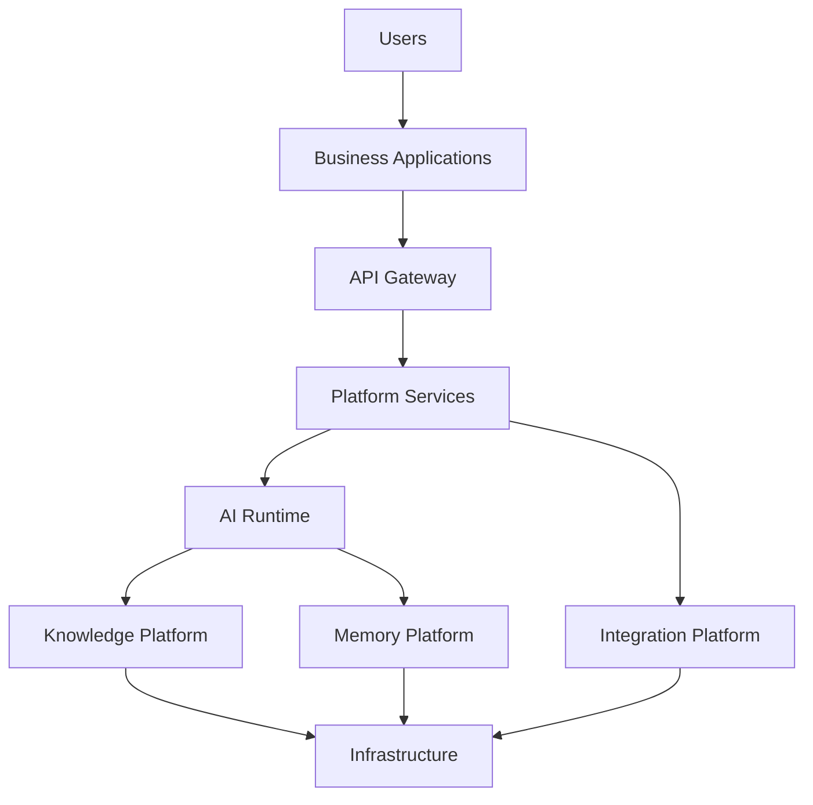
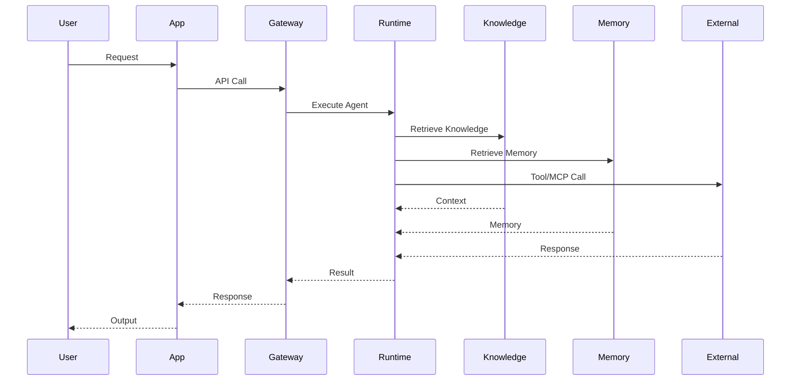
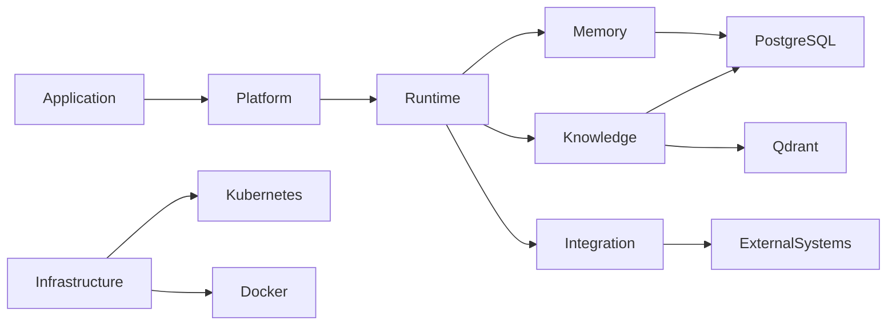

# OM-SOL-101 — Platform Building Blocks

---

# Executive Summary

This document defines the logical building blocks of the OneMind AI Operating Platform.

Each building block represents an independently deployable platform capability that can be reused across multiple business solutions.

---

# Objectives

The platform shall provide:

- Modular architecture
- AI-first runtime
- Event-driven communication
- Domain-oriented services
- Cloud-native deployment
- Independent scalability

---

# Platform Building Blocks

```text
Presentation

↓

Business Applications

↓

API Gateway

↓

Platform Services

↓

AI Runtime

↓

Knowledge Platform

↓

Memory Platform

↓

Integration Platform

↓

Infrastructure
```

---

# Logical Architecture



---

# Core Building Blocks

## User Experience

Responsibilities

- Web Portal

- Mobile

- Dashboard

- Chat UI

---

## Business Applications

Examples

- Hospital AIOS

- Condo AIOS

- Manufacturing AIOS

Applications contain business logic only.

Reusable capabilities belong to Platform Services.

---

## API Gateway

Responsibilities

- Routing

- Authentication

- Authorization

- Rate Limiting

- API Versioning

- Service Discovery

---

## Platform Services

Shared enterprise services.

Includes

- Workflow

- Scheduler

- Notification

- Configuration

- Identity

- Search

- File Storage

- Audit

---

## AI Runtime

Provides

- Agent Runtime

- Prompt Engine

- LLM Gateway

- Tool Execution

- Agent Collaboration

- Planning

- Reasoning

---

## Knowledge Platform

Provides

- Document Management

- Vector Database

- Semantic Search

- Embedding Pipeline

- Knowledge Governance

---

## Memory Platform

Responsible for

- Session Memory

- User Memory

- Agent Memory

- Organization Memory

- Episodic Memory

- Long-term Memory

---

## Integration Platform

Provides

- REST APIs

- GraphQL

- Event Bus

- Message Queue

- MCP

- Webhooks

- External Connectors

---

## Infrastructure

Includes

- Kubernetes

- Docker

- PostgreSQL

- Qdrant

- Redis

- Object Storage

- Monitoring

- Logging

---

# Runtime Interaction



---

# Dependency View



---

# Architecture Decisions

| ADR | Description |
|------|-------------|
| ADR-001 | PostgreSQL |
| ADR-002 | Qdrant |
| ADR-003 | LiteLLM |

---

# Traceability

| Source | Target |
|---------|--------|
| OM-BIZ-010 | Platform Vision |
| OM-ARCH-080 | Principles |
| OM-ARCH-090 | Layered Architecture |
| OM-ARCH-091 | Event-driven Pattern |
| OM-SOL-100 | Solution Overview |

---

# Draw.io Reference

```
assets/diagrams/solution/

01-platform-building-blocks.drawio
```

---

# Future Evolution

Future milestones may introduce

- Event Mesh

- Agent Marketplace

- Plugin SDK

- Distributed Memory

- AI Marketplace

- Multi-region Deployment

---

# Summary

The Platform Building Blocks define the logical decomposition of the OneMind AI Operating Platform into reusable, independently evolvable architectural capabilities.

These building blocks establish the architectural foundation for all subsequent solution architecture documents within Milestone M4.