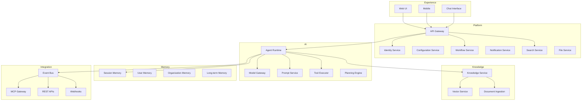
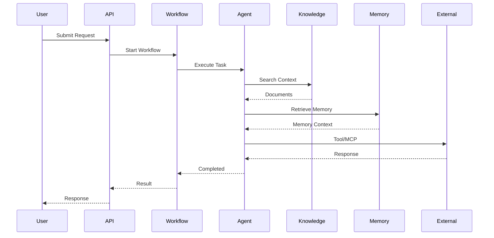
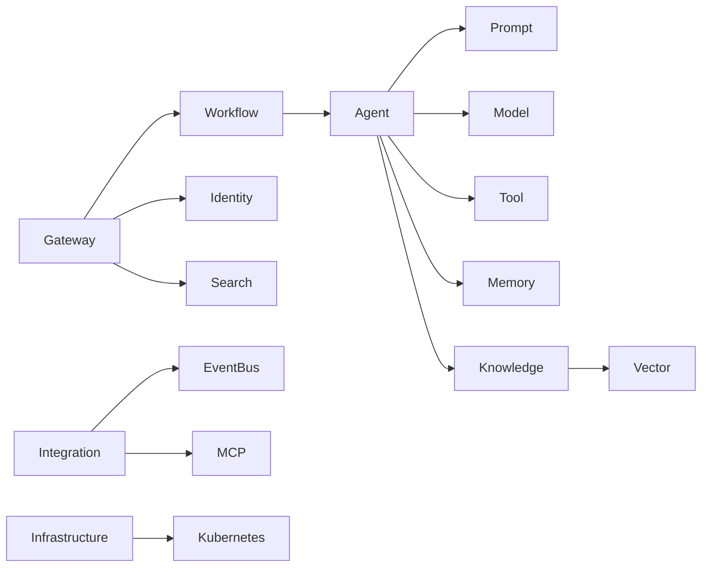

# OM-SOL-102 — Service Architecture

---

# Executive Summary

The OneMind platform is composed of independent platform services organized around business capabilities rather than technical layers.

Each service owns its own responsibilities, APIs, persistence, lifecycle, and deployment, while collaborating through APIs and asynchronous events.

---

# Objectives

The Service Architecture is designed to achieve:

- High cohesion
- Loose coupling
- Independent deployment
- Independent scalability
- Domain ownership
- API-first communication
- Event-driven integration

---

# Architecture Principles

This architecture follows:

- Domain-Oriented Design
- Service-Oriented Platform
- API First
- Event First
- Database per Service
- Stateless Services
- Cloud Native

---

# Service Landscape



---

# Service Categories

## Experience Services

Provide user-facing interfaces.

Examples

- Web Portal
- Mobile
- Dashboard
- Chat UI

---

## Platform Services

Reusable enterprise capabilities.

Services include

- Identity
- Authorization
- Workflow
- Notification
- Configuration
- Search
- File Management

---

## AI Services

Responsible for intelligence.

Includes

- Agent Runtime
- Prompt Engine
- Planning Engine
- Model Gateway
- Tool Execution

---

## Knowledge Services

Provide enterprise knowledge.

Includes

- Knowledge Repository
- Embedding Pipeline
- Semantic Search
- Vector Database

---

## Memory Services

Responsible for contextual reasoning.

Includes

- Session Memory
- User Memory
- Organization Memory
- Long-Term Memory

---

## Integration Services

Provide connectivity.

Includes

- API Gateway
- Event Bus
- MCP Gateway
- Webhooks
- External APIs

---

# Service Ownership

| Domain | Owner |
|---------|-------|
| Platform | Platform Team |
| AI Runtime | AI Platform Team |
| Knowledge | Knowledge Team |
| Memory | AI Platform Team |
| Integration | Integration Team |
| Infrastructure | Platform Engineering |

---

# Communication Patterns

### Synchronous

- REST
- gRPC
- GraphQL

### Asynchronous

- Event Bus
- Queue
- Pub/Sub

---

# Runtime Interaction



---

# Service Dependencies



---

# Deployment Strategy

Each service shall be independently deployable.

Requirements

- Stateless
- Containerized
- API Versioned
- Health Checks
- Metrics Endpoint
- OpenTelemetry Enabled

---

# Security

Every service shall implement

- OAuth2/OIDC
- RBAC
- Audit Logging
- Encryption in Transit
- Encryption at Rest
- Secrets Management

---

# Scalability

Services scale independently.

Examples

- AI Runtime → Horizontal
- Knowledge → Horizontal
- Vector Database → Cluster
- PostgreSQL → HA Cluster

---

# Related ADRs

| ADR | Topic |
|------|-------|
| ADR-001 | PostgreSQL |
| ADR-002 | Qdrant |
| ADR-003 | LiteLLM |

---

# Traceability

| Source | Target |
|---------|--------|
| OM-SOL-100 | Solution Overview |
| OM-SOL-101 | Building Blocks |
| OM-ARCH-090 | Layered Architecture |
| OM-ARCH-091 | Event-Driven Pattern |

---

# Draw.io Reference

```text
assets/diagrams/solution/
02-service-architecture.drawio
```

---

# Future Evolution

Future versions may introduce

- Service Mesh
- Agent Mesh
- Distributed Workflow
- AI Service Marketplace
- Autonomous Service Discovery

---

# Summary

The Service Architecture defines the major runtime services of the OneMind platform, their responsibilities, communication mechanisms, ownership boundaries, and deployment model.

It establishes the service-oriented foundation upon which all future platform capabilities will be implemented.