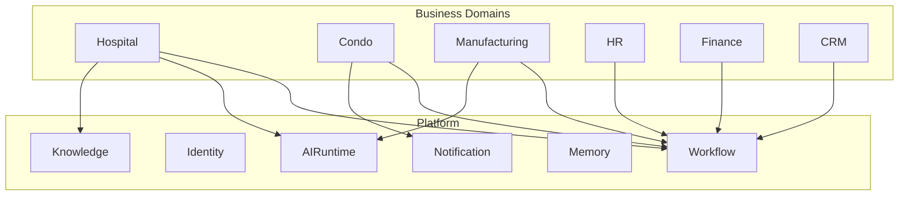
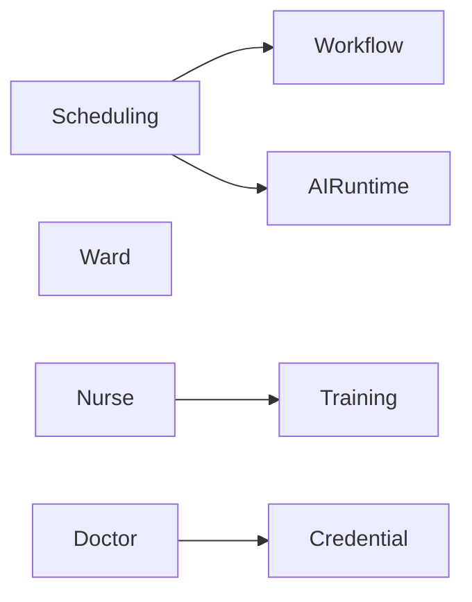
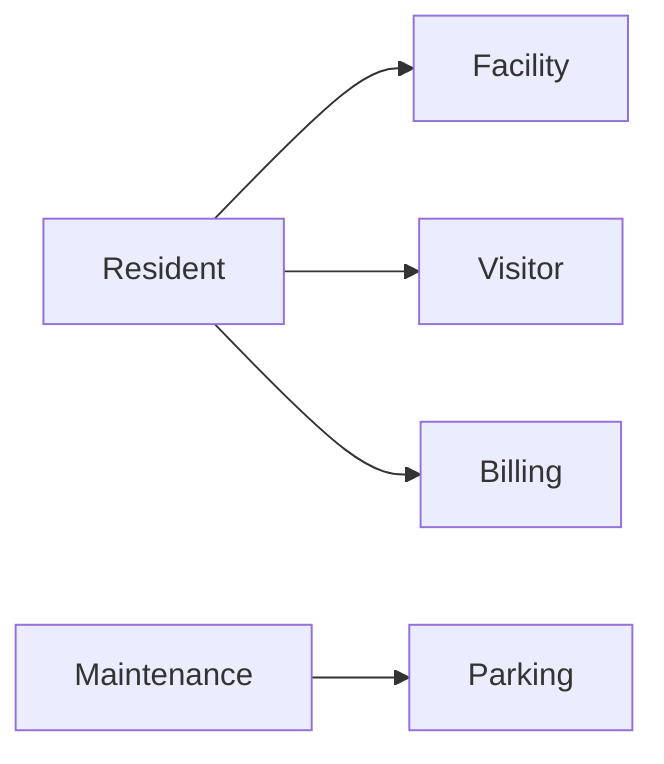
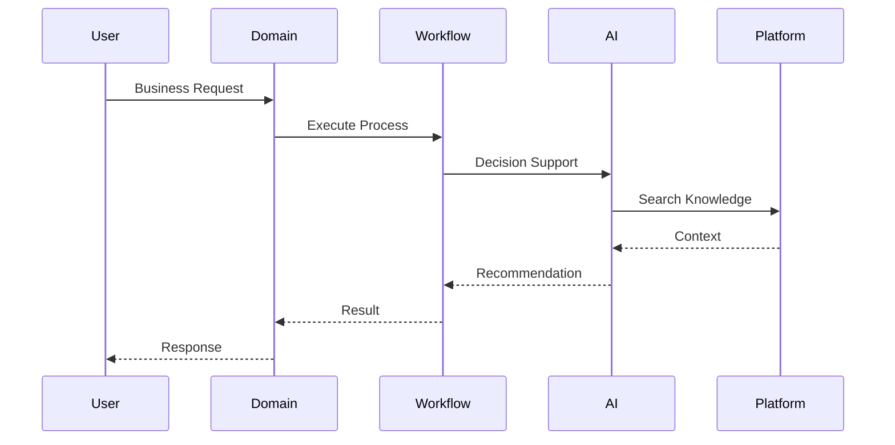

# OM-SOL-103 — Domain Services

---

# Executive Summary

Domain Services encapsulate business capabilities that differentiate one solution from another. Unlike Shared Platform Services, Domain Services implement domain-specific rules, policies, workflows, and intelligence while leveraging reusable platform capabilities.

This separation enables OneMind to support multiple industries—such as healthcare, smart buildings, manufacturing, logistics, and government—without duplicating common platform functionality.

---

# Objectives

The Domain Service Architecture shall:

- Isolate business logic from platform capabilities
- Enable industry-specific solutions
- Promote reuse of platform services
- Support independent deployment
- Preserve bounded contexts
- Reduce coupling between domains

---

# Domain-Driven Design

Each Domain Service owns:

- Business Rules
- Domain Models
- Business Policies
- Domain Events
- Domain APIs
- Domain Data

A Domain Service **must not** implement generic platform capabilities already provided by the platform.

---

# Logical Domain Architecture



---

# Domain Service Catalog

| Domain | Example Services |
|----------|-----------------|
| Healthcare | Scheduling, Clinical Workflow, Patient Coordination |
| Smart Condo | Resident Management, Visitor Management, Facility Booking |
| Manufacturing | Production Planning, Maintenance, Quality Inspection |
| HR | Recruitment, Leave, Performance |
| Finance | Billing, Budgeting, Payment |
| CRM | Customer Management, Case Management |

---

# Example — Hospital Domain



Example Services

- Staff Scheduling
- Shift Optimization
- Training Management
- Credential Management
- Workforce Analytics

---

# Example — Smart Condo Domain



Example Services

- Resident Portal
- Visitor Registration
- Facility Booking
- Complaint Management
- Maintenance Request
- EV Charging

---

# Service Ownership

Each domain owns:

- APIs
- Events
- Business Rules
- Persistence
- Security Policies

Platform Teams must not implement business-specific logic.

---

# Communication

Domain Services communicate via:

- REST APIs
- Events
- Commands
- Queries

Direct database sharing is prohibited.

---

# Runtime Interaction



---

# Dependency Rules

Allowed

Domain

→ Platform

→ AI Runtime

→ Workflow

→ Knowledge

→ Memory

Not Allowed

Domain

→ Another Domain Database

Domain

→ Internal Platform Database

---

# Domain Boundaries

Each Domain shall have:

- Independent Repository
- Independent Database
- Independent APIs
- Independent Events
- Independent Deployment Pipeline

---

# Architecture Decisions

| Decision | Description |
|-----------|-------------|
| Database per Domain | Mandatory |
| API First | Mandatory |
| Event First | Recommended |
| Shared Platform | Mandatory |

---

# Related Documents

- OM-SOL-100
- OM-SOL-101
- OM-SOL-102
- OM-ARCH-090
- OM-ARCH-091

---

# Draw.io Reference

```
assets/diagrams/solution/

03-domain-services.drawio
```

---

# Future Evolution

Future releases may introduce:

- Industry Solution Packs
- Domain SDK
- Domain Marketplace
- AI Domain Templates

---

# Summary

Domain Services encapsulate business-specific capabilities while relying on reusable platform services. This architecture enables OneMind to support multiple industries with minimal duplication, clear ownership, and strong separation of concerns.
