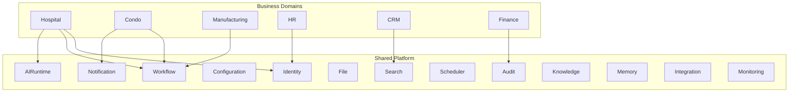
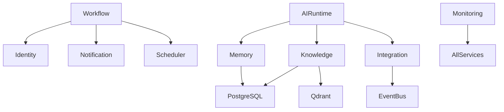
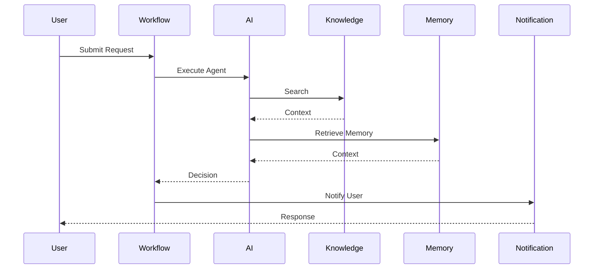

# OM-SOL-104 — Shared Platform Services

---

# Executive Summary

Shared Platform Services provide reusable enterprise capabilities consumed by all OneMind business domains.

Unlike Domain Services, Platform Services contain no business-specific logic. They expose standardized APIs, publish platform events, enforce governance, and provide common operational capabilities.

Every business solution built on OneMind shall consume these services rather than reimplementing them.

---

# Objectives

The Platform Service Catalog shall:

- Maximize reuse
- Standardize enterprise capabilities
- Reduce duplication
- Improve maintainability
- Enable independent scaling
- Simplify governance

---

# Platform Overview



---

# Platform Service Catalog

| Service | Responsibility |
|----------|----------------|
| Identity Service | Authentication / Authorization |
| Workflow Service | Business Workflow Execution |
| Notification Service | Email, SMS, Push, LINE |
| Search Service | Enterprise Search |
| File Service | Document Storage |
| Configuration Service | Runtime Configuration |
| Scheduler Service | Job Scheduling |
| Audit Service | Audit Logging |
| AI Runtime | Agent Execution |
| Knowledge Service | Knowledge Retrieval |
| Memory Service | Context Management |
| Integration Service | External Connectivity |
| Monitoring Service | Health & Metrics |

---

# Detailed Service Specifications

---

## Identity Service

### Responsibilities

- Authentication
- Authorization
- SSO
- OAuth2
- OpenID Connect
- RBAC

### Public APIs

- Login
- Logout
- Refresh Token
- User Profile

### Events

Published

- UserLoggedIn
- UserLoggedOut

Consumed

- UserCreated

### Storage

- PostgreSQL

### Scaling

Horizontal

---

## Workflow Service

Responsibilities

- BPM
- Workflow Engine
- State Management
- Task Routing

Public APIs

- Start Workflow
- Resume Workflow
- Cancel Workflow

Events

Published

- WorkflowStarted
- WorkflowCompleted

Consumed

- UserAction

Storage

- PostgreSQL

---

## Notification Service

Responsibilities

- Email
- SMS
- Push
- LINE
- Teams
- Slack

Supported Channels

- SMTP
- Twilio
- Firebase
- LINE API

---

## AI Runtime

Responsibilities

- Agent Runtime
- Prompt Engine
- Tool Execution
- Planning
- Reasoning
- Agent Collaboration

Dependencies

- Knowledge
- Memory
- Model Gateway

---

## Knowledge Service

Responsibilities

- Document Repository
- Embedding Pipeline
- Vector Search
- Semantic Search

Storage

- PostgreSQL
- Qdrant

---

## Memory Service

Responsibilities

- Session Memory
- User Memory
- Organization Memory
- Episodic Memory
- Long-Term Memory

---

## Search Service

Responsibilities

- Full Text Search
- Semantic Search
- Hybrid Search

Dependencies

- Knowledge
- Vector Database

---

## File Service

Responsibilities

- File Upload
- Document Storage
- Versioning
- Metadata

Storage

- S3 Compatible Storage

---

## Audit Service

Responsibilities

- Audit Trail
- Compliance
- Immutable Logs

---

## Configuration Service

Responsibilities

- Runtime Configuration
- Feature Flags
- Secrets Reference

---

## Scheduler Service

Responsibilities

- Scheduled Jobs
- Cron
- Agent Scheduling

---

## Monitoring Service

Responsibilities

- Metrics
- Logs
- Distributed Tracing
- Health Checks

---

## Integration Service

Responsibilities

- REST APIs
- GraphQL
- Event Bus
- Webhooks
- MCP

---

# Service Dependencies



---

# Runtime View



---

# Platform Standards

Every Platform Service shall provide:

- REST API
- OpenAPI Specification
- Health Endpoint
- Metrics Endpoint
- Audit Logs
- OpenTelemetry
- RBAC
- Versioned APIs
- Independent Deployment

---

# Non-Functional Requirements

| Requirement | Target |
|-------------|--------|
| Availability | 99.9% |
| API Response | <300 ms |
| Health Check | Mandatory |
| OpenTelemetry | Mandatory |
| Audit Logging | Mandatory |
| Encryption | TLS 1.3 |
| Horizontal Scaling | Supported |

---

# ADR Mapping

| ADR | Topic |
|------|-------|
| ADR-001 | PostgreSQL |
| ADR-002 | Qdrant |
| ADR-003 | LiteLLM |

---

# Traceability

| Source | Target |
|---------|--------|
| OM-SOL-100 | Overview |
| OM-SOL-101 | Building Blocks |
| OM-SOL-102 | Service Architecture |
| OM-SOL-103 | Domain Services |

---

# Draw.io Reference

```text
assets/diagrams/solution/
04-shared-platform-services.drawio
```

---

# Future Evolution

Planned platform services include:

- API Management
- Feature Flag Service
- Event Mesh
- Agent Marketplace
- Plugin SDK
- Service Mesh
- AI Governance Runtime

---

# Summary

Shared Platform Services form the reusable foundation of the OneMind AI Operating Platform. By centralizing common capabilities, the platform enables multiple business domains to innovate independently while maintaining architectural consistency, governance, scalability, and operational excellence.
