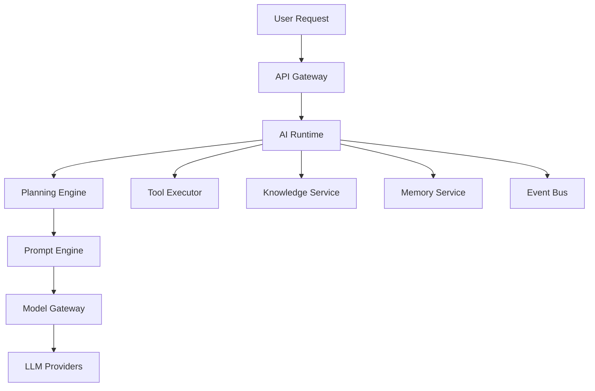
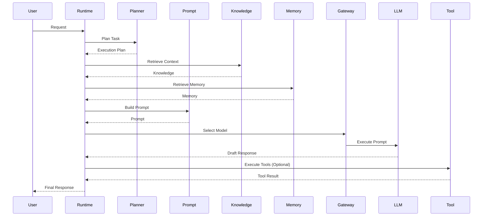
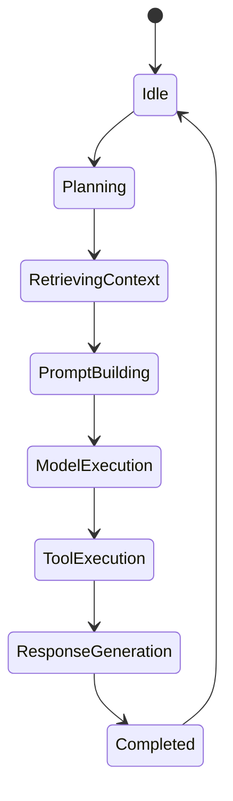

# OM-SOL-105 — AI Runtime Architecture

---

# Executive Summary

The AI Runtime is the execution engine of the OneMind AI Operating Platform. It is responsible for orchestrating intelligent agents, coordinating reasoning, managing prompts, invoking tools, integrating enterprise knowledge and memory, and delivering context-aware responses.

Unlike a traditional chatbot runtime, the OneMind AI Runtime is designed as a distributed, extensible, multi-agent execution platform capable of supporting multiple business domains simultaneously.

---

# Objectives

The AI Runtime shall provide:

- Multi-agent execution
- Context-aware reasoning
- Dynamic model routing
- Tool orchestration
- Enterprise knowledge integration
- Long-term memory utilization
- Secure runtime governance
- Horizontal scalability

---

# AI Runtime Overview



---

# Runtime Responsibilities

The AI Runtime is responsible for:

- Agent lifecycle management
- Task planning
- Context assembly
- Prompt construction
- Model selection
- Tool execution
- Memory retrieval
- Knowledge retrieval
- Response generation
- Runtime telemetry

---

# Runtime Components

| Component | Responsibility |
|-----------|----------------|
| Agent Runtime | Executes AI agents |
| Planning Engine | Decomposes complex tasks |
| Prompt Engine | Builds prompts dynamically |
| Model Gateway | Routes requests to appropriate LLMs |
| Tool Executor | Executes tools and MCP functions |
| Memory Connector | Retrieves contextual memory |
| Knowledge Connector | Retrieves enterprise knowledge |
| Response Composer | Generates final response |
| Event Publisher | Publishes runtime events |

---

# Runtime Flow



---

# Runtime States



---

# AI Runtime Services

## Agent Runtime

- Executes autonomous agents
- Coordinates task execution
- Maintains execution state

---

## Planning Engine

- Goal decomposition
- Task sequencing
- Dependency resolution

---

## Prompt Engine

- Prompt templates
- Dynamic context injection
- Prompt optimization

---

## Model Gateway

- Model selection
- Provider abstraction
- Load balancing
- Failover
- Cost optimization

---

## Tool Executor

- MCP
- REST APIs
- Databases
- Scripts
- Internal services

---

## Knowledge Connector

Provides:

- RAG
- Semantic Search
- Knowledge Ranking
- Citation Support

---

## Memory Connector

Provides:

- Session Memory
- User Memory
- Organization Memory
- Long-Term Memory

---

# Runtime Events

Published Events

- AgentStarted
- AgentCompleted
- ToolInvoked
- PromptGenerated
- ModelSelected
- MemoryRetrieved
- KnowledgeRetrieved

Consumed Events

- UserRequestReceived
- WorkflowStarted
- ScheduledTaskTriggered

---

# Non-Functional Requirements

| Requirement | Target |
|-------------|--------|
| Concurrent Agents | 10,000+ |
| Runtime Availability | 99.9% |
| Context Retrieval | <100 ms |
| Prompt Construction | <50 ms |
| Model Routing | <20 ms |
| Horizontal Scaling | Supported |

---

# Security Considerations

- RBAC enforcement
- Prompt filtering
- Tool authorization
- Data masking
- Audit logging
- Model isolation
- Secure secret management

---

# Related Documents

- OM-SOL-100
- OM-SOL-101
- OM-SOL-102
- OM-SOL-106 Agent Runtime
- OM-SOL-107 Model Gateway Architecture
- OM-SOL-108 Prompt Orchestration
- OM-SOL-109 Tool & MCP Integration

---

# Draw.io Reference

```text
assets/diagrams/solution/
05-ai-runtime-architecture.drawio
```

---

# Summary

The AI Runtime is the intelligent execution layer of OneMind. It orchestrates planning, reasoning, memory, knowledge, tools, and model execution into a unified runtime capable of supporting enterprise-scale, multi-agent AI applications across diverse business domains.
