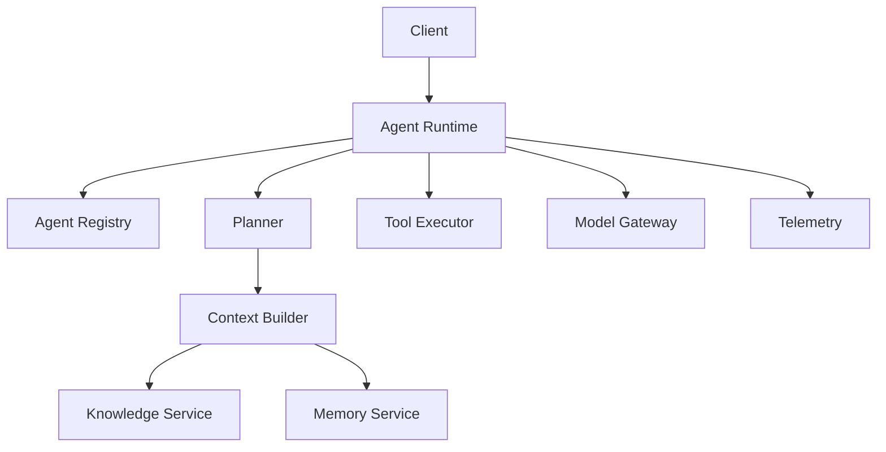
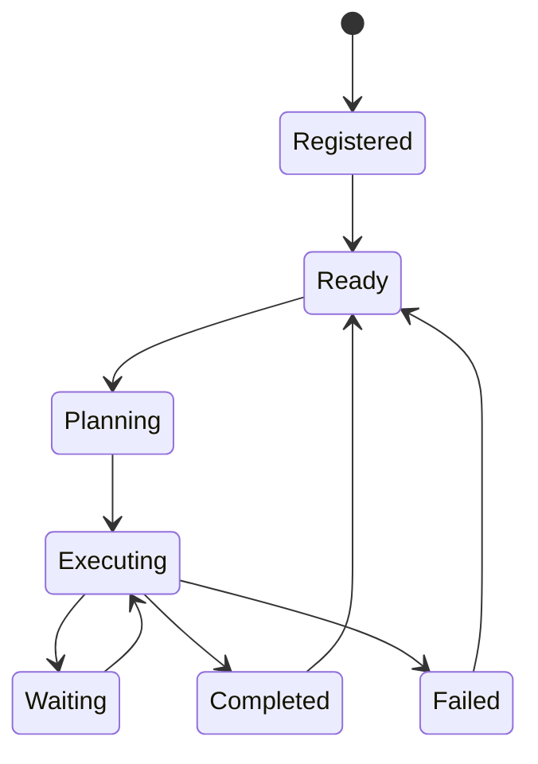
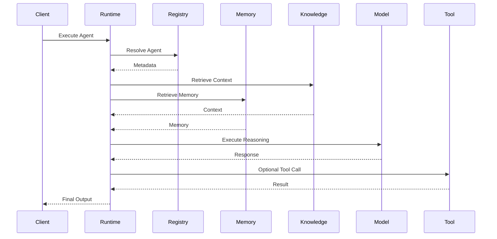
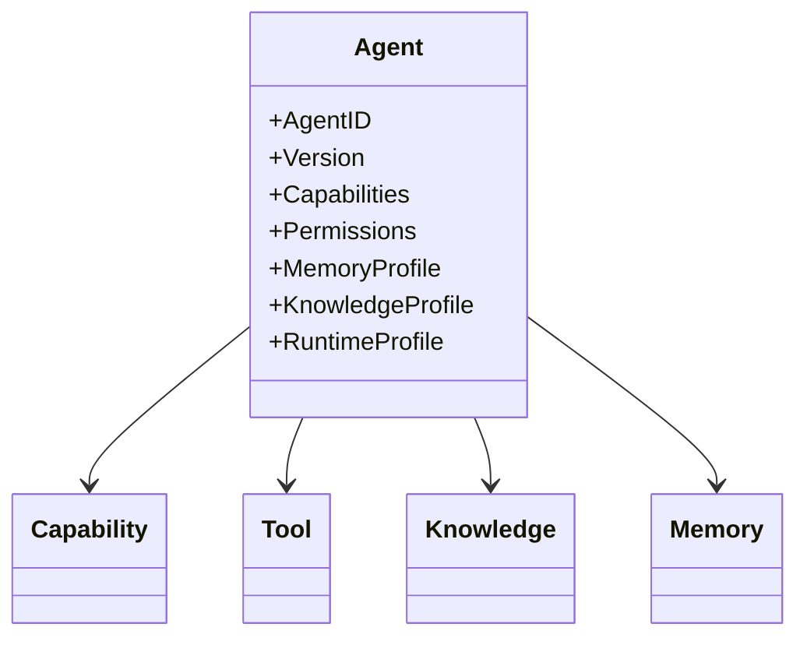
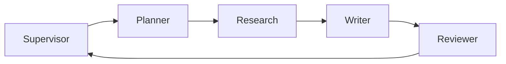

# OM-SOL-106 — Agent Runtime

---

# Executive Summary

The OneMind Agent Runtime is the execution environment for autonomous and collaborative AI agents.

It standardizes how agents are registered, discovered, executed, communicate, access knowledge and memory, invoke tools, and report execution status.

This specification defines the canonical runtime model for every OneMind agent.

---

# Objectives

The Agent Runtime shall provide:

- Standardized Agent Lifecycle
- Multi-Agent Collaboration
- Capability Discovery
- Memory Integration
- Knowledge Integration
- Tool Execution
- Event Publishing
- Runtime Isolation
- Horizontal Scalability

---

# Runtime Overview



---

# Agent Lifecycle



---

# Agent Runtime Flow



---

# Agent Components

Every agent consists of:

- Identity
- Metadata
- Capabilities
- Goals
- Planning Logic
- Memory Connector
- Knowledge Connector
- Tool Connector
- Runtime State
- Telemetry

---

# Agent Metadata

Each registered agent shall define:

| Field | Description |
|---------|-------------|
| Agent ID | Unique Identifier |
| Name | Display Name |
| Description | Business Purpose |
| Version | Semantic Version |
| Owner | Team |
| Domain | Business Domain |
| Capabilities | Supported Skills |
| Permissions | Allowed Operations |
| Runtime Profile | Resource Limits |

---

# Capability Model



---

# Context Model

Runtime context includes:

- User Context
- Session Context
- Organization Context
- Business Context
- Memory Context
- Knowledge Context
- Runtime Variables

---

# Agent Collaboration

Supported collaboration models:

- Delegation
- Supervisor
- Peer-to-Peer
- Swarm
- Pipeline
- Consensus



---

# Agent Communication

Communication mechanisms:

- Internal Events
- Commands
- Queries
- Shared Context
- Workflow Messages

Direct database access between agents is prohibited.

---

# Agent Registry

Responsibilities:

- Registration
- Discovery
- Versioning
- Health Status
- Capability Lookup
- Dependency Mapping

---

# Runtime Policies

The runtime shall enforce:

- Authentication
- Authorization
- Capability Validation
- Resource Quotas
- Execution Timeouts
- Retry Policies
- Audit Logging

---

# Runtime Telemetry

Collected metrics include:

- Execution Time
- Token Usage
- Cost
- Tool Calls
- Errors
- Success Rate
- Memory Hits
- Knowledge Hits

---

# Non-Functional Requirements

| Requirement | Target |
|-------------|--------|
| Concurrent Agents | 10,000+ |
| Agent Startup | <100 ms |
| Registry Lookup | <20 ms |
| Runtime Availability | 99.9% |
| Horizontal Scaling | Supported |

---

# ADR Mapping

| ADR | Description |
|------|-------------|
| ADR-001 | PostgreSQL |
| ADR-002 | Qdrant |
| ADR-003 | LiteLLM |

---

# Traceability

| Source | Target |
|---------|--------|
| OM-SOL-100 | Solution Architecture Overview |
| OM-SOL-101 | Platform Building Blocks |
| OM-SOL-102 | Service Architecture |
| OM-SOL-105 | AI Runtime Architecture |
| OM-ARCH-092 | Agent Collaboration Pattern |

---

# Draw.io Reference

```text
assets/diagrams/solution/
06-agent-runtime.drawio
```

---

# Future Evolution

Planned enhancements include:

- Agent Marketplace
- Dynamic Capability Loading
- Distributed Agent Mesh
- Federated Agent Runtime
- Autonomous Agent Provisioning
- Agent Skill Packages

---

# Summary

The Agent Runtime establishes the execution specification for every OneMind agent, including lifecycle, capability management, collaboration, governance, telemetry, and runtime policies. It provides a consistent foundation for building interoperable, enterprise-grade AI agents across all OneMind solutions.