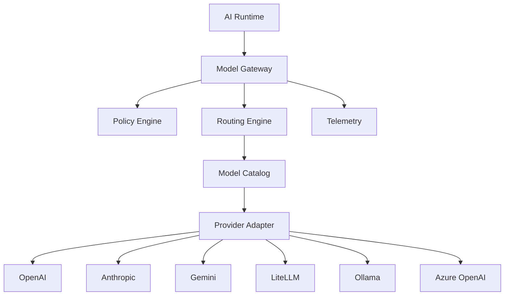
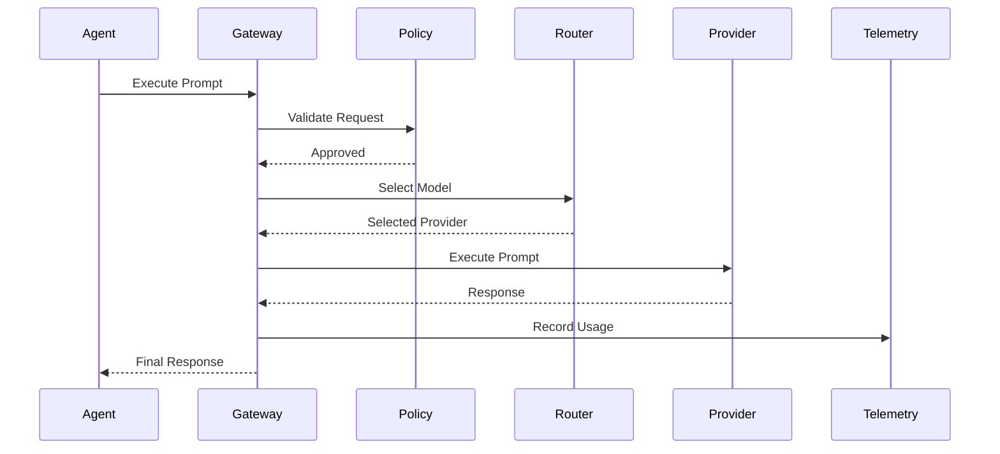

# OM-SOL-107 — Model Gateway Architecture

---

# Executive Summary

The OneMind Model Gateway is the centralized control plane for all Large Language Model (LLM) interactions across the platform.

Rather than acting as a simple proxy, it performs intelligent model selection, policy enforcement, cost optimization, provider abstraction, telemetry collection, and failover management.

The gateway decouples AI applications from specific model vendors, enabling OneMind to support cloud-hosted, self-hosted, and hybrid AI deployments.

---

# Objectives

The Model Gateway shall:

- Abstract LLM providers
- Enable intelligent model routing
- Optimize cost and latency
- Enforce enterprise AI governance
- Provide high availability
- Support model version management
- Centralize telemetry and auditing

---

# Logical Architecture



---

# Gateway Responsibilities

The Model Gateway is responsible for:

- Model discovery
- Provider abstraction
- Routing decisions
- Authentication
- Authorization
- Prompt policy validation
- Cost optimization
- Latency optimization
- Failover
- Usage accounting
- Telemetry collection

---

# Runtime Flow



---

# Model Selection Strategy

The Routing Engine evaluates:

- Required capabilities
- Context size
- Token limits
- Estimated latency
- Estimated cost
- Provider availability
- Security classification
- Data residency
- Business policy

Example:

| Scenario | Preferred Model |
|----------|-----------------|
| Fast chat | GPT-4.1 Mini / Gemini Flash |
| Complex reasoning | GPT-5 / Claude Opus |
| Local deployment | Ollama |
| Sensitive data | Self-hosted model |
| Batch summarization | LiteLLM managed pool |

---

# Provider Abstraction

Supported providers include:

- OpenAI
- Anthropic
- Google Gemini
- Azure OpenAI
- Ollama
- LiteLLM
- Future providers via adapter interface

Applications interact only with the Model Gateway API.

---

# Policy Engine

The Policy Engine enforces:

- Allowed models
- Token quotas
- Maximum cost
- Data classification
- Regional restrictions
- Prompt filtering
- Output filtering
- Safety policies

---

# Model Catalog

The catalog maintains:

- Model ID
- Provider
- Version
- Context window
- Cost profile
- Capability tags
- Availability
- Supported modalities

---

# Routing Policies

```mermaid
flowchart TD

Request

↓

Capability Match

↓

Policy Validation

↓

Cost Optimization

↓

Latency Optimization

↓

Availability Check

↓

Provider Selection

↓

Model Execution
```

---

# Failover Strategy

Priority order:

1. Primary model
2. Same-provider backup
3. Cross-provider equivalent
4. Local model
5. Cached response (when applicable)

---

# Telemetry

Collected metrics:

- Prompt count
- Completion count
- Tokens (input/output)
- Cost
- Latency
- Errors
- Retry count
- Provider availability
- Cache hit ratio

---

# Security

The gateway enforces:

- OAuth2/OIDC authentication
- RBAC authorization
- Prompt redaction
- PII masking
- Encryption in transit
- Audit logging
- Secret management

---

# Non-Functional Requirements

| Requirement | Target |
|-------------|--------|
| Routing latency | <20 ms |
| Availability | 99.9% |
| Horizontal scaling | Supported |
| Multi-provider | Mandatory |
| Telemetry | Mandatory |
| Audit logging | Mandatory |

---

# ADR Mapping

| ADR | Description |
|------|-------------|
| ADR-003 | LiteLLM |
| OM-ARCH-087 | API Design Standards |
| OM-ARCH-097 | Governance Operating Model |

---

# Traceability

| Source | Target |
|---------|--------|
| OM-SOL-105 | AI Runtime Architecture |
| OM-SOL-106 | Agent Runtime |
| OM-ARCH-092 | Agent Collaboration Pattern |
| OM-ARCH-093 | RAG Pattern |

---

# Draw.io Reference

```text
assets/diagrams/solution/
07-model-gateway-architecture.drawio
```

---

# Future Evolution

Future enhancements may include:

- AI Benchmark–driven routing
- Dynamic A/B model selection
- Multi-model ensemble execution
- On-device model support
- Carbon-aware routing
- Federated model registry

---

# Summary

The Model Gateway Architecture establishes a vendor-neutral, policy-driven control plane for all LLM interactions within OneMind. It enables intelligent routing, centralized governance, operational visibility, and resilient multi-provider execution while insulating applications from changes in underlying AI models and providers.
