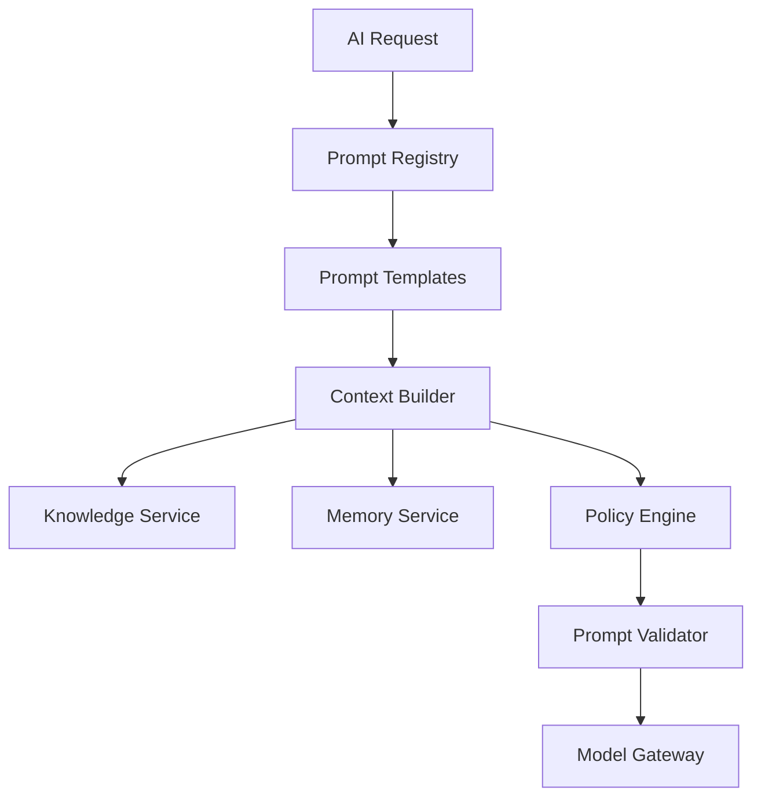
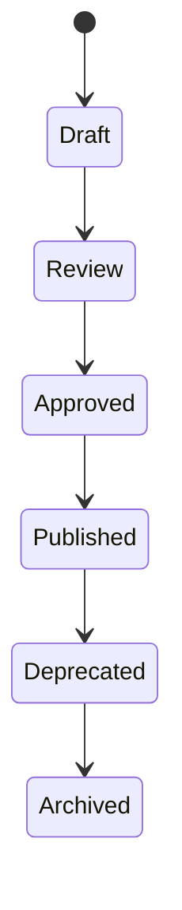
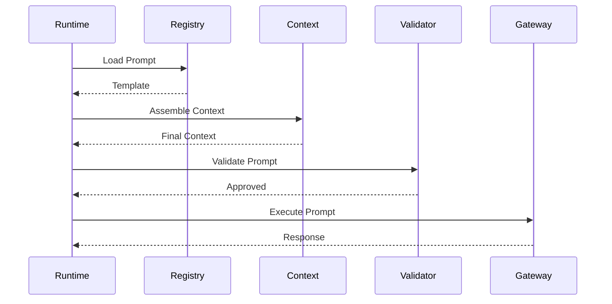

# OM-SOL-108 — Prompt Orchestration

---

# Executive Summary

Prompt Orchestration is the enterprise capability responsible for constructing, governing, versioning, validating, and executing prompts across the OneMind platform.

Unlike traditional AI systems where prompts are embedded within application code, OneMind treats prompts as managed enterprise assets with defined ownership, lifecycle, governance, approval workflows, quality metrics, and traceability.

The Prompt Orchestration layer dynamically assembles prompts using business context, enterprise knowledge, organizational memory, user context, runtime policies, and model capabilities.

---

# Objectives

The Prompt Orchestration platform shall:

- Manage Prompt Assets
- Version prompts
- Assemble dynamic prompts
- Validate prompts
- Apply governance
- Support A/B testing
- Support prompt evaluation
- Enable prompt reuse
- Maintain auditability

---

# Prompt Architecture



---

# Prompt Lifecycle



---

# Prompt Asset

Every Prompt Asset contains:

| Field | Description |
|---------|-------------|
| Prompt ID | Unique Identifier |
| Name | Prompt Name |
| Version | Semantic Version |
| Owner | Business Owner |
| Status | Lifecycle Status |
| Template | Prompt Template |
| Variables | Runtime Variables |
| Allowed Models | Supported Models |
| Security Classification | Public/Internal/Restricted |
| Approval | Governance Status |

---

# Prompt Registry

The registry stores:

- Templates
- Prompt Versions
- Owners
- Tags
- Policies
- Evaluation Scores
- Approval History
- Dependencies

---

# Prompt Template

```text
System Role

Business Context

Organization Context

User Context

Knowledge Context

Memory Context

Task Definition

Constraints

Output Format
```

---

# Dynamic Context Assembly

```mermaid
graph LR

User

Knowledge

Memory

Policies

Workflow

PromptTemplate

↓

ContextBuilder

↓

FinalPrompt
```

The Context Builder dynamically injects:

- User profile
- Organization profile
- Session context
- Business data
- Knowledge retrieval
- Long-term memory
- Runtime variables
- Security policies

---

# Runtime Flow



---

# Prompt Validation

Validation rules include:

- Missing variables
- Prompt size
- Token estimation
- Restricted content
- Security policies
- Data classification
- Output schema compliance

---

# Prompt Governance

Governance includes:

- Ownership
- Approval workflow
- Version control
- Change history
- Audit logging
- Policy compliance

---

# Prompt Versioning

Version format:

```
Major.Minor.Patch
```

Example:

```
1.0.0

1.1.0

2.0.0
```

Every execution records:

- Prompt Version
- Model Version
- Runtime Version

---

# Prompt Evaluation

Metrics include:

- Accuracy
- Hallucination Rate
- User Satisfaction
- Latency
- Token Usage
- Cost
- Retry Rate
- Safety Score

---

# Prompt A/B Testing

Supported experiments:

- Multiple templates
- Multiple models
- Different context strategies
- Output comparison

```mermaid
flowchart LR

Traffic

--> Prompt A

Traffic

--> Prompt B

Prompt A --> Evaluation

Prompt B --> Evaluation
```

---

# Security

The Prompt Orchestrator enforces:

- Prompt approval
- PII masking
- Sensitive data filtering
- Prompt injection protection
- Audit logging
- Access control

---

# Non-Functional Requirements

| Requirement | Target |
|-------------|--------|
| Registry Lookup | <20 ms |
| Context Assembly | <100 ms |
| Prompt Validation | <30 ms |
| Prompt Versioning | Mandatory |
| Audit Logging | Mandatory |

---

# ADR Mapping

| ADR | Description |
|------|-------------|
| ADR-003 | LiteLLM |
| OM-ARCH-085 | Documentation Standards |
| OM-ARCH-097 | Governance Operating Model |

---

# Traceability

| Source | Target |
|---------|--------|
| OM-SOL-105 | AI Runtime Architecture |
| OM-SOL-106 | Agent Runtime |
| OM-SOL-107 | Model Gateway Architecture |
| OM-ARCH-084 | Compliance Framework |

---

# Draw.io Reference

```text
assets/diagrams/solution/
08-prompt-orchestration.drawio
```

---

# Future Evolution

Future capabilities include:

- Prompt Marketplace
- Prompt SDK
- AI-assisted Prompt Generation
- Prompt Optimization
- Automatic Prompt Regression Testing
- Policy-as-Code for Prompt Governance

---

# Summary

Prompt Orchestration transforms prompts into governed enterprise assets. By managing their lifecycle, composition, validation, evaluation, and governance, OneMind ensures consistent, secure, and high-quality AI interactions across all business domains while enabling continuous improvement and operational excellence.
