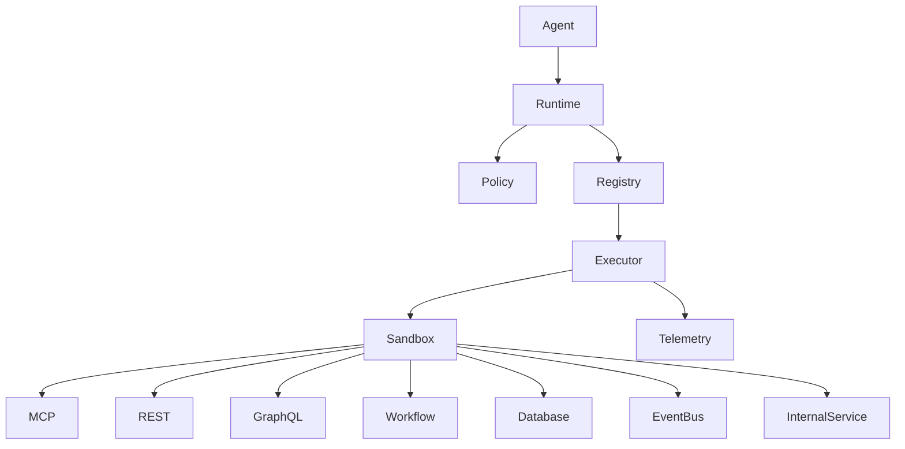
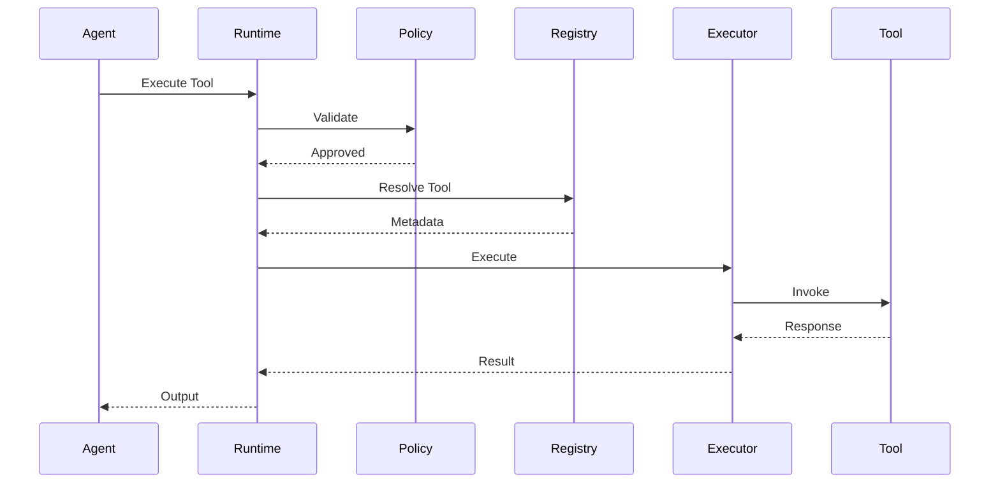
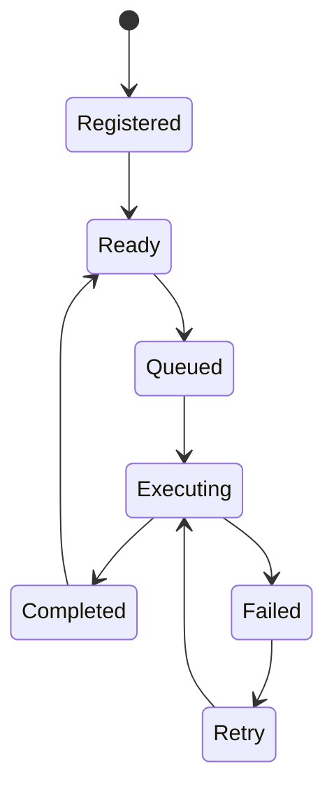

# OM-SOL-109 — Tool Execution & MCP Runtime

---

# Executive Summary

The Tool Execution & MCP Runtime provides a secure, observable, and policy-driven execution environment for external and internal tools used by AI agents.

Rather than allowing agents to invoke tools directly, OneMind centralizes tool execution through a governed runtime that validates permissions, enforces policies, manages execution, and records telemetry.

The runtime supports Model Context Protocol (MCP), REST APIs, GraphQL, databases, workflows, scripts, and enterprise services through a unified execution contract.

---

# Objectives

The runtime shall provide:

- Unified Tool Contract
- Secure Tool Execution
- MCP Integration
- External API Integration
- Database Access
- Workflow Invocation
- Policy Enforcement
- Observability
- Retry & Compensation
- Execution Isolation

---

# Logical Architecture



---

# Runtime Responsibilities

The Tool Runtime is responsible for:

- Tool Discovery
- Capability Validation
- Permission Checking
- Parameter Validation
- Execution Scheduling
- Timeout Handling
- Retry Policy
- Compensation
- Telemetry Collection
- Audit Logging

---

# Tool Categories

| Category | Examples |
|----------|----------|
| MCP | MCP Servers |
| REST | Internal / External APIs |
| GraphQL | Enterprise APIs |
| Database | PostgreSQL, SQL Server |
| Workflow | n8n, Temporal |
| Messaging | Kafka, RabbitMQ |
| Files | S3, NAS, SharePoint |
| Scripts | Python, Bash |
| AI Services | OCR, Speech, Vision |

---

# Tool Registry

Every tool shall register:

| Field | Description |
|--------|-------------|
| Tool ID | Unique Identifier |
| Name | Tool Name |
| Version | Semantic Version |
| Category | Tool Category |
| Owner | Responsible Team |
| Input Schema | JSON Schema |
| Output Schema | JSON Schema |
| Permissions | Required Roles |
| Timeout | Maximum Runtime |
| Retry Policy | Retry Configuration |

---

# Tool Contract

```json
{
  "tool_id": "knowledge.search",
  "version": "1.0.0",
  "input": {},
  "output": {},
  "timeout": 30,
  "retry": 2
}
```

---

# Runtime Flow



---

# Execution Lifecycle



---

# MCP Runtime

Supported MCP capabilities include:

- Tool Discovery
- Tool Invocation
- Resource Access
- Prompt Resources
- Context Exchange
- Session Management

The MCP Runtime shall support multiple concurrent MCP servers with capability-based routing.

---

# Security Model

Every execution shall enforce:

- Authentication
- Authorization
- Capability Validation
- Input Validation
- Output Validation
- Secret Isolation
- Network Isolation
- Audit Logging

---

# Sandbox

Tool execution shall occur within isolated execution environments.

Isolation options include:

- Containers
- Kubernetes Jobs
- Serverless Functions
- Remote Workers
- Secure Python Runtime

Direct execution on the AI Runtime host is prohibited.

---

# Timeout & Retry

Default execution policy:

| Property | Default |
|----------|----------|
| Timeout | 30 seconds |
| Retry | 2 |
| Backoff | Exponential |
| Circuit Breaker | Enabled |

---

# Compensation

For long-running or transactional tools:

- Saga Pattern
- Rollback Events
- Manual Intervention
- Dead Letter Queue

---

# Observability

Collected metrics:

- Execution Count
- Success Rate
- Failure Rate
- Average Duration
- Queue Time
- Retry Count
- Timeout Count
- Resource Utilization

---

# Non-Functional Requirements

| Requirement | Target |
|-------------|--------|
| Tool Resolution | <20 ms |
| Runtime Availability | 99.9% |
| Horizontal Scaling | Supported |
| Sandbox Isolation | Mandatory |
| Audit Logging | Mandatory |

---

# ADR Mapping

| ADR | Description |
|------|-------------|
| ADR-001 | PostgreSQL |
| ADR-002 | Qdrant |
| ADR-003 | LiteLLM |

---

# Traceability

| Source | Target |
|---------|--------|
| OM-SOL-105 | AI Runtime Architecture |
| OM-SOL-106 | Agent Runtime |
| OM-SOL-107 | Model Gateway Architecture |
| OM-SOL-108 | Prompt Orchestration |
| OM-ARCH-092 | Agent Collaboration Pattern |

---

# Draw.io Reference

```text
assets/diagrams/solution/
09-tool-execution-mcp-runtime.drawio
```

---

# Future Evolution

Future capabilities include:

- Distributed Tool Mesh
- Tool Marketplace
- Policy-as-Code
- Remote Secure Execution
- AI-generated Tool Adapters
- Autonomous Tool Selection

---

# Summary

The Tool Execution & MCP Runtime provides the governed execution layer between AI agents and enterprise capabilities. By standardizing tool contracts, enforcing security policies, isolating execution, and providing comprehensive observability, OneMind enables reliable, scalable, and secure integration with internal and external systems while preserving architectural consistency.