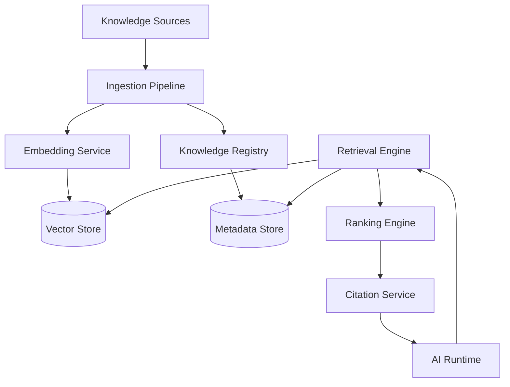
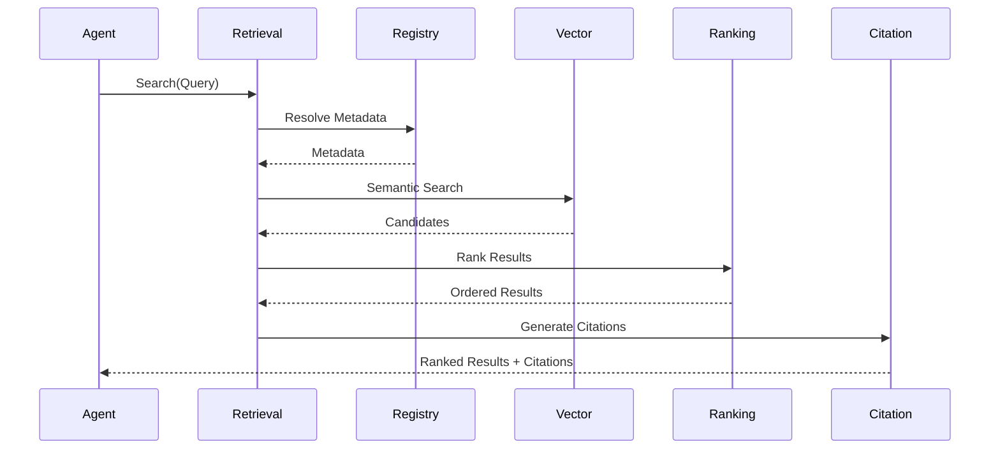
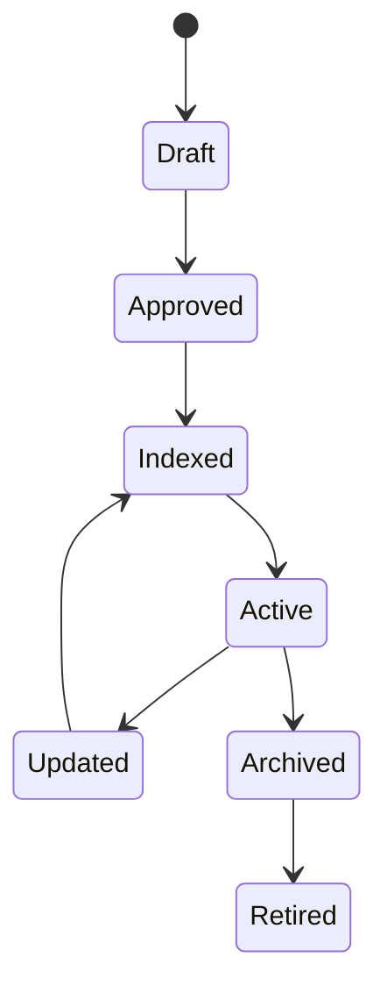

# OM-SOL-110 — Knowledge Runtime

---

# Executive Summary

The Knowledge Runtime provides the enterprise knowledge execution layer for OneMind. It governs how structured and unstructured knowledge is ingested, indexed, enriched, secured, retrieved, ranked, and delivered to AI agents and business applications.

The Knowledge Runtime abstracts the underlying storage technologies and exposes a consistent runtime contract for semantic retrieval, metadata management, citation generation, and knowledge lifecycle management.

---

# Objectives

The Knowledge Runtime shall:

- Provide enterprise knowledge retrieval
- Support Retrieval-Augmented Generation (RAG)
- Separate knowledge from application logic
- Enable semantic and hybrid search
- Enforce knowledge governance
- Support multi-tenant isolation
- Maintain full traceability and citations

---

# Scope

## Included

- Document ingestion
- Metadata extraction
- Embedding management
- Vector retrieval
- Semantic search
- Hybrid search
- Citation generation
- Knowledge governance

## Excluded

- Agent memory (OM-SOL-111)
- Prompt management (OM-SOL-108)
- Model routing (OM-SOL-107)

---

# Responsibilities

The Knowledge Runtime is responsible for:

- Knowledge registration
- Knowledge indexing
- Metadata management
- Embedding generation
- Search execution
- Result ranking
- Citation generation
- Version management
- Knowledge lifecycle

---

# Architecture Principles

- Knowledge is an enterprise asset.
- Applications never access vector stores directly.
- Retrieval is API-first.
- Storage technology is abstracted.
- Knowledge must be versioned.
- Every answer shall be traceable to its sources.

---

# Runtime Components

| Component | Responsibility |
|-----------|----------------|
| Knowledge Registry | Catalog and metadata |
| Ingestion Pipeline | Import and preprocessing |
| Embedding Service | Vector generation |
| Index Manager | Index lifecycle |
| Retrieval Engine | Search orchestration |
| Ranking Engine | Result ordering |
| Citation Service | Source attribution |
| Governance Service | Policies and lifecycle |

---

# Logical Architecture



---

# Runtime Flow



---

# Public Interfaces

| Interface | Purpose |
|------------|---------|
| Search | Semantic retrieval |
| HybridSearch | Keyword + vector |
| GetDocument | Retrieve source |
| GetMetadata | Metadata lookup |
| ListCollections | Repository discovery |
| GenerateCitation | Citation generation |

---

# Published Events

- KnowledgeIndexed
- KnowledgeUpdated
- KnowledgeDeleted
- EmbeddingGenerated
- SearchCompleted

---

# Consumed Events

- DocumentUploaded
- DocumentApproved
- DocumentArchived
- EmbeddingRequested

---

# Data Ownership

The Knowledge Runtime owns:

- Knowledge Catalog
- Metadata
- Embeddings
- Search Indexes
- Citations

It **does not** own business records or runtime memory.

---

# Retrieval Pipeline

```mermaid
flowchart LR

Query

-->

Normalization

-->

Embedding

-->

Vector Search

-->

Hybrid Ranking

-->

Security Filter

-->

Citation

-->

Response
```

---

# Knowledge Lifecycle



---

# Security Considerations

The runtime shall enforce:

- RBAC
- ABAC (optional)
- Tenant isolation
- Classification labels
- Encryption at rest
- TLS in transit
- Source authorization
- Audit logging

---

# Non-Functional Requirements

| Requirement | Target |
|-------------|--------|
| Search latency | <200 ms |
| Indexing | Asynchronous |
| Horizontal scaling | Supported |
| Multi-tenant | Mandatory |
| Citation generation | Mandatory |

---

# Observability

Metrics collected:

- Search latency
- Search success rate
- Retrieval accuracy
- Embedding latency
- Index size
- Cache hit ratio
- Citation coverage

---

# Error Handling

The runtime shall support:

- Retry for transient failures
- Partial retrieval
- Graceful degradation
- Dead-letter queue for ingestion
- Index rebuild procedures

---

# ADR Mapping

| ADR | Description |
|------|-------------|
| ADR-001 | PostgreSQL |
| ADR-002 | Qdrant |
| ADR-003 | LiteLLM |

---

# Traceability

| Source | Target |
|---------|--------|
| OM-SOL-105 | AI Runtime |
| OM-SOL-107 | Model Gateway |
| OM-SOL-108 | Prompt Orchestration |
| OM-SOL-109 | Tool Execution & MCP Runtime |
| OM-ARCH-093 | Retrieval-Augmented Generation Pattern |

---

# Draw.io Reference

```text
assets/diagrams/solution/
10-knowledge-runtime.drawio
```

---

# Future Evolution

Future enhancements include:

- Knowledge Graph integration
- Multi-vector retrieval
- Cross-repository federation
- Incremental indexing
- AI-assisted document enrichment
- Knowledge quality scoring

---

# Summary

The Knowledge Runtime establishes the governed execution layer for enterprise knowledge within OneMind. It provides secure, scalable, and traceable retrieval services that enable AI agents to access trusted organizational knowledge while maintaining governance, provenance, and operational consistency.