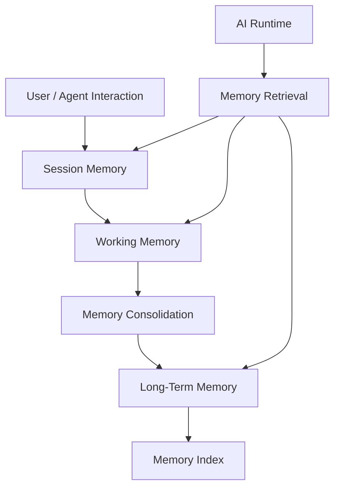
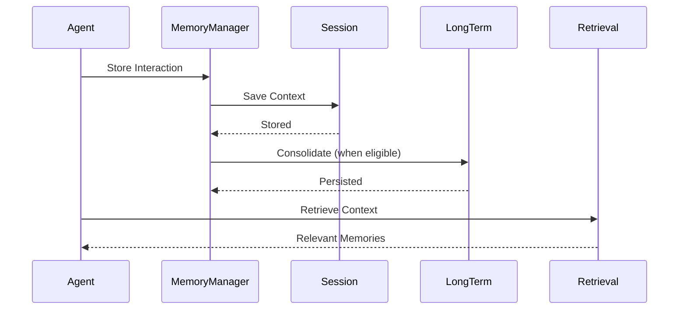
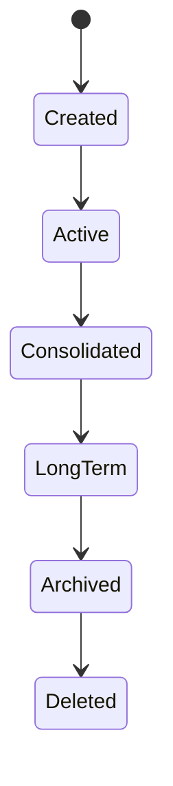

# OM-SOL-111 — Memory Runtime

---

# Executive Summary

The Memory Runtime provides the cognitive memory subsystem for the OneMind platform. It manages how experiences, conversations, decisions, preferences, reasoning artifacts, and organizational learning are captured, organized, retrieved, and evolved over time.

Unlike the Knowledge Runtime, which governs verified enterprise knowledge, the Memory Runtime represents dynamic contextual memory that continuously evolves through interactions between users, AI agents, workflows, and enterprise systems.

The Memory Runtime transforms OneMind from a stateless AI platform into a continuously learning AI Operating Platform.

---

# Objectives

The Memory Runtime shall:

- Maintain conversational continuity
- Preserve organizational experience
- Store reasoning artifacts
- Support long-term learning
- Enable personalized AI behavior
- Separate memory from knowledge
- Support memory lifecycle governance
- Provide secure and auditable memory access

---

# Scope

## Included

- Session Memory
- Working Memory
- Episodic Memory
- Semantic Memory
- Organizational Memory
- Agent Memory
- Workflow Memory
- Memory Retrieval
- Memory Consolidation

## Excluded

- Enterprise Knowledge Repository (OM-SOL-110)
- Prompt Management (OM-SOL-108)
- Model Routing (OM-SOL-107)

---

# Responsibilities

The Memory Runtime is responsible for:

- Memory creation
- Memory retrieval
- Memory ranking
- Memory consolidation
- Memory expiration
- Memory summarization
- Memory security
- Memory governance

---

# Architecture Principles

- Memory represents experience rather than authoritative facts.
- Every memory has an owner and lifecycle.
- Memory retrieval is context-aware.
- Long-term memory is continuously consolidated.
- Memory shall be explainable and traceable.
- Sensitive memories shall be protected by policy.

---

# Runtime Components

| Component | Responsibility |
|-----------|----------------|
| Memory Manager | Orchestrates memory operations |
| Session Store | Active conversation context |
| Working Memory | Short-term reasoning context |
| Long-Term Store | Persistent memories |
| Consolidation Engine | Summarization and promotion |
| Memory Index | Semantic indexing |
| Retrieval Engine | Context-aware retrieval |
| Governance Service | Policies and lifecycle |

---

# Logical Architecture



---

# Runtime Flow



---

# Memory Types

| Type | Purpose | Lifetime |
|------|---------|----------|
| Session Memory | Active conversation | Minutes / Hours |
| Working Memory | Current reasoning | Temporary |
| Episodic Memory | Events and interactions | Long-term |
| Semantic Memory | Learned concepts | Long-term |
| Organizational Memory | Institutional knowledge from experience | Persistent |
| Agent Memory | Agent-specific learning | Persistent |
| Workflow Memory | Process execution history | Configurable |

---

# Memory Lifecycle



---

# Public Interfaces

| Interface | Purpose |
|------------|---------|
| StoreMemory | Persist new memory |
| RetrieveMemory | Retrieve relevant memories |
| SearchMemory | Semantic search |
| ConsolidateMemory | Summarize and promote |
| DeleteMemory | Remove memory |
| ArchiveMemory | Archive expired memory |

---

# Published Events

- MemoryCreated
- MemoryUpdated
- MemoryConsolidated
- MemoryArchived
- MemoryDeleted

---

# Consumed Events

- ConversationCompleted
- WorkflowCompleted
- AgentTaskFinished
- UserPreferenceUpdated
- KnowledgeUpdated

---

# Data Ownership

The Memory Runtime owns:

- Conversation history
- Episodic memories
- Working context
- User preferences
- Agent experiences
- Workflow experiences

It does **not** own verified enterprise knowledge.

---

# Memory Consolidation

```mermaid
flowchart LR

Session

-->

Working Memory

-->

Summarization

-->

Quality Evaluation

-->

Long-Term Memory

-->

Semantic Index
```

---

# Security Considerations

The runtime shall enforce:

- RBAC
- Tenant isolation
- Memory classification
- Encryption at rest
- Encryption in transit
- Right-to-erasure support
- Audit logging

---

# Non-Functional Requirements

| Requirement | Target |
|-------------|--------|
| Memory Retrieval | <150 ms |
| Consolidation | Asynchronous |
| Horizontal Scaling | Supported |
| Multi-tenant | Mandatory |
| Encryption | Mandatory |

---

# Observability

Collected metrics include:

- Retrieval latency
- Consolidation latency
- Memory growth rate
- Retrieval accuracy
- Cache hit ratio
- Expired memories
- Consolidation success rate

---

# Error Handling

The runtime shall support:

- Retry on transient failures
- Partial retrieval
- Recovery from index failures
- Safe archival
- Memory consistency verification

---

# ADR Mapping

| ADR | Description |
|------|-------------|
| ADR-001 | PostgreSQL |
| ADR-002 | Qdrant |
| ADR-003 | LiteLLM |

---

# Traceability

| Source | Target |
|---------|--------|
| OM-SOL-105 | AI Runtime |
| OM-SOL-106 | Agent Runtime |
| OM-SOL-108 | Prompt Orchestration |
| OM-SOL-110 | Knowledge Runtime |
| OM-ARCH-094 | Memory Architecture Pattern |

---

# Draw.io Reference

```text
assets/diagrams/solution/
11-memory-runtime.drawio
```

---

# Future Evolution

Future capabilities include:

- Federated Memory
- Cross-Agent Shared Memory
- Memory Graph
- Temporal Memory
- Confidence Scoring
- AI-assisted Memory Consolidation
- Forgetting Policies
- Memory Federation Across Organizations

---

# Summary

The Memory Runtime establishes the cognitive memory layer of the OneMind platform. By managing experiences, context, and organizational learning independently from enterprise knowledge, it enables AI agents to maintain continuity, improve decision-making, personalize interactions, and evolve through accumulated experience while preserving governance, security, and traceability.