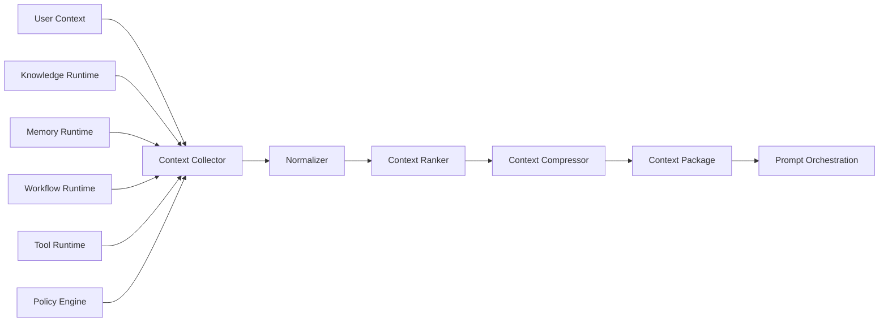
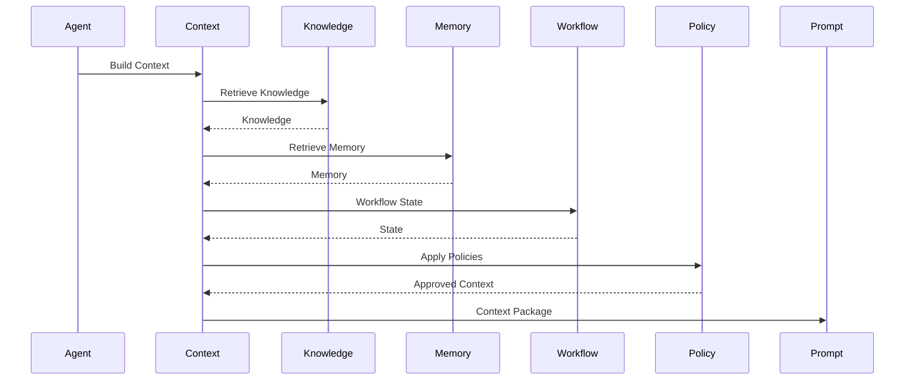
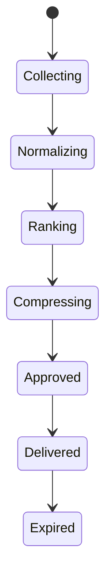

# OM-SOL-112 — Context Orchestration

---

# Executive Summary

Context Orchestration is the cognitive coordination layer of the OneMind platform. It assembles, enriches, validates, prioritizes, and delivers contextual information required for AI reasoning and decision-making.

Rather than relying solely on retrieved knowledge, the Context Orchestrator synthesizes information from enterprise knowledge, organizational memory, user identity, workflow state, runtime policies, tool outputs, and environmental signals into a unified execution context.

This capability transforms OneMind from a retrieval-centric platform into a context-aware AI Operating Platform.

---

# Objectives

The Context Orchestrator shall:

- Assemble contextual information from multiple runtime services
- Prioritize relevant context
- Eliminate redundant or conflicting information
- Enforce security and governance policies
- Optimize token utilization
- Provide explainable context composition
- Deliver a normalized context package to downstream runtimes

---

# Scope

## Included

- Context aggregation
- Context normalization
- Context prioritization
- Context filtering
- Context compression
- Token budget management
- Context provenance
- Context governance

## Excluded

- Prompt template management (OM-SOL-108)
- Knowledge storage (OM-SOL-110)
- Memory persistence (OM-SOL-111)
- Model execution (OM-SOL-107)

---

# Responsibilities

The Context Orchestrator is responsible for:

- Context discovery
- Context assembly
- Context enrichment
- Context deduplication
- Context ranking
- Token budgeting
- Provenance tracking
- Context delivery

---

# Architecture Principles

- Context is runtime-specific.
- Context is assembled dynamically.
- Every context element has provenance.
- Context composition shall be explainable.
- Token usage shall be optimized.
- Security policies shall be enforced before context delivery.

---

# Runtime Components

| Component | Responsibility |
|-----------|----------------|
| Context Manager | Coordinates orchestration |
| Context Collector | Retrieves runtime context |
| Context Normalizer | Standardizes formats |
| Context Ranker | Scores relevance |
| Context Compressor | Reduces token usage |
| Policy Filter | Applies governance |
| Provenance Tracker | Tracks sources |
| Context Package Builder | Produces final context |

---

# Logical Architecture



---

# Runtime Flow



---

# Context Sources

| Source | Description |
|----------|-------------|
| User Profile | Identity, preferences |
| Organization | Business context |
| Knowledge Runtime | Verified enterprise knowledge |
| Memory Runtime | Experiences and conversations |
| Workflow Runtime | Current process state |
| Tool Runtime | Latest execution results |
| Policies | Security and compliance |
| Environment | Time, location, tenant, device |

---

# Context Package

Every context package contains:

- Context ID
- Correlation ID
- Session ID
- User Context
- Organization Context
- Knowledge References
- Memory References
- Workflow State
- Tool Outputs
- Runtime Policies
- Token Budget
- Provenance Metadata

---

# Context Lifecycle



---

# Public Interfaces

| Interface | Purpose |
|------------|---------|
| BuildContext | Assemble runtime context |
| GetContext | Retrieve current package |
| RefreshContext | Rebuild context |
| ValidateContext | Apply policies |
| CompressContext | Optimize token usage |

---

# Published Events

- ContextBuilt
- ContextDelivered
- ContextExpired
- ContextRefreshed
- ContextRejected

---

# Consumed Events

- UserAuthenticated
- WorkflowStarted
- MemoryUpdated
- KnowledgeUpdated
- ToolExecutionCompleted
- PolicyChanged

---

# Data Ownership

The Context Orchestrator owns:

- Context Packages
- Context Metadata
- Provenance Records
- Context Scores

It does **not** own:

- Knowledge repositories
- Memory stores
- Workflow state
- Prompt templates

---

# Token Budget Strategy

```mermaid
flowchart TD

Collect

↓

Rank

↓

Deduplicate

↓

Compress

↓

Policy Filter

↓

Token Budget Check

↓

Final Context
```

Priority order:

1. Security Policies
2. User Intent
3. Workflow State
4. Memory
5. Knowledge
6. Tool Results
7. Historical Context

---

# Security Considerations

The runtime shall enforce:

- RBAC
- Tenant isolation
- Context classification
- PII masking
- Context provenance
- Audit logging
- Data minimization

---

# Non-Functional Requirements

| Requirement | Target |
|-------------|--------|
| Context assembly | <150 ms |
| Token optimization | Mandatory |
| Multi-source aggregation | Supported |
| Horizontal scaling | Supported |
| Provenance tracking | Mandatory |

---

# Observability

Metrics collected:

- Context build latency
- Context size
- Token utilization
- Compression ratio
- Source contribution
- Policy rejection rate
- Context freshness

---

# Error Handling

The runtime shall support:

- Partial context assembly
- Source timeout handling
- Context fallback
- Policy violation reporting
- Provenance validation failures

---

# ADR Mapping

| ADR | Description |
|------|-------------|
| ADR-002 | Qdrant |
| ADR-003 | LiteLLM |

---

# Traceability

| Source | Target |
|---------|--------|
| OM-SOL-107 | Model Gateway Architecture |
| OM-SOL-108 | Prompt Orchestration |
| OM-SOL-110 | Knowledge Runtime |
| OM-SOL-111 | Memory Runtime |
| OM-ARCH-093 | Retrieval-Augmented Generation Pattern |
| OM-ARCH-094 | Memory Architecture Pattern |

---

# Draw.io Reference

```text
assets/diagrams/solution/
12-context-orchestration.drawio
```

---

# Future Evolution

Future capabilities include:

- Adaptive Context Learning
- Multi-Agent Shared Context
- Predictive Context Assembly
- Semantic Context Graph
- Context Quality Scoring
- Context Marketplace
- Cross-Tenant Federated Context

---

# Summary

The Context Orchestrator is the cognitive coordination layer of OneMind. By assembling, governing, and optimizing contextual information from multiple runtime services, it enables AI agents to reason with a complete, relevant, secure, and explainable understanding of each situation, providing the foundation for consistent enterprise-grade intelligence.