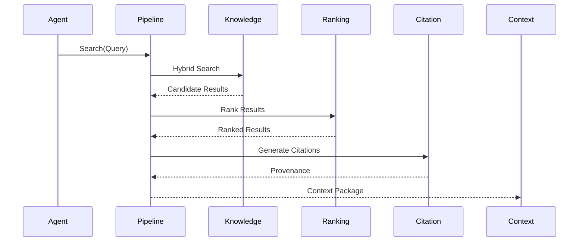
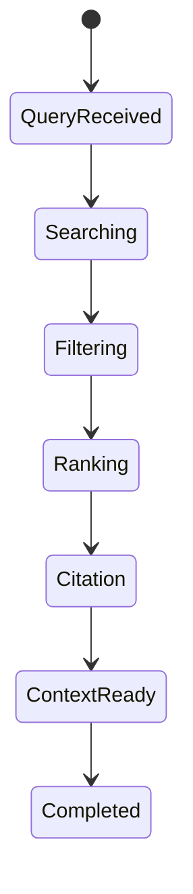

# OM-SOL-113 — Retrieval Pipeline

---

# Executive Summary

The Retrieval Pipeline is responsible for transforming user intent into trusted, ranked, and policy-compliant contextual information for AI reasoning.

Unlike conventional Retrieval-Augmented Generation (RAG) implementations that rely primarily on vector similarity search, the OneMind Retrieval Pipeline combines semantic search, keyword search, metadata filtering, business policies, contextual ranking, citation generation, and quality validation into a governed retrieval workflow.

This architecture ensures that downstream AI components receive context that is relevant, explainable, secure, and optimized for enterprise decision-making.

---

# Objectives

The Retrieval Pipeline shall:

- Interpret user intent
- Execute semantic and hybrid retrieval
- Apply metadata and policy filters
- Rank and rerank results
- Optimize context for token budgets
- Generate source citations
- Produce explainable retrieval outcomes

---

# Scope

## Included

- Query normalization
- Query expansion
- Embedding generation
- Hybrid search
- Metadata filtering
- Security filtering
- Reranking
- Citation generation
- Context handoff

## Excluded

- Knowledge storage (OM-SOL-110)
- Memory retrieval (OM-SOL-111)
- Prompt composition (OM-SOL-108)

---

# Responsibilities

The Retrieval Pipeline is responsible for:

- Query interpretation
- Candidate retrieval
- Hybrid search orchestration
- Result ranking
- Citation assembly
- Token optimization
- Retrieval telemetry

---

# Architecture Principles

- Retrieval shall be explainable.
- Security filtering precedes ranking.
- Hybrid search is the default strategy.
- Provenance is mandatory.
- Retrieval quality is measurable.
- Pipelines are composable and extensible.

---

# Runtime Components

| Component | Responsibility |
|-----------|----------------|
| Query Analyzer | Intent analysis and normalization |
| Query Expander | Synonyms and semantic enrichment |
| Embedding Service | Vector generation |
| Hybrid Search Engine | Vector + keyword retrieval |
| Metadata Filter | Business and security filtering |
| Ranking Engine | Relevance scoring |
| Citation Generator | Provenance creation |
| Context Exporter | Deliver ranked context |

---

# Logical Architecture


---

# Runtime Flow



---

# Retrieval Stages

| Stage | Description |
|---------|-------------|
| Query Analysis | Understand user intent |
| Query Expansion | Add semantic context |
| Embedding | Generate vector |
| Candidate Retrieval | Hybrid search |
| Metadata Filtering | Apply governance |
| Security Filtering | Remove unauthorized data |
| Ranking | Order by relevance |
| Citation | Generate provenance |
| Context Export | Deliver to orchestration |

---

# Hybrid Retrieval Strategy

The default retrieval mode combines:

- Semantic vector search
- Keyword search
- Metadata filtering
- Business taxonomy
- Temporal relevance
- Confidence scoring

---

# Ranking Strategy

Ranking factors include:

- Semantic similarity
- Business priority
- Freshness
- Source authority
- Security classification
- Document quality
- User context
- Workflow relevance

---

# Public Interfaces

| Interface | Purpose |
|------------|---------|
| Retrieve | Execute retrieval |
| HybridSearch | Combined search |
| Rank | Result ranking |
| GenerateCitation | Provenance |
| ExplainRetrieval | Explain ranking |

---

# Published Events

- RetrievalStarted
- RetrievalCompleted
- RetrievalFailed
- RankingCompleted
- CitationGenerated

---

# Consumed Events

- QuerySubmitted
- KnowledgeIndexed
- PolicyUpdated
- UserAuthenticated

---

# Data Ownership

The Retrieval Pipeline owns:

- Retrieval sessions
- Ranking metadata
- Query transformations
- Citation metadata

It does not own:

- Knowledge repositories
- Memory stores
- Prompt templates

---

# Retrieval Lifecycle



---

# Security Considerations

The runtime shall enforce:

- RBAC
- ABAC (optional)
- Tenant isolation
- Classification filtering
- PII masking
- Audit logging
- Secure query execution

---

# Non-Functional Requirements

| Requirement | Target |
|-------------|--------|
| Query analysis | <20 ms |
| Retrieval latency | <200 ms |
| Ranking latency | <50 ms |
| Hybrid search | Mandatory |
| Citation coverage | 100% |

---

# Observability

Metrics include:

- Retrieval latency
- Ranking latency
- Search accuracy
- Citation coverage
- Cache hit ratio
- Average context size
- Token efficiency
- Failed retrievals

---

# Error Handling

The runtime shall support:

- Partial retrieval
- Retry for transient failures
- Empty-result fallback
- Timeout handling
- Ranking degradation
- Citation recovery

---

# ADR Mapping

| ADR | Description |
|------|-------------|
| ADR-002 | Qdrant |
| ADR-003 | LiteLLM |

---

# Traceability

| Source | Target |
|---------|--------|
| OM-SOL-110 | Knowledge Runtime |
| OM-SOL-111 | Memory Runtime |
| OM-SOL-112 | Context Orchestration |
| OM-ARCH-093 | Retrieval-Augmented Generation Pattern |

---

# Draw.io Reference

```text
assets/diagrams/solution/
13-retrieval-pipeline.drawio
```

---

# Future Evolution

Future enhancements include:

- Graph-based retrieval
- Multi-vector retrieval
- Federated retrieval
- AI-assisted reranking
- Adaptive query expansion
- Cross-language retrieval
- Retrieval quality benchmarking

---

# Summary

The Retrieval Pipeline provides the governed execution flow for enterprise information retrieval within OneMind. By combining hybrid search, contextual ranking, security enforcement, provenance tracking, and quality validation, it ensures that downstream AI components receive trusted, relevant, and explainable context suitable for enterprise-grade reasoning and decision-making.