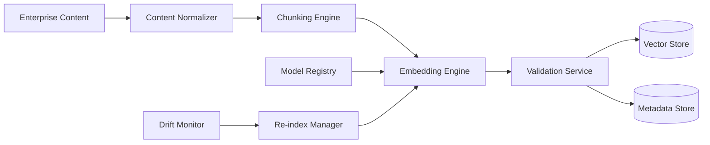
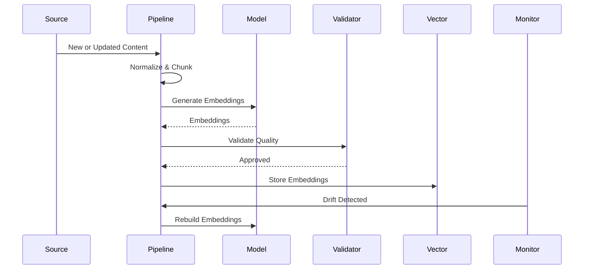
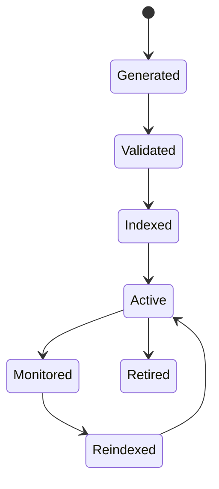

# OM-SOL-114 — Embedding Pipeline

---

# Executive Summary

The Embedding Pipeline is responsible for transforming enterprise information into high-quality vector representations that enable semantic understanding, retrieval, clustering, recommendation, and AI reasoning across the OneMind platform.

Rather than treating embeddings as static vectors, the pipeline governs the complete lifecycle of embedding generation, validation, versioning, storage, refresh, and retirement. It supports multiple embedding models, preserves provenance, and continuously monitors embedding quality and drift.

This capability establishes the semantic representation layer that underpins Knowledge Runtime, Memory Runtime, Retrieval Pipeline, and future AI capabilities.

---

# Objectives

The Embedding Pipeline shall:

- Generate semantic vector representations
- Support multiple embedding models
- Version embeddings independently of source data
- Detect embedding drift
- Validate embedding quality
- Support incremental re-indexing
- Maintain provenance and traceability
- Optimize embedding performance and cost

---

# Scope

## Included

- Content preprocessing
- Chunking
- Embedding generation
- Embedding versioning
- Vector persistence
- Incremental updates
- Re-index orchestration
- Quality evaluation
- Drift detection
- Metadata synchronization

## Excluded

- Knowledge retrieval (OM-SOL-113)
- Memory management (OM-SOL-111)
- Prompt orchestration (OM-SOL-108)

---

# Responsibilities

The Embedding Pipeline is responsible for:

- Content normalization
- Chunk generation
- Embedding generation
- Embedding validation
- Version management
- Storage coordination
- Drift monitoring
- Re-index scheduling
- Embedding lifecycle management

---

# Architecture Principles

- Embeddings are derived artifacts.
- Source content remains the system of record.
- Embeddings are versioned independently.
- Multiple embedding models may coexist.
- Regeneration shall be automated.
- Every embedding shall be traceable to its source.

---

# Runtime Components

| Component | Responsibility |
|-----------|----------------|
| Content Normalizer | Prepare source content |
| Chunking Engine | Split content into semantic chunks |
| Embedding Engine | Generate vector embeddings |
| Model Registry | Manage embedding model versions |
| Validation Service | Verify embedding quality |
| Vector Repository | Persist embeddings |
| Drift Monitor | Detect semantic degradation |
| Re-index Manager | Coordinate embedding refresh |

---

# Logical Architecture



---

# Runtime Flow



---

# Embedding Lifecycle



---

# Embedding Version Strategy

Each embedding shall maintain:

- Embedding ID
- Source Document ID
- Source Version
- Embedding Model
- Embedding Model Version
- Chunk Identifier
- Generation Timestamp
- Quality Score
- Drift Status

---

# Public Interfaces

| Interface | Purpose |
|------------|---------|
| GenerateEmbedding | Create embeddings |
| ValidateEmbedding | Quality verification |
| RefreshEmbedding | Regenerate vectors |
| DeleteEmbedding | Remove embeddings |
| GetEmbeddingMetadata | Retrieve metadata |
| ReindexCollection | Refresh collection |

---

# Published Events

- EmbeddingGenerated
- EmbeddingValidated
- EmbeddingUpdated
- EmbeddingRetired
- ReindexCompleted
- DriftDetected

---

# Consumed Events

- DocumentUploaded
- DocumentUpdated
- DocumentDeleted
- ModelVersionReleased
- ReindexRequested

---

# Data Ownership

The Embedding Pipeline owns:

- Embedding vectors
- Embedding metadata
- Chunk metadata
- Model references
- Drift records

It does **not** own:

- Source documents
- Enterprise knowledge
- Runtime memory

---

# Chunking Strategy

Supported chunking methods include:

- Fixed-size chunking
- Semantic chunking
- Section-aware chunking
- Hierarchical chunking
- Sliding window chunking

Chunking policies should be selected according to content type and retrieval objectives.

---

# Quality Evaluation

Embedding quality shall be assessed using:

- Coverage
- Semantic coherence
- Duplicate ratio
- Retrieval precision
- Retrieval recall
- Vector density
- Chunk completeness
- Citation accuracy

---

# Drift Detection

The Drift Monitor shall detect:

- Model drift
- Data drift
- Semantic drift
- Index inconsistency
- Embedding obsolescence

Upon detection, the Re-index Manager may schedule partial or full regeneration.

---

# Security Considerations

The runtime shall enforce:

- RBAC
- Tenant isolation
- Encryption at rest
- TLS in transit
- Metadata protection
- Audit logging
- Secure model access

---

# Non-Functional Requirements

| Requirement | Target |
|-------------|--------|
| Embedding generation | Asynchronous |
| Validation latency | <100 ms |
| Horizontal scaling | Supported |
| Multi-model support | Mandatory |
| Version traceability | Mandatory |

---

# Observability

Metrics include:

- Embedding throughput
- Generation latency
- Validation success rate
- Drift detection rate
- Re-index duration
- Chunk size distribution
- Model utilization
- Storage growth

---

# Error Handling

The runtime shall support:

- Retry for transient failures
- Partial regeneration
- Dead-letter queue
- Rollback to previous embedding version
- Validation failure reporting

---

# ADR Mapping

| ADR | Description |
|------|-------------|
| ADR-002 | Qdrant |
| ADR-003 | LiteLLM |

---

# Traceability

| Source | Target |
|---------|--------|
| OM-SOL-110 | Knowledge Runtime |
| OM-SOL-111 | Memory Runtime |
| OM-SOL-113 | Retrieval Pipeline |
| OM-ARCH-093 | Retrieval-Augmented Generation Pattern |

---

# Draw.io Reference

```text
assets/diagrams/solution/
14-embedding-pipeline.drawio
```

---

# Future Evolution

Future enhancements include:

- Adaptive embedding selection
- Multi-vector representation
- Cross-modal embeddings
- Federated embedding repositories
- Embedding compression
- Hardware-accelerated generation
- AI-assisted chunk optimization

---

# Summary

The Embedding Pipeline establishes the semantic representation layer of the OneMind platform. By governing the complete lifecycle of enterprise embeddings—from generation and validation to versioning, monitoring, and retirement—it ensures that all downstream AI capabilities operate on accurate, explainable, and continuously maintained semantic representations.