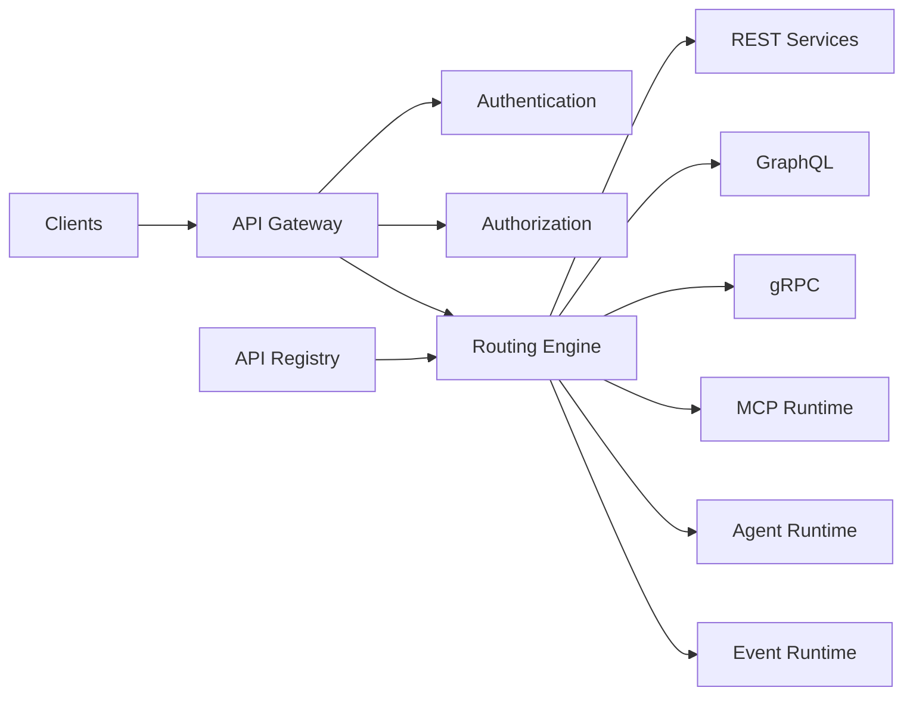
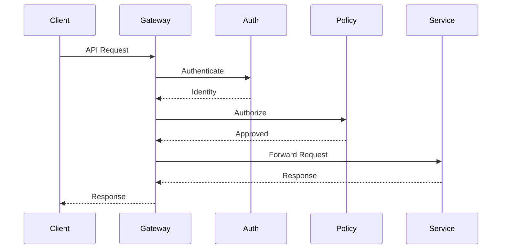
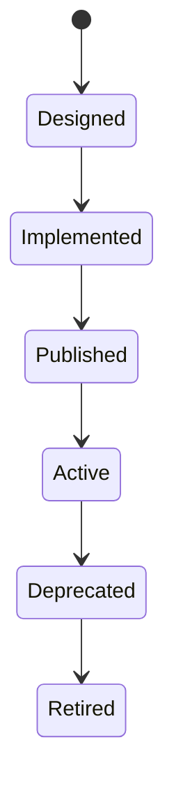

# OM-SOL-115 — API Gateway Architecture

---

# Executive Summary

The API Gateway Architecture provides the unified ingress layer for all external and internal interactions with the OneMind platform. It centralizes request routing, authentication, authorization, protocol translation, policy enforcement, observability, and traffic management across diverse communication models.

Unlike a traditional API gateway focused only on REST endpoints, the OneMind API Gateway supports REST, GraphQL, gRPC, Server-Sent Events (SSE), WebSockets, MCP (Model Context Protocol), Agent APIs, and Event APIs through a single governance framework.

This architecture establishes a secure, scalable, and extensible access layer that enables consistent integration with enterprise applications, AI agents, external services, and developer ecosystems.

---

# Objectives

The API Gateway shall:

- Provide a single entry point for platform services
- Support multiple communication protocols
- Enforce authentication and authorization
- Apply runtime governance and security policies
- Route requests intelligently
- Support API lifecycle management
- Enable observability and rate control
- Provide protocol abstraction for downstream services

---

# Scope

## Included

- REST APIs
- GraphQL APIs
- gRPC Services
- WebSocket connections
- Server-Sent Events
- MCP endpoints
- Agent APIs
- Event APIs
- Webhooks
- API versioning
- API discovery

## Excluded

- Internal service implementation
- Business logic
- Workflow execution
- Model inference

---

# Responsibilities

The API Gateway is responsible for:

- Request routing
- Authentication
- Authorization
- API version negotiation
- Rate limiting
- Traffic shaping
- Load balancing
- Protocol translation
- API discovery
- Request validation
- Response transformation
- Audit logging

---

# Architecture Principles

- API First
- Secure by Default
- Protocol Agnostic
- Stateless Request Processing
- Zero Trust
- Versioned Interfaces
- Backward Compatibility
- Observability by Design

---

# Runtime Components

| Component | Responsibility |
|-----------|----------------|
| API Gateway | Entry point |
| Authentication Service | Identity verification |
| Authorization Engine | Policy evaluation |
| Routing Engine | Intelligent routing |
| Protocol Adapter | REST / GraphQL / gRPC / MCP translation |
| Rate Limiter | Traffic protection |
| API Registry | Service discovery |
| Observability Collector | Metrics, logs, traces |

---

# Logical Architecture



---

# Runtime Flow



---

# Supported Protocols

| Protocol | Purpose |
|----------|---------|
| REST | Standard business APIs |
| GraphQL | Flexible data retrieval |
| gRPC | High-performance service communication |
| WebSocket | Real-time bidirectional communication |
| Server-Sent Events | Streaming updates |
| MCP | AI tool integration |
| Event API | Event publication and subscription |
| Webhook | External callbacks |

---

# API Lifecycle



---

# Public Interfaces

| Interface | Purpose |
|------------|---------|
| RegisterAPI | Register new endpoint |
| DiscoverAPI | Service discovery |
| RouteRequest | Intelligent routing |
| ValidateToken | Authentication |
| EvaluatePolicy | Authorization |
| PublishWebhook | External notification |

---

# Published Events

- APIRegistered
- APIPublished
- RequestReceived
- RequestCompleted
- RequestRejected
- RateLimitExceeded

---

# Consumed Events

- ServiceRegistered
- PolicyUpdated
- CertificateRenewed
- IdentityChanged

---

# Data Ownership

The API Gateway owns:

- API registry
- Routing configuration
- Gateway policies
- Traffic metrics
- API metadata

It does **not** own business data or service state.

---

# Security Considerations

The gateway shall enforce:

- OAuth2 / OpenID Connect
- JWT validation
- mTLS (internal services)
- API keys (where appropriate)
- RBAC / ABAC
- Rate limiting
- WAF integration
- TLS termination
- Audit logging

---

# Non-Functional Requirements

| Requirement | Target |
|-------------|--------|
| Request latency | <20 ms overhead |
| Availability | 99.99% |
| Horizontal scaling | Mandatory |
| Protocol support | Multi-protocol |
| Zero-downtime deployment | Required |

---

# Observability

Metrics include:

- Request rate
- Error rate
- Latency
- Authentication failures
- Authorization failures
- Rate limit violations
- Traffic by protocol
- API usage by consumer

---

# Error Handling

The runtime shall support:

- Standardized error responses
- Circuit breaker integration
- Retry guidance
- Graceful degradation
- Timeout management
- Request tracing

---

# ADR Mapping

| ADR | Description |
|------|-------------|
| ADR-003 | LiteLLM |
| ADR-004 *(future)* | API Gateway Technology Selection |

---

# Traceability

| Source | Target |
|---------|--------|
| OM-SOL-105 | AI Runtime |
| OM-SOL-109 | Tool Execution & MCP Runtime |
| OM-SOL-117 | Workflow Runtime |
| OM-SOL-118 | Integration Runtime |
| OM-ARCH-087 | API Design Standards |

---

# Draw.io Reference

```text
assets/diagrams/solution/
15-api-gateway-architecture.drawio
```

---

# Future Evolution

Future capabilities include:

- AI-assisted traffic optimization
- Dynamic API composition
- API marketplace
- GraphQL federation
- Service mesh integration
- Edge gateway deployment
- Adaptive rate limiting
- Multi-region gateway federation

---

# Summary

The API Gateway Architecture establishes a unified, secure, and protocol-agnostic integration layer for the OneMind platform. By supporting diverse communication models and enforcing centralized governance, it enables scalable connectivity between users, AI agents, enterprise systems, and external ecosystems while maintaining consistent security, observability, and operational excellence.