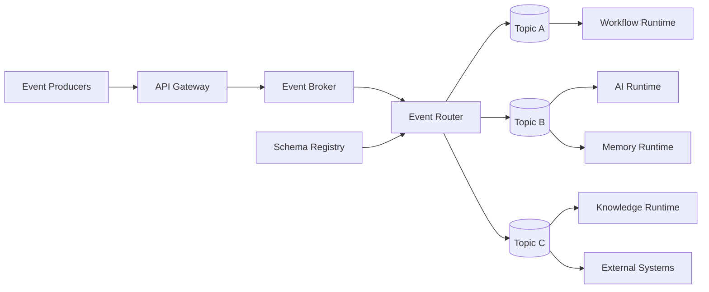
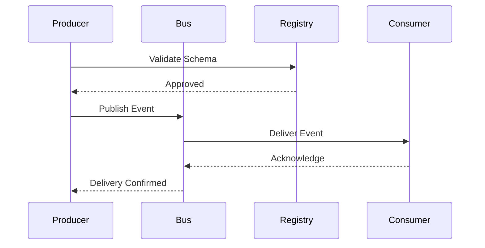
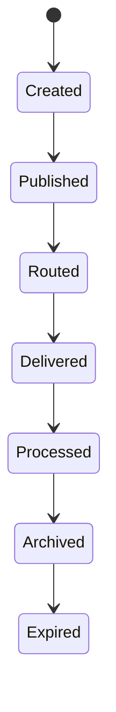

# OM-SOL-116 — Event Bus Architecture

---

# Executive Summary

The Event Bus Architecture provides the enterprise event backbone for the OneMind platform. It enables asynchronous, event-driven communication among AI runtimes, business services, workflows, external systems, and intelligent agents while maintaining governance, reliability, observability, and security.

Rather than acting solely as a messaging infrastructure, the Event Bus serves as the platform's integration fabric, allowing independent components to collaborate through immutable domain events without tight coupling.

This architecture supports scalability, resilience, extensibility, and real-time responsiveness across the entire OneMind ecosystem.

---

# Objectives

The Event Bus shall:

- Enable asynchronous communication
- Decouple platform components
- Support event-driven workflows
- Guarantee reliable event delivery
- Standardize enterprise event contracts
- Enable real-time processing
- Provide complete event observability
- Support multi-tenant event isolation

---

# Scope

## Included

- Event publication
- Event subscription
- Event routing
- Topic management
- Event replay
- Dead Letter Queue (DLQ)
- Event schema registry
- Event versioning
- Event governance
- Event monitoring

## Excluded

- Business process execution
- API request processing
- Persistent knowledge storage

---

# Responsibilities

The Event Bus is responsible for:

- Event transport
- Event routing
- Topic management
- Subscription management
- Delivery guarantees
- Event replay
- Event persistence
- Schema validation
- Event governance

---

# Architecture Principles

- Events are immutable.
- Producers do not know consumers.
- Consumers are independently deployable.
- Event contracts are versioned.
- Event schemas are centrally governed.
- Delivery guarantees are explicit.
- Events are traceable and auditable.

---

# Runtime Components

| Component | Responsibility |
|-----------|----------------|
| Event Broker | Event transport |
| Topic Manager | Topic lifecycle |
| Schema Registry | Event contract management |
| Event Router | Intelligent routing |
| Subscription Manager | Consumer registration |
| Replay Service | Historical replay |
| Dead Letter Queue | Failed message handling |
| Event Monitor | Metrics and tracing |

---

# Logical Architecture



---

# Runtime Flow



---

# Event Lifecycle



---

# Event Categories

| Category | Description |
|----------|-------------|
| Domain Events | Business state changes |
| Runtime Events | Platform runtime activities |
| Agent Events | Agent collaboration |
| Workflow Events | Process execution |
| Integration Events | External communication |
| Security Events | Authentication, authorization, audit |
| System Events | Infrastructure and operations |

---

# Delivery Guarantees

Supported delivery modes:

- At-most-once
- At-least-once
- Exactly-once (where supported)

Selection shall depend on business criticality and runtime requirements.

---

# Public Interfaces

| Interface | Purpose |
|------------|---------|
| PublishEvent | Publish an event |
| Subscribe | Register consumer |
| ReplayEvents | Replay historical events |
| ValidateSchema | Verify event contract |
| RegisterTopic | Create topic |
| GetEventStatus | Delivery tracking |

---

# Published Events

- EventPublished
- EventDelivered
- EventRejected
- EventExpired
- EventReplayed
- DeadLetterCreated

---

# Consumed Events

- SchemaRegistered
- ConsumerRegistered
- TopicCreated
- PolicyUpdated

---

# Event Contract

Every event shall include:

- Event ID
- Event Type
- Event Version
- Correlation ID
- Causation ID
- Timestamp
- Tenant ID
- Producer ID
- Payload
- Metadata
- Security Classification

---

# Data Ownership

The Event Bus owns:

- Event metadata
- Topic definitions
- Delivery status
- Subscription metadata
- Replay records

It does **not** own business data contained within event payloads.

---

# Security Considerations

The Event Bus shall enforce:

- Mutual TLS
- RBAC
- Tenant isolation
- Payload encryption (where required)
- Schema validation
- Digital signatures (optional)
- Audit logging

---

# Non-Functional Requirements

| Requirement | Target |
|-------------|--------|
| Publish latency | <20 ms |
| Delivery latency | <100 ms |
| Availability | 99.99% |
| Horizontal scaling | Mandatory |
| Event replay | Supported |

---

# Observability

Metrics include:

- Events per second
- Delivery latency
- Consumer lag
- Failed deliveries
- DLQ size
- Replay frequency
- Topic utilization
- Processing throughput

---

# Error Handling

The runtime shall support:

- Automatic retries
- Dead Letter Queue
- Poison message isolation
- Replay mechanisms
- Circuit breaker integration
- Consumer timeout detection

---

# ADR Mapping

| ADR | Description |
|------|-------------|
| ADR-005 *(future)* | Event Streaming Platform Selection |

---

# Traceability

| Source | Target |
|---------|--------|
| OM-SOL-106 | Agent Runtime |
| OM-SOL-111 | Memory Runtime |
| OM-SOL-117 | Workflow Runtime |
| OM-SOL-118 | Integration Runtime |
| OM-ARCH-091 | Event-Driven Architecture Pattern |

---

# Draw.io Reference

```text
assets/diagrams/solution/
16-event-bus-architecture.drawio
```

---

# Future Evolution

Future capabilities include:

- Event Mesh
- Cross-region federation
- Multi-cloud event routing
- Event sourcing
- CQRS integration
- AI-assisted routing optimization
- Event quality scoring
- Event lineage visualization

---

# Summary

The Event Bus Architecture establishes the enterprise event backbone for the OneMind platform. Through standardized event contracts, reliable asynchronous messaging, comprehensive governance, and rich observability, it enables loosely coupled collaboration among AI runtimes, business services, workflows, and external systems while supporting enterprise-scale resilience and extensibility.
