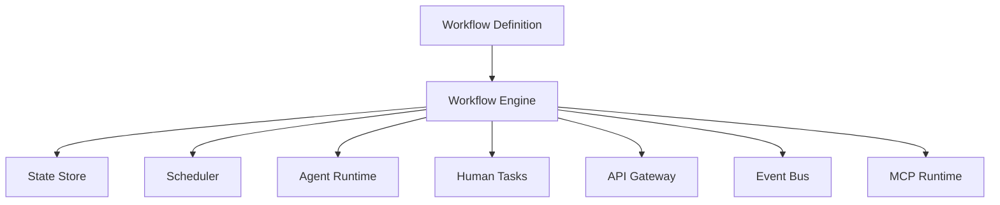
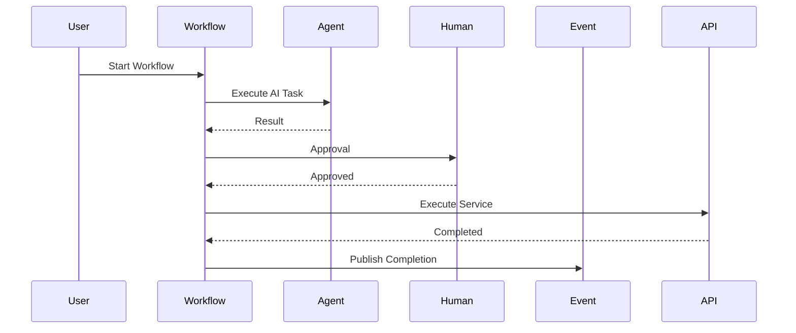
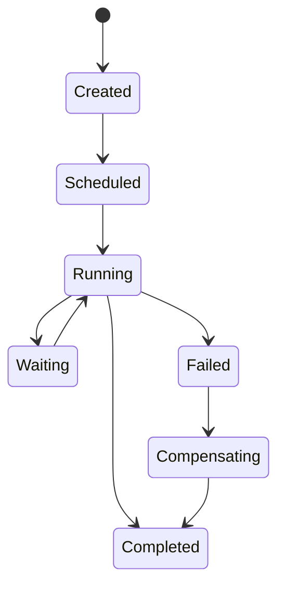

# OM-SOL-117 — Workflow Runtime

---

# Executive Summary

The Workflow Runtime is the enterprise orchestration engine of the OneMind platform. It coordinates long-running business processes, AI agent collaboration, human approvals, service integrations, and event-driven execution through a unified workflow model.

Unlike traditional workflow engines that focus on task sequencing, the OneMind Workflow Runtime orchestrates intelligent execution across humans, AI agents, APIs, MCP tools, events, and enterprise services.

This runtime establishes the operational backbone for business automation and AI-assisted process execution.

---

# Objectives

The Workflow Runtime shall:

- Execute business workflows
- Coordinate AI agent collaboration
- Support Human-in-the-Loop (HITL)
- Orchestrate service interactions
- React to platform events
- Manage long-running processes
- Support compensation and recovery
- Provide end-to-end workflow observability

---

# Scope

## Included

- Workflow orchestration
- Task scheduling
- Human approvals
- AI agent coordination
- Event-driven workflows
- Saga orchestration
- Compensation logic
- Workflow persistence
- Execution monitoring

## Excluded

- Business service implementation
- API gateway
- Event transport
- Knowledge storage

---

# Responsibilities

The Workflow Runtime is responsible for:

- Workflow execution
- State management
- Task dispatching
- Agent assignment
- Human task coordination
- Retry handling
- Timeout management
- Compensation execution
- Workflow auditing

---

# Architecture Principles

- Workflows are declarative.
- Execution is event-driven.
- Human and AI are equal participants.
- Long-running workflows are first-class citizens.
- Workflow state is durable.
- Compensation is preferred over rollback.

---

# Runtime Components

| Component | Responsibility |
|-----------|----------------|
| Workflow Engine | Execute workflows |
| State Manager | Persist execution state |
| Task Dispatcher | Assign work |
| Human Task Service | Human approvals |
| Agent Coordinator | AI collaboration |
| Event Adapter | Event integration |
| Compensation Manager | Recovery logic |
| Scheduler | Timers and delayed execution |

---

# Logical Architecture



---

# Runtime Flow



---

# Workflow Lifecycle



---

# Workflow Types

| Type | Description |
|------|-------------|
| Business Workflow | Enterprise process |
| AI Workflow | AI reasoning chain |
| Agent Workflow | Multi-agent collaboration |
| Human Workflow | Approval and review |
| Event Workflow | Event-driven execution |
| Integration Workflow | External systems |
| Scheduled Workflow | Time-based execution |

---

# Saga Pattern

Supported execution models:

- Orchestration Saga
- Choreography Saga
- Compensation Transactions
- Retry with Backoff
- Idempotent Activities

---

# Public Interfaces

| Interface | Purpose |
|------------|---------|
| StartWorkflow | Launch workflow |
| CancelWorkflow | Stop execution |
| ResumeWorkflow | Continue execution |
| CompleteTask | Finish activity |
| AssignTask | Dispatch work |
| GetWorkflowStatus | Runtime monitoring |

---

# Published Events

- WorkflowStarted
- WorkflowCompleted
- WorkflowFailed
- TaskAssigned
- TaskCompleted
- CompensationStarted
- CompensationCompleted

---

# Consumed Events

- APICompleted
- AgentCompleted
- HumanApproved
- TimerExpired
- ExternalEventReceived

---

# Data Ownership

The Workflow Runtime owns:

- Workflow definitions
- Execution state
- Task metadata
- Scheduling metadata
- Compensation records

It does **not** own business data processed within activities.

---

# Human-in-the-Loop

Supported capabilities:

- Manual approvals
- Escalation
- Delegation
- SLA monitoring
- Multi-stage approvals
- Parallel approvals

---

# Security Considerations

The runtime shall enforce:

- RBAC
- Workflow authorization
- Task-level permissions
- Audit logging
- Secure task assignment
- Tenant isolation

---

# Non-Functional Requirements

| Requirement | Target |
|-------------|--------|
| Workflow startup | <200 ms |
| State persistence | Durable |
| Horizontal scaling | Mandatory |
| Long-running workflows | Supported |
| Compensation | Mandatory |

---

# Observability

Metrics include:

- Active workflows
- Completed workflows
- Failed workflows
- Task duration
- SLA compliance
- Retry count
- Compensation rate
- Queue depth

---

# Error Handling

The runtime shall support:

- Automatic retries
- Exponential backoff
- Timeout recovery
- Compensation workflows
- Dead-letter handling
- Manual intervention

---

# ADR Mapping

| ADR | Description |
|------|-------------|
| ADR-006 *(future)* | Workflow Engine Selection |

---

# Traceability

| Source | Target |
|---------|--------|
| OM-SOL-106 | Agent Runtime |
| OM-SOL-109 | Tool Execution & MCP Runtime |
| OM-SOL-115 | API Gateway Architecture |
| OM-SOL-116 | Event Bus Architecture |
| OM-ARCH-092 | Agent Collaboration Pattern |

---

# Draw.io Reference

```text
assets/diagrams/solution/
17-workflow-runtime.drawio
```

---

# Future Evolution

Future capabilities include:

- BPMN 2.0 native execution
- AI-assisted workflow generation
- Adaptive workflow optimization
- Dynamic agent allocation
- Cross-organization workflow federation
- Predictive SLA management
- Digital twin simulation

---

# Summary

The Workflow Runtime is the orchestration core of the OneMind platform. By coordinating AI agents, humans, enterprise services, tools, and events through durable, observable, and policy-governed workflows, it enables intelligent business automation that is resilient, scalable, and enterprise-ready.