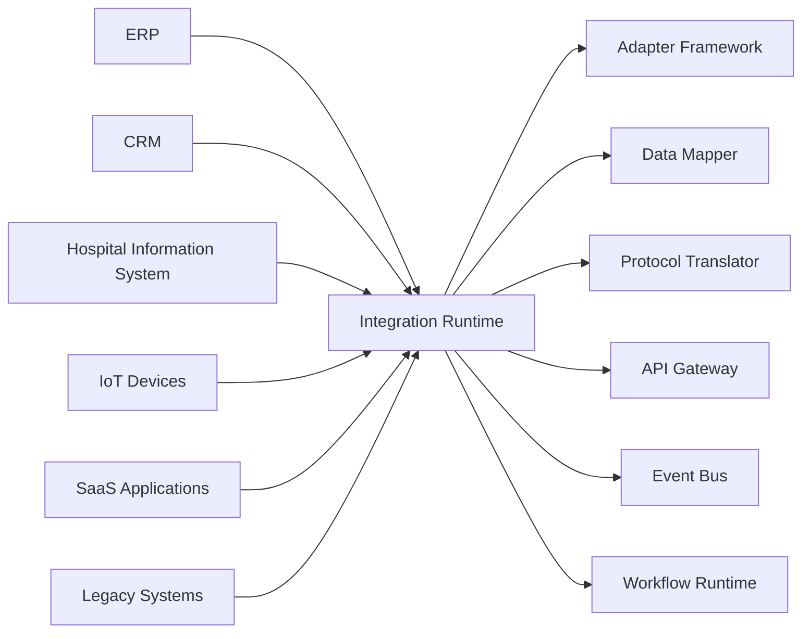
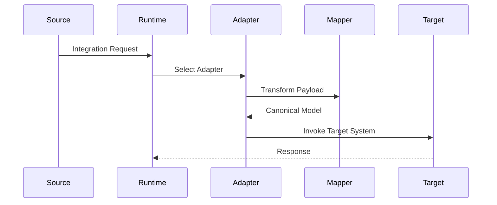
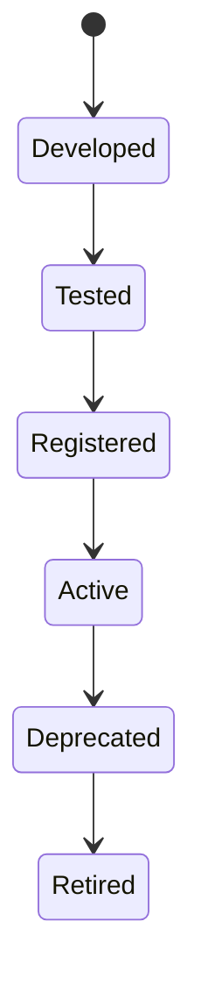

# OM-SOL-118 — Integration Runtime

---

# Executive Summary

The Integration Runtime provides the enterprise connectivity layer for the OneMind platform. It enables secure, scalable, and governed communication between OneMind and internal enterprise systems, external SaaS platforms, IoT devices, cloud services, and legacy applications.

Rather than implementing point-to-point integrations, the Integration Runtime standardizes connectivity through reusable adapters, integration contracts, protocol mediation, transformation services, and centralized governance.

This runtime allows OneMind to operate as the digital integration hub for intelligent enterprise ecosystems.

---

# Objectives

The Integration Runtime shall:

- Standardize enterprise integrations
- Support synchronous and asynchronous communication
- Provide reusable integration adapters
- Enable protocol mediation and data transformation
- Enforce integration governance
- Support hybrid cloud and on-premises connectivity
- Provide monitoring and resilience for integrations

---

# Scope

## Included

- Enterprise application integration
- SaaS integration
- Legacy system integration
- IoT integration
- File-based integration
- API integration
- Event integration
- Data transformation
- Adapter management
- Integration monitoring

## Excluded

- Workflow orchestration
- API gateway request routing
- Event transport infrastructure
- Business service implementation

---

# Responsibilities

The Integration Runtime is responsible for:

- Adapter execution
- Protocol translation
- Data mapping
- Message transformation
- Connection management
- Retry orchestration
- Error isolation
- Integration governance
- Integration observability

---

# Architecture Principles

- Adapter-first architecture
- Contract-driven integration
- Loose coupling
- Protocol abstraction
- Reusable connectors
- Secure by default
- Observable integrations

---

# Runtime Components

| Component | Responsibility |
|-----------|----------------|
| Integration Engine | Execute integrations |
| Adapter Framework | Standard connectors |
| Protocol Translator | Protocol mediation |
| Data Mapper | Schema transformation |
| Connection Manager | Endpoint management |
| Retry Manager | Failure recovery |
| Integration Registry | Adapter catalog |
| Monitoring Service | Metrics and health |

---

# Logical Architecture



---

# Runtime Flow



---

# Supported Integration Types

| Type | Examples |
|------|----------|
| REST API | ERP, CRM, HRM |
| GraphQL | Modern applications |
| gRPC | Internal microservices |
| Event Streaming | Kafka, Pulsar |
| Webhook | SaaS callbacks |
| File Transfer | CSV, XML, JSON |
| Database | JDBC/ODBC |
| IoT Protocols | MQTT, OPC-UA |
| Email | SMTP, IMAP |

---

# Adapter Lifecycle



---

# Public Interfaces

| Interface | Purpose |
|------------|---------|
| RegisterAdapter | Register connector |
| ExecuteIntegration | Invoke integration |
| ValidateContract | Verify payload |
| GetAdapterStatus | Health monitoring |
| RetryIntegration | Manual retry |

---

# Published Events

- IntegrationStarted
- IntegrationCompleted
- IntegrationFailed
- AdapterRegistered
- AdapterRetired

---

# Consumed Events

- WorkflowRequested
- APIRequestReceived
- EventReceived
- ScheduleTriggered

---

# Canonical Data Model

The Integration Runtime shall transform external payloads into canonical enterprise models before they are consumed by internal services.

Benefits include:

- Reduced coupling
- Simplified mappings
- Consistent validation
- Easier governance

---

# Data Ownership

The Integration Runtime owns:

- Adapter definitions
- Mapping configurations
- Connection metadata
- Integration logs
- Retry metadata

It does **not** own business entities exchanged through integrations.

---

# Security Considerations

The runtime shall enforce:

- Mutual TLS
- OAuth2/OpenID Connect
- API keys where appropriate
- Secrets management
- Payload encryption
- Audit logging
- Tenant isolation

---

# Non-Functional Requirements

| Requirement | Target |
|-------------|--------|
| Adapter startup | <100 ms |
| Transformation latency | <50 ms |
| Horizontal scaling | Mandatory |
| High availability | 99.99% |
| Retry support | Mandatory |

---

# Observability

Metrics include:

- Integration throughput
- Adapter latency
- Transformation errors
- Retry count
- Connection failures
- Success rate
- Payload size
- Endpoint availability

---

# Error Handling

The runtime shall support:

- Automatic retries
- Exponential backoff
- Circuit breakers
- Dead-letter queues
- Idempotent processing
- Fallback adapters

---

# ADR Mapping

| ADR | Description |
|------|-------------|
| ADR-005 *(future)* | Integration Platform Selection |
| ADR-006 *(future)* | Canonical Data Model Strategy |

---

# Traceability

| Source | Target |
|---------|--------|
| OM-SOL-115 | API Gateway Architecture |
| OM-SOL-116 | Event Bus Architecture |
| OM-SOL-117 | Workflow Runtime |
| OM-ARCH-091 | Event-Driven Architecture Pattern |
| OM-ARCH-087 | API Design Standards |

---

# Draw.io Reference

```text
assets/diagrams/solution/
18-integration-runtime.drawio
```

---

# Future Evolution

Future capabilities include:

- Low-code connector development
- AI-assisted data mapping
- Dynamic protocol discovery
- Event mesh federation
- Edge integration gateways
- Digital twin integration
- Semantic integration catalog

---

# Summary

The Integration Runtime establishes the enterprise connectivity foundation of the OneMind platform. By standardizing adapters, protocols, data transformation, and governance, it enables secure, resilient, and scalable integration across enterprise systems, cloud services, intelligent devices, and external ecosystems while minimizing coupling and maximizing interoperability.