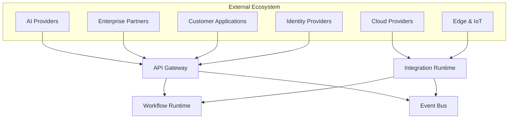

# OM-SOL-119 — External Connectivity

---

# Executive Summary

The External Connectivity Architecture defines how the OneMind platform securely and reliably connects with external ecosystems, including enterprise partners, cloud providers, AI service providers, identity platforms, edge environments, SaaS applications, and customer-facing channels.

Rather than treating external integrations as isolated connections, this architecture establishes a governed connectivity model based on trust boundaries, standardized interfaces, security zones, and enterprise connectivity policies.

This document completes the Integration Layer by defining how OneMind participates in a broader digital ecosystem while preserving security, interoperability, and operational resilience.

---

# Objectives

The External Connectivity Architecture shall:

- Standardize external connectivity
- Define trust boundaries
- Secure external communications
- Support hybrid and multi-cloud deployments
- Enable partner and third-party integrations
- Govern AI provider connectivity
- Support edge and mobile environments
- Ensure observability across external interfaces

---

# Scope

## Included

- Enterprise partner integrations
- AI provider connectivity
- Cloud provider connectivity
- Identity federation
- External APIs
- Webhooks
- Edge connectivity
- Mobile applications
- Customer portals
- Third-party SaaS

## Excluded

- Internal service communication
- Workflow orchestration
- Event transport implementation

---

# Responsibilities

The External Connectivity Architecture is responsible for:

- External interface governance
- Connectivity standards
- Trust boundary definition
- Secure communication
- Federation management
- External endpoint monitoring
- Connectivity resilience

---

# Architecture Principles

- Zero Trust by Default
- External systems are loosely coupled
- Standards over proprietary interfaces
- Encryption for all external communications
- Explicit trust boundaries
- Least privilege access
- Continuous verification

---

# External Connectivity Domains

| Domain | Examples |
|---------|----------|
| Enterprise Systems | ERP, CRM, HIS |
| AI Providers | OpenAI, Anthropic, Gemini, Local LLM |
| Cloud Services | AWS, Azure, GCP |
| Identity Providers | OAuth2, OpenID Connect, SAML |
| Partner Platforms | Suppliers, Government, Financial Institutions |
| Customer Channels | Web, Mobile, Chatbots |
| IoT & Edge | Sensors, PLCs, Gateways |
| Collaboration Tools | Email, Teams, Slack |

---

# Logical Architecture



---

# Trust Boundaries

```mermaid
flowchart LR

Internet

-->

DMZ

-->

API Gateway

-->

Internal Services

-->

Protected Data

style Internet fill:#fdd
style DMZ fill:#ffd
style Internal Services fill:#dfd
style Protected Data fill:#ccf
```

---

# Connectivity Patterns

Supported patterns include:

- Request / Response
- Publish / Subscribe
- Event Streaming
- File Exchange
- Webhooks
- Batch Synchronization
- Real-Time Streaming
- Federated Identity
- Secure Tunneling

---

# Identity Federation

Supported identity mechanisms:

- OAuth2
- OpenID Connect
- SAML 2.0
- Mutual TLS
- API Keys (limited use)
- Service Accounts

---

# AI Provider Connectivity

Supported deployment models:

- Local LLM
- Private Cloud AI
- Public AI APIs
- Multi-provider routing
- AI Gateway abstraction

---

# Security Zones

| Zone | Description |
|------|-------------|
| Public | Internet-facing services |
| DMZ | Controlled ingress |
| Integration | API and Adapter layer |
| Application | Business services |
| Data | Protected enterprise data |
| Management | Administrative services |

---

# Public Interfaces

| Interface | Purpose |
|------------|---------|
| RegisterPartner | Onboard external organization |
| RegisterProvider | Add AI or Cloud provider |
| ValidateConnection | Connectivity verification |
| ExchangeCertificate | Mutual trust establishment |
| GetConnectivityStatus | Health monitoring |

---

# Published Events

- PartnerConnected
- ProviderRegistered
- ConnectivityEstablished
- ConnectivityLost
- AuthenticationSucceeded
- AuthenticationFailed

---

# Consumed Events

- CertificateRenewed
- PolicyUpdated
- IdentityChanged
- EndpointDiscovered

---

# Data Ownership

The External Connectivity Architecture owns:

- Partner metadata
- Endpoint registry
- Connectivity policies
- Trust relationships
- Certificate metadata

It does **not** own external business data.

---

# Security Considerations

The architecture shall enforce:

- Zero Trust
- Mutual TLS
- Certificate lifecycle management
- OAuth2/OpenID Connect
- Network segmentation
- WAF integration
- DDoS protection
- Audit logging
- Continuous monitoring

---

# Non-Functional Requirements

| Requirement | Target |
|-------------|--------|
| External availability | 99.99% |
| TLS | Mandatory |
| Horizontal scalability | Mandatory |
| Multi-cloud support | Required |
| Federation support | Required |

---

# Observability

Metrics include:

- Connection success rate
- Authentication failures
- Provider availability
- API latency
- External throughput
- Certificate expiration
- Endpoint health
- Connectivity SLA

---

# Error Handling

The architecture shall support:

- Automatic retries
- Circuit breakers
- Endpoint failover
- Graceful degradation
- Provider fallback
- Connection quarantine

---

# ADR Mapping

| ADR | Description |
|------|-------------|
| ADR-003 | LiteLLM |
| ADR-005 *(future)* | Integration Platform Selection |
| ADR-007 *(future)* | External Connectivity Strategy |

---

# Traceability

| Source | Target |
|---------|--------|
| OM-SOL-115 | API Gateway Architecture |
| OM-SOL-116 | Event Bus Architecture |
| OM-SOL-118 | Integration Runtime |
| OM-ARCH-084 | Architecture Compliance Framework |
| OM-ARCH-087 | API Design Standards |

---

# Draw.io Reference

```text
assets/diagrams/solution/
19-external-connectivity.drawio
```

---

# Future Evolution

Future enhancements include:

- Multi-region connectivity
- Cross-organization federation
- AI provider marketplace
- Sovereign cloud connectivity
- Edge mesh networking
- Autonomous connection optimization
- Policy-driven adaptive routing

---

# Summary

The External Connectivity Architecture defines how OneMind securely participates in enterprise digital ecosystems. By standardizing trust boundaries, identity federation, connectivity patterns, and governance across external interactions, it enables resilient, scalable, and secure collaboration with partners, cloud platforms, AI providers, customer applications, and intelligent edge environments.