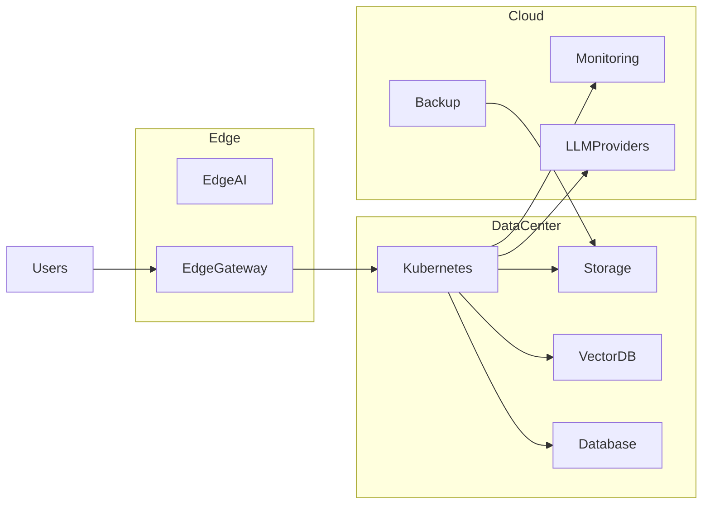
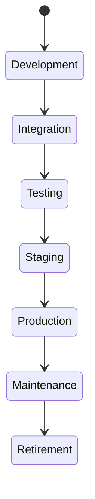

# OM-SOL-120 — Deployment Topology

---

# Executive Summary

The Deployment Topology defines how the OneMind platform is deployed across diverse infrastructure environments while maintaining portability, resilience, scalability, and operational consistency.

OneMind is designed as a cloud-neutral platform that supports Local Development, On-Premises, Private Cloud, Public Cloud, Hybrid Cloud, Multi-Cloud, and Edge deployments using a common architectural model.

The deployment architecture separates logical platform capabilities from infrastructure implementation, enabling organizations to select deployment models according to regulatory, security, performance, and operational requirements.

---

# Objectives

The Deployment Topology shall:

- Support multiple deployment models
- Enable infrastructure portability
- Provide high availability
- Support horizontal scalability
- Enable disaster recovery
- Minimize vendor lock-in
- Standardize deployment architecture
- Support AI workloads across heterogeneous environments

---

# Scope

## Included

- Local development
- On-premises deployment
- Private cloud
- Public cloud
- Hybrid cloud
- Multi-cloud
- Edge deployment
- Kubernetes deployment
- Container platform topology

## Excluded

- CI/CD implementation
- Infrastructure provisioning
- Monitoring configuration
- Security operations

---

# Architecture Principles

- Cloud Neutral
- Kubernetes First
- Immutable Infrastructure
- Infrastructure as Code
- Container Native
- Zero Downtime Deployment
- Environment Consistency

---

# Supported Deployment Models

| Model | Typical Usage |
|--------|---------------|
| Local | Development and testing |
| On-Premises | Regulated enterprises |
| Private Cloud | Enterprise platforms |
| Public Cloud | Elastic workloads |
| Hybrid Cloud | Mixed environments |
| Multi-Cloud | High resilience |
| Edge | Low-latency AI execution |

---

# Logical Deployment

```mermaid
flowchart TB

Users

-->

Gateway

-->

Application Services

-->

AI Runtime

-->

Knowledge Runtime

-->

Memory Runtime

-->

Data Platform

-->

Infrastructure
```

---

# Physical Deployment



---

# Kubernetes Topology

Core platform workloads include:

- API Gateway
- AI Runtime
- Agent Runtime
- Workflow Runtime
- Integration Runtime
- Knowledge Runtime
- Memory Runtime
- Event Bus
- Observability Stack

Each runtime shall be independently deployable and horizontally scalable.

---

# Deployment Zones

| Zone | Purpose |
|------|---------|
| Edge | Local processing |
| DMZ | External ingress |
| Application | Business workloads |
| AI | AI runtimes |
| Data | Persistent storage |
| Management | Platform administration |

---

# Infrastructure Components

| Component | Purpose |
|-----------|---------|
| Kubernetes | Container orchestration |
| PostgreSQL | Transactional data |
| Qdrant | Vector storage |
| Object Storage | Documents and artifacts |
| Message Broker | Event transport |
| API Gateway | External access |
| Observability Stack | Monitoring |

---

# Deployment Lifecycle



---

# Environment Strategy

| Environment | Purpose |
|-------------|---------|
| Local | Developer workstation |
| Dev | Feature development |
| Test | Functional testing |
| UAT | User acceptance |
| Staging | Pre-production |
| Production | Live operations |

---

# Non-Functional Requirements

| Requirement | Target |
|-------------|--------|
| Availability | 99.99% |
| Deployment automation | Mandatory |
| Horizontal scaling | Mandatory |
| Rolling updates | Supported |
| Platform portability | Mandatory |

---

# Security Considerations

The deployment topology shall enforce:

- Network segmentation
- TLS everywhere
- Secrets management
- Container image signing
- Secure supply chain
- Infrastructure hardening

---

# Observability

Deployment metrics include:

- Cluster health
- Node utilization
- Pod availability
- Deployment duration
- Resource consumption
- Infrastructure cost

---

# Disaster Recovery

Supported capabilities:

- Backup and restore
- Cross-region replication
- Infrastructure recreation
- Automated failover
- Recovery validation

---

# ADR Mapping

| ADR | Description |
|------|-------------|
| ADR-001 | PostgreSQL |
| ADR-002 | Qdrant |
| ADR-003 | LiteLLM |

---

# Traceability

| Source | Target |
|---------|--------|
| OM-SOL-105 | AI Runtime |
| OM-SOL-110 | Knowledge Runtime |
| OM-SOL-117 | Workflow Runtime |
| OM-SOL-118 | Integration Runtime |
| OM-ARCH-080 | Architecture Principles |

---

# Draw.io Reference

```text
assets/diagrams/solution/
20-deployment-topology.drawio
```

---

# Future Evolution

Future enhancements include:

- Multi-region Kubernetes federation
- Sovereign cloud deployments
- GPU resource scheduling
- Edge cluster federation
- AI workload optimization
- Autonomous infrastructure scaling

---

# Summary

The Deployment Topology defines a cloud-neutral, Kubernetes-first deployment architecture for OneMind. By supporting multiple deployment models, standardized environments, resilient infrastructure patterns, and enterprise operational practices, it enables organizations to deploy the platform consistently across development, on-premises, cloud, and edge environments.