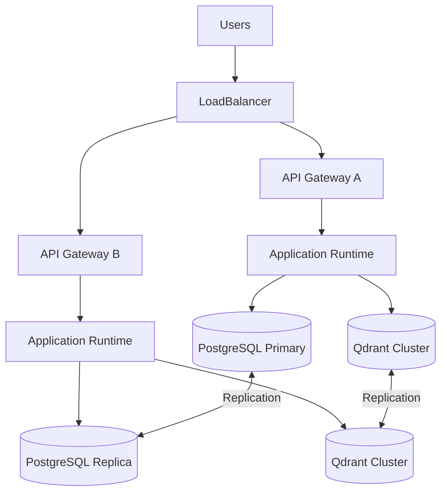
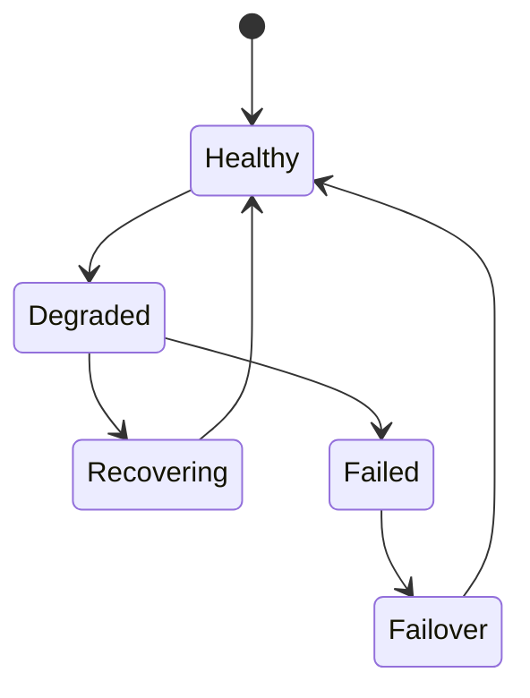

# OM-SOL-121 — High Availability Architecture

---

# Executive Summary

The High Availability Architecture defines the resilience strategy for the OneMind platform to ensure continuous operation despite infrastructure failures, software faults, network disruptions, or regional outages.

Rather than relying on infrastructure redundancy alone, OneMind adopts a resilience-by-design approach combining redundancy, fault isolation, automated recovery, graceful degradation, and continuous health monitoring.

This architecture enables enterprise-grade availability for AI services, business processes, knowledge management, and platform operations.

---

# Objectives

The High Availability Architecture shall:

- Minimize service downtime
- Eliminate single points of failure
- Support automatic failover
- Enable rolling upgrades without interruption
- Isolate failures between platform components
- Maintain data consistency during failures
- Support business continuity and disaster recovery

---

# Scope

## Included

- Multi-instance deployment
- Load balancing
- Health monitoring
- Active-Active topology
- Active-Passive topology
- Database replication
- Automatic failover
- Resilience patterns
- Service recovery

## Excluded

- Disaster Recovery planning (covered separately)
- Capacity planning
- Infrastructure provisioning

---

# Architecture Principles

- No Single Point of Failure (SPOF)
- Failure is expected
- Self-healing infrastructure
- Graceful degradation
- Stateless application services
- Automated recovery
- Continuous health verification

---

# High Availability Topology



---

# Availability Layers

| Layer | Strategy |
|--------|----------|
| Network | Redundant ingress |
| API Gateway | Multiple instances |
| Application Runtime | Stateless scaling |
| Workflow Runtime | Durable execution |
| Event Bus | Clustered brokers |
| Knowledge Runtime | Distributed indexing |
| Memory Runtime | Replicated storage |
| Data Layer | Replication and backup |

---

# Deployment Models

| Model | Characteristics |
|--------|-----------------|
| Active-Active | Maximum availability |
| Active-Passive | Cost-efficient resilience |
| Multi-AZ | Zone fault tolerance |
| Multi-Region | Regional resilience |

---

# Failure Handling



---

# Health Monitoring

The platform shall continuously evaluate:

- Liveness
- Readiness
- Startup health
- Dependency availability
- Database connectivity
- Message broker connectivity
- External provider availability
- AI model endpoint availability

---

# Resilience Patterns

Supported patterns include:

- Retry with exponential backoff
- Circuit breaker
- Bulkhead isolation
- Timeout protection
- Fallback services
- Request hedging
- Idempotent operations

---

# Load Balancing

Supported strategies:

- Round Robin
- Least Connections
- Weighted Routing
- Geographic Routing
- Session Affinity (when required)

---

# Data Availability

Persistent services shall support:

- Synchronous replication
- Asynchronous replication
- Automated backup
- Point-in-Time Recovery (PITR)
- Snapshot management

---

# Recovery Objectives

| Metric | Target |
|--------|--------|
| Availability | ≥99.99% |
| RTO | ≤30 minutes |
| RPO | ≤5 minutes |
| Automated failover | ≤2 minutes |

---

# Public Interfaces

| Interface | Purpose |
|------------|---------|
| GetHealthStatus | Platform health |
| TriggerFailover | Controlled failover |
| CheckReplication | Replication status |
| GetAvailabilityReport | Availability metrics |

---

# Published Events

- ServiceHealthy
- ServiceDegraded
- ServiceRecovered
- FailoverStarted
- FailoverCompleted
- ReplicaPromoted

---

# Consumed Events

- HealthCheckFailed
- InfrastructureAlert
- DatabaseUnavailable
- ClusterRecovered

---

# Security Considerations

High availability shall preserve:

- Authentication continuity
- Authorization consistency
- Secret replication
- Certificate availability
- Audit log durability

---

# Observability

Metrics include:

- Service availability
- Mean Time Between Failures (MTBF)
- Mean Time To Recovery (MTTR)
- Failover frequency
- Replica lag
- Recovery duration
- Error rate
- Dependency health

---

# Error Handling

The architecture shall support:

- Automatic restart
- Pod rescheduling
- Node replacement
- Service failover
- Traffic rerouting
- Graceful shutdown

---

# ADR Mapping

| ADR | Description |
|------|-------------|
| ADR-001 | PostgreSQL |
| ADR-002 | Qdrant |
| ADR-003 | LiteLLM |

---

# Traceability

| Source | Target |
|---------|--------|
| OM-SOL-120 | Deployment Topology |
| OM-SOL-123 | Observability Architecture |
| OM-SOL-124 | Platform Operations |
| OM-ARCH-080 | Architecture Principles |

---

# Draw.io Reference

```text
assets/diagrams/solution/
21-high-availability-architecture.drawio
```

---

# Future Evolution

Future enhancements include:

- Multi-region active-active deployment
- Autonomous failover orchestration
- Predictive failure detection
- AI-assisted resilience optimization
- Self-healing infrastructure
- Chaos engineering integration

---

# Summary

The High Availability Architecture establishes the resilience foundation of the OneMind platform. By combining redundancy, automated recovery, fault isolation, health monitoring, and proven resilience patterns, it enables continuous operation of enterprise AI services while minimizing downtime and operational risk.