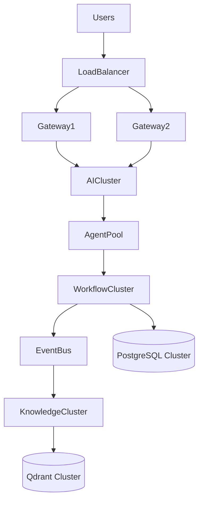
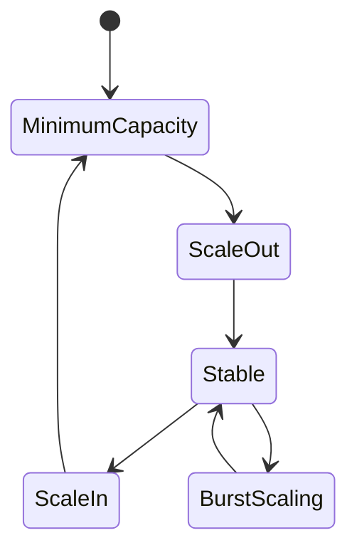

# OM-SOL-122 — Scalability Architecture

---

# Executive Summary

The Scalability Architecture defines how the OneMind platform expands computational capacity, storage, networking, and AI resources while maintaining consistent performance, reliability, and operational efficiency.

Unlike traditional enterprise systems, OneMind must scale heterogeneous workloads including AI inference, multi-agent collaboration, knowledge retrieval, workflow orchestration, event processing, and real-time integrations. This architecture establishes elastic scaling strategies that enable growth from proof-of-concept deployments to enterprise and national-scale implementations.

---

# Objectives

The Scalability Architecture shall:

- Support horizontal and vertical scaling
- Enable elastic AI workload execution
- Scale independent platform runtimes
- Optimize GPU and CPU utilization
- Support distributed storage
- Maintain predictable performance under increasing load
- Enable automated capacity expansion

---

# Scope

## Included

- Horizontal scaling
- Vertical scaling
- Autoscaling
- GPU scaling
- Stateless services
- Distributed data services
- Queue-based workload distribution
- Capacity planning

## Excluded

- Infrastructure provisioning
- Disaster recovery
- Cost optimization

---

# Architecture Principles

- Scale out before scale up
- Stateless services by default
- Independent runtime scaling
- Elastic infrastructure
- Event-driven workload distribution
- AI resource awareness
- Capacity driven by demand

---

# Scaling Dimensions

| Dimension | Strategy |
|-----------|----------|
| API Layer | Horizontal autoscaling |
| AI Runtime | GPU-aware scaling |
| Agent Runtime | Independent worker scaling |
| Workflow Runtime | Queue-based scaling |
| Event Bus | Partition expansion |
| Knowledge Runtime | Distributed indexing |
| Memory Runtime | Distributed caching |
| Database | Read replicas and partitioning |

---

# Logical Scaling Model



---

# Elastic Runtime



---

# Autoscaling Strategy

The platform shall support:

- CPU-based autoscaling
- Memory-based autoscaling
- Queue-length autoscaling
- Request-rate autoscaling
- GPU utilization autoscaling
- Custom business metrics

---

# AI Runtime Scaling

AI workloads shall support:

- Model replication
- GPU pool allocation
- Dynamic model loading
- Multi-model routing
- Token-aware scheduling
- Inference batching

---

# Data Layer Scaling

Persistent services shall support:

| Component | Strategy |
|-----------|----------|
| PostgreSQL | Read replicas, partitioning |
| Qdrant | Distributed collections |
| Object Storage | Horizontal expansion |
| Cache | Distributed cache cluster |

---

# Event Scaling

The Event Bus shall support:

- Topic partitioning
- Consumer groups
- Parallel event processing
- Backpressure management
- Dynamic consumer allocation

---

# Capacity Planning

Capacity planning shall consider:

- Concurrent users
- Active AI agents
- Workflow executions
- Event throughput
- LLM token consumption
- Embedding generation
- Vector search volume
- Storage growth

---

# Public Interfaces

| Interface | Purpose |
|------------|---------|
| GetCapacityStatus | Current utilization |
| TriggerScaleOut | Manual scaling |
| TriggerScaleIn | Capacity reduction |
| GetScalingMetrics | Elasticity metrics |

---

# Published Events

- ScaleOutStarted
- ScaleOutCompleted
- ScaleInStarted
- ScaleInCompleted
- CapacityThresholdExceeded

---

# Consumed Events

- HighLoadDetected
- QueueThresholdExceeded
- GPUCapacityExceeded
- ResourceRecovered

---

# Data Ownership

The Scalability Architecture owns:

- Scaling policies
- Capacity thresholds
- Runtime scaling metadata
- Autoscaling configurations

---

# Security Considerations

Scaling operations shall preserve:

- Identity propagation
- Policy consistency
- Secret synchronization
- Tenant isolation
- Audit logging

---

# Non-Functional Requirements

| Requirement | Target |
|-------------|--------|
| Horizontal scaling | Mandatory |
| Autoscaling reaction | <60 seconds |
| Stateless services | Required |
| GPU utilization | >80% target |
| Zero-downtime scaling | Required |

---

# Observability

Metrics include:

- CPU utilization
- Memory utilization
- GPU utilization
- Active replicas
- Queue depth
- Requests per second
- Token throughput
- Autoscaling events

---

# Error Handling

The architecture shall support:

- Scaling rollback
- Capacity throttling
- Resource quota enforcement
- Graceful overload handling
- Admission control
- Workload shedding

---

# ADR Mapping

| ADR | Description |
|------|-------------|
| ADR-001 | PostgreSQL |
| ADR-002 | Qdrant |
| ADR-003 | LiteLLM |

---

# Traceability

| Source | Target |
|---------|--------|
| OM-SOL-105 | AI Runtime |
| OM-SOL-116 | Event Bus Architecture |
| OM-SOL-120 | Deployment Topology |
| OM-SOL-121 | High Availability Architecture |
| OM-ARCH-080 | Architecture Principles |

---

# Draw.io Reference

```text
assets/diagrams/solution/
22-scalability-architecture.drawio
```

---

# Future Evolution

Future enhancements include:

- Predictive autoscaling using AI
- Kubernetes Cluster Autoscaler integration
- GPU federation across clusters
- Multi-region workload balancing
- AI-driven capacity planning
- Carbon-aware workload scheduling
- Cost-aware autoscaling
- Autonomous runtime optimization

---

# Summary

The Scalability Architecture establishes the elasticity model for the OneMind platform. By enabling independent runtime scaling, intelligent AI workload distribution, GPU-aware scheduling, and automated capacity management, it ensures that the platform can evolve seamlessly from small proof-of-concept deployments to enterprise and national-scale AI operating environments while maintaining performance, resilience, and operational efficiency.