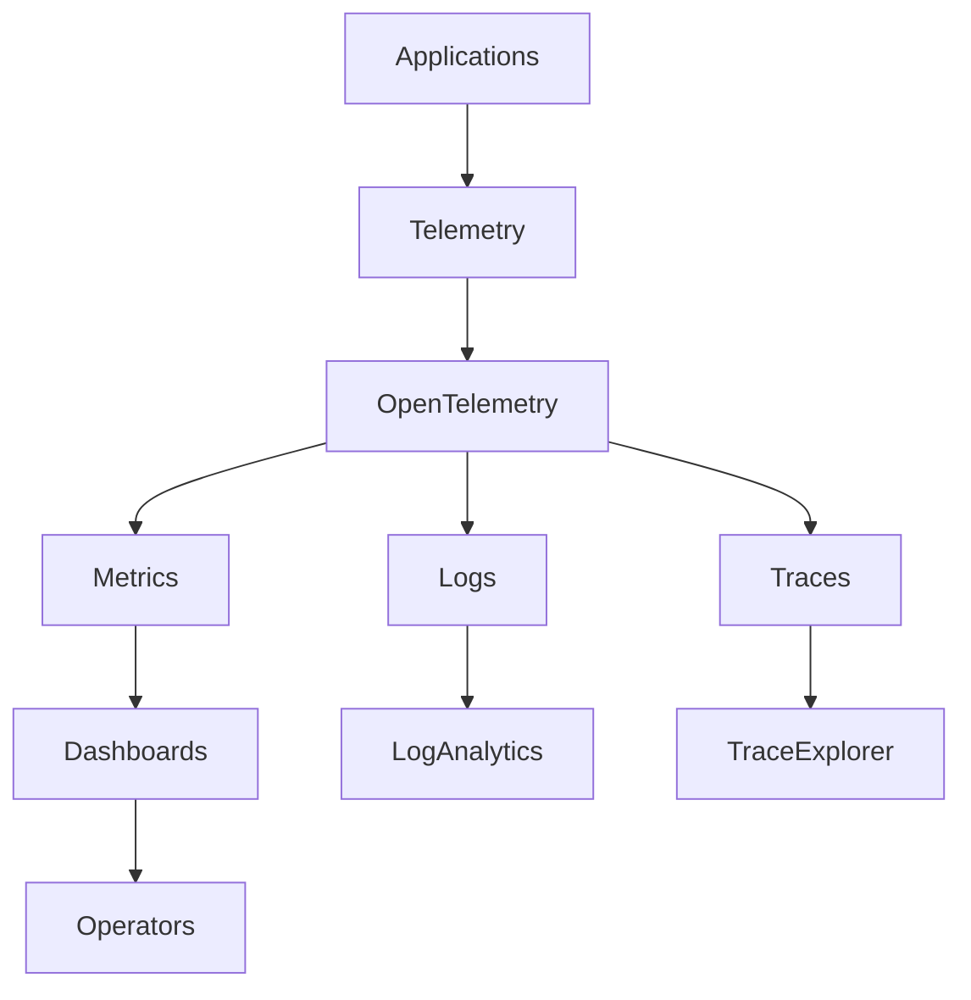
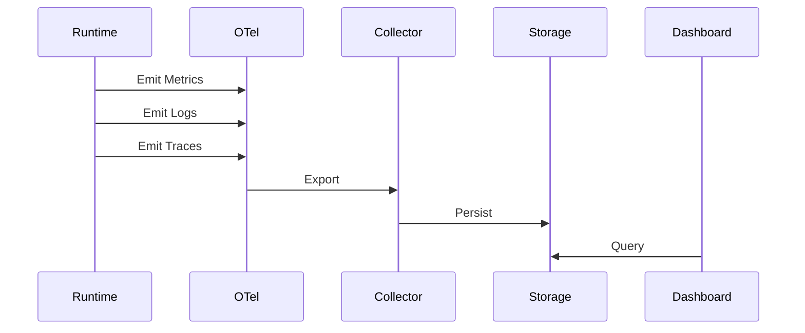

# OM-SOL-123 — Observability Architecture

---

# Executive Summary

The Observability Architecture defines how the OneMind platform provides comprehensive visibility into infrastructure, platform services, AI runtimes, multi-agent collaboration, workflows, integrations, and business operations.

Unlike traditional monitoring solutions that focus only on infrastructure health, OneMind adopts a full-stack observability model combining metrics, logs, traces, events, AI telemetry, and business KPIs. This architecture enables proactive operations, rapid troubleshooting, performance optimization, and AI governance across the entire platform.

---

# Objectives

The Observability Architecture shall:

- Provide end-to-end platform visibility
- Enable proactive incident detection
- Support distributed tracing
- Monitor AI model behavior
- Track agent collaboration
- Measure business outcomes
- Enable AIOps capabilities
- Support continuous optimization

---

# Scope

## Included

- Metrics collection
- Centralized logging
- Distributed tracing
- AI telemetry
- Agent telemetry
- Workflow monitoring
- Event monitoring
- Business KPI monitoring
- Alerting
- Dashboards

## Excluded

- Incident response procedures
- Security Operations (SOC)
- Capacity planning

---

# Architecture Principles

- Observability by Design
- OpenTelemetry First
- Correlation Across Layers
- Actionable Insights
- Low Operational Overhead
- Business-Centric Monitoring
- AI Transparency

---

# Observability Stack

| Layer | Capability |
|--------|------------|
| Infrastructure | CPU, Memory, Disk, Network |
| Kubernetes | Cluster Health |
| Platform | Runtime Health |
| AI Runtime | Model Performance |
| Agent Runtime | Collaboration Metrics |
| Workflow Runtime | Execution Metrics |
| Event Bus | Throughput & Lag |
| Business Layer | KPIs |

---

# Logical Architecture



---

# Observability Pipeline



---

# Telemetry Domains

| Domain | Examples |
|---------|----------|
| Infrastructure | CPU, Memory |
| Containers | Pod Health |
| API Gateway | Latency |
| AI Runtime | Token Usage |
| Agent Runtime | Task Success |
| Workflow | Duration |
| Event Bus | Queue Lag |
| Integration | Adapter Errors |
| Business | SLA, KPI |

---

# AI Telemetry

The platform shall collect:

- Model latency
- Prompt execution time
- Token consumption
- Completion length
- Model routing decisions
- Hallucination indicators
- Cache hit ratio
- Embedding latency
- Vector search latency

---

# Agent Telemetry

The platform shall monitor:

- Agent lifecycle
- Task assignments
- Success rate
- Failure rate
- Collaboration graph
- Retry count
- Tool usage
- Memory access

---

# Distributed Tracing

Tracing shall support:

- End-to-end request tracking
- Cross-runtime correlation
- Parent-child span relationships
- Workflow execution tracing
- Agent interaction tracing
- External API tracing

---

# Logging Strategy

The platform shall support:

- Structured logging
- Correlation IDs
- Centralized log collection
- Log retention policies
- Searchable logs
- Audit logs
- AI execution logs

---

# Alerting Strategy

Alerts shall be generated for:

- Runtime failures
- High latency
- Error thresholds
- Queue saturation
- AI provider failures
- Workflow failures
- Infrastructure degradation
- SLA violations

---

# Dashboards

Standard dashboards include:

- Platform Overview
- Infrastructure Health
- AI Runtime
- Agent Collaboration
- Workflow Execution
- API Performance
- Business Operations
- Executive KPI Dashboard

---

# Public Interfaces

| Interface | Purpose |
|------------|---------|
| GetMetrics | Retrieve metrics |
| QueryLogs | Search logs |
| QueryTraces | Analyze traces |
| GetDashboard | Dashboard access |
| GetHealthSummary | Platform health |

---

# Published Events

- AlertRaised
- AlertResolved
- SLAExceeded
- TelemetryCollected
- DashboardUpdated

---

# Consumed Events

- RuntimeStarted
- RuntimeStopped
- WorkflowCompleted
- AIExecutionCompleted
- InfrastructureAlert

---

# Data Ownership

The Observability Architecture owns:

- Metrics
- Logs
- Traces
- Alert metadata
- Dashboard definitions
- Telemetry configuration

---

# Security Considerations

Observability shall enforce:

- RBAC for dashboards
- Sensitive data masking
- Secure telemetry transport
- Audit logging
- Tenant isolation
- Compliance retention

---

# Non-Functional Requirements

| Requirement | Target |
|-------------|--------|
| Metrics latency | <10 seconds |
| Log ingestion | Near real-time |
| Trace collection | ≥99% |
| Dashboard availability | 99.99% |
| Alert latency | <30 seconds |

---

# Observability KPIs

| KPI | Target |
|-----|--------|
| MTTR | <30 min |
| MTTD | <5 min |
| Alert accuracy | >95% |
| AI success rate | >99% |
| Workflow success | >99.5% |

---

# AIOps Readiness

Future AIOps capabilities include:

- Anomaly detection
- Predictive failure analysis
- Root cause analysis
- AI-assisted troubleshooting
- Automated remediation
- Capacity prediction

---

# ADR Mapping

| ADR | Description |
|------|-------------|
| ADR-003 | LiteLLM |
| ADR-008 *(future)* | Observability Platform Selection |

---

# Traceability

| Source | Target |
|---------|--------|
| OM-SOL-105 | AI Runtime |
| OM-SOL-117 | Workflow Runtime |
| OM-SOL-121 | High Availability Architecture |
| OM-SOL-122 | Scalability Architecture |
| OM-ARCH-096 | Architecture Metrics and KPIs |

---

# Draw.io Reference

```text
assets/diagrams/solution/
23-observability-architecture.drawio
```

---

# Future Evolution

Future enhancements include:

- AI-generated operational insights
- Autonomous anomaly detection
- Digital twin observability
- Cross-cluster telemetry federation
- Business process mining
- Sustainability dashboards
- FinOps integration
- Autonomous Operations (NoOps)

---

# Summary

The Observability Architecture provides full-stack visibility across the OneMind platform. By integrating metrics, logs, traces, AI telemetry, agent telemetry, and business KPIs into a unified observability framework, it enables proactive operations, resilient AI services, faster incident resolution, and continuous optimization for enterprise-scale intelligent platforms.