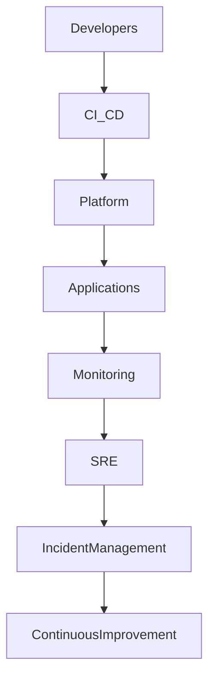
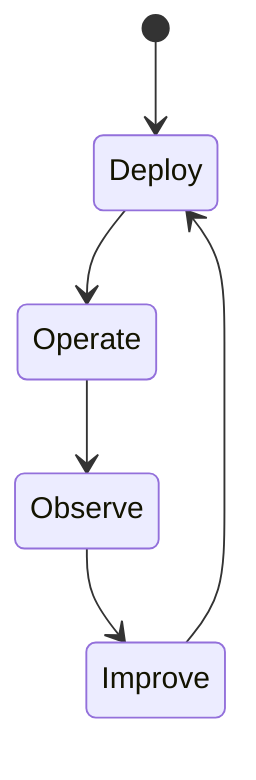
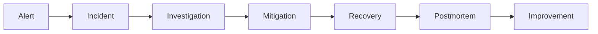

# OM-SOL-124 — Platform Operations

---

# Executive Summary

The Platform Operations Architecture defines the operational model required to run the OneMind platform reliably, securely, and efficiently in production.

Unlike traditional IT operations that focus primarily on infrastructure, OneMind operations encompass AI runtimes, multi-agent systems, workflows, knowledge services, integrations, and business capabilities. This document establishes an enterprise operating model based on Site Reliability Engineering (SRE), Platform Engineering, DevSecOps, and AI Operations (AIOps).

---

# Objectives

The Platform Operations Architecture shall:

- Standardize day-to-day platform operations
- Enable reliable service delivery
- Support continuous deployment
- Improve operational resilience
- Minimize operational risk
- Automate routine operational activities
- Enable AI-assisted operations
- Support continuous improvement

---

# Scope

## Included

- Day-2 Operations
- Site Reliability Engineering (SRE)
- Platform Engineering
- DevSecOps
- Incident Management
- Problem Management
- Change Management
- Release Management
- Operational Runbooks
- Capacity Operations
- AI Operations (AIOps)

## Excluded

- Enterprise governance
- Security governance
- Business continuity planning

---

# Architecture Principles

- Operations by Design
- Everything as Code
- Automation First
- Self-Service Platform
- Reliability over Complexity
- Continuous Improvement
- AI-Assisted Operations

---

# Operational Domains

| Domain | Responsibility |
|----------|----------------|
| Platform Engineering | Platform lifecycle |
| SRE | Reliability & availability |
| DevSecOps | CI/CD & security |
| Infrastructure | Compute, storage, networking |
| AI Operations | AI runtime management |
| Knowledge Operations | Knowledge lifecycle |
| Data Operations | Databases & storage |
| Integration Operations | External connectivity |
| Support Operations | Incident handling |

---

# Operational Architecture



---

# Operational Lifecycle



---

# Operational Processes

| Process | Description |
|----------|-------------|
| Deployment | Automated release |
| Monitoring | Health monitoring |
| Incident Response | Fault recovery |
| Problem Management | Root cause analysis |
| Change Management | Controlled change |
| Capacity Management | Resource planning |
| Backup & Restore | Data protection |
| Patch Management | Platform maintenance |

---

# Operational Responsibilities

## Platform Engineering

- Kubernetes platform
- Runtime services
- Infrastructure automation
- Platform upgrades

## Site Reliability Engineering

- Reliability
- Availability
- Performance
- Capacity
- Error budgets

## AI Operations

- LLM lifecycle
- Model deployment
- Model versioning
- Prompt management
- Embedding services
- AI quality monitoring

---

# Release Strategy

Supported deployment methods:

- Blue-Green Deployment
- Rolling Deployment
- Canary Release
- Feature Flags
- Progressive Delivery

---

# Incident Management



---

# Runbooks

Standard operational runbooks shall exist for:

- Cluster failure
- Database failover
- AI provider outage
- Workflow recovery
- Event bus recovery
- Vector database recovery
- Backup restoration
- Security incident response

---

# Service Level Objectives

| Service | Target |
|----------|--------|
| Platform Availability | 99.99% |
| API Availability | 99.99% |
| AI Runtime | 99.9% |
| Knowledge Runtime | 99.9% |
| Workflow Runtime | 99.9% |

---

# Error Budgets

Error budgets shall be defined for:

- API latency
- Platform downtime
- AI inference failures
- Workflow failures
- Event delivery failures

---

# Operational Metrics

Metrics include:

- Deployment frequency
- Lead time
- MTTR
- MTTD
- Change failure rate
- Platform uptime
- AI success rate
- Workflow success rate

---

# Public Interfaces

| Interface | Purpose |
|------------|---------|
| GetPlatformStatus | Platform overview |
| GetOperationalMetrics | Operational KPIs |
| TriggerMaintenance | Maintenance mode |
| GetRunbook | Operational guidance |
| GetIncidentStatus | Incident tracking |

---

# Published Events

- DeploymentCompleted
- MaintenanceStarted
- MaintenanceCompleted
- IncidentOpened
- IncidentResolved
- CapacityExceeded
- PlatformRecovered

---

# Consumed Events

- MonitoringAlert
- SecurityAlert
- DeploymentRequested
- BackupCompleted
- WorkflowFailed

---

# Security Considerations

Platform operations shall enforce:

- Least privilege access
- Segregation of duties
- Secure automation
- Audit logging
- Secrets management
- Operational approval workflows

---

# Non-Functional Requirements

| Requirement | Target |
|-------------|--------|
| Deployment automation | Mandatory |
| Self-healing | Required |
| Runbook coverage | 100% Critical Services |
| Mean Time To Detect | <5 min |
| Mean Time To Recover | <30 min |

---

# Operational Maturity

| Level | Description |
|---------|-------------|
| Level 1 | Manual Operations |
| Level 2 | Automated Operations |
| Level 3 | Self-Service Platform |
| Level 4 | AI-Assisted Operations |
| Level 5 | Autonomous Operations |

---

# ADR Mapping

| ADR | Description |
|------|-------------|
| ADR-001 | PostgreSQL |
| ADR-002 | Qdrant |
| ADR-003 | LiteLLM |

---

# Traceability

| Source | Target |
|---------|--------|
| OM-SOL-120 | Deployment Topology |
| OM-SOL-121 | High Availability Architecture |
| OM-SOL-122 | Scalability Architecture |
| OM-SOL-123 | Observability Architecture |
| OM-ARCH-097 | Architecture Governance Operating Model |

---

# Draw.io Reference

```text
assets/diagrams/solution/
24-platform-operations.drawio
```

---

# Future Evolution

Future enhancements include:

- Autonomous Operations (NoOps)
- AI-generated runbooks
- Predictive maintenance
- Self-healing infrastructure
- Intelligent capacity optimization
- AI-assisted incident response
- Autonomous release orchestration
- Digital operations twin

---

# Summary

The Platform Operations Architecture defines the enterprise operating model for OneMind. By integrating SRE, Platform Engineering, DevSecOps, AIOps, and operational excellence into a unified framework, it enables reliable, scalable, secure, and continuously improving operations for enterprise AI platforms.