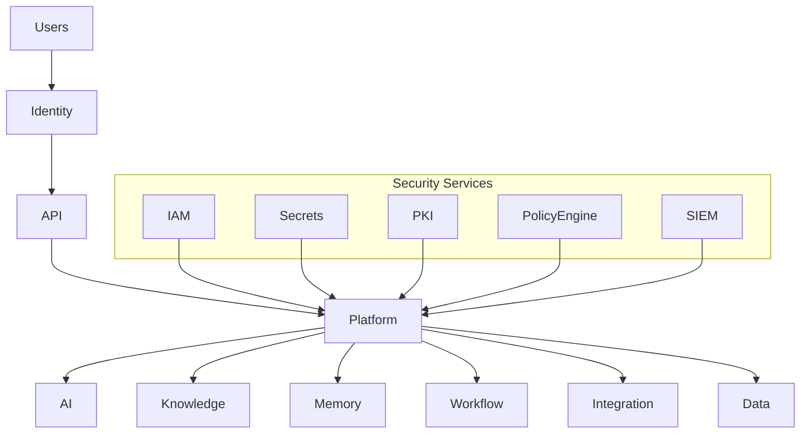

# OM-SOL-125 — Enterprise Security Architecture

---

# Executive Summary

The Enterprise Security Architecture defines the security foundation of the OneMind platform. It establishes a defense-in-depth strategy that protects identities, workloads, data, AI services, integrations, and operational infrastructure while enabling secure innovation and enterprise agility.

Security is treated as a cross-cutting architectural capability rather than an isolated subsystem. Every runtime, service, workflow, and AI component participates in a Zero Trust security model.

This architecture aligns with internationally recognized frameworks including ISO/IEC 27001, ISO/IEC 42001, NIST Cybersecurity Framework (CSF) 2.0, NIST AI Risk Management Framework (AI RMF), OWASP ASVS, and applicable privacy regulations such as PDPA and GDPR.

---

# Objectives

The Enterprise Security Architecture shall:

- Protect enterprise assets
- Enforce Zero Trust principles
- Secure AI workloads
- Protect enterprise knowledge
- Support regulatory compliance
- Enable secure software delivery
- Minimize attack surfaces
- Provide continuous security monitoring

---

# Scope

## Included

- Identity security
- Network security
- Application security
- API security
- Data protection
- AI security
- Infrastructure security
- Container security
- Secrets management
- Cryptography
- Security monitoring

## Excluded

- Operational IAM implementation
- Compliance procedures
- Security awareness training

---

# Architecture Principles

- Zero Trust by Default
- Least Privilege
- Defense in Depth
- Secure by Design
- Privacy by Design
- Continuous Verification
- Security Automation
- AI Safety by Design

---

# Security Domains

| Domain | Responsibility |
|----------|----------------|
| Identity Security | Authentication & authorization |
| Network Security | Secure communications |
| Application Security | Secure services |
| API Security | Gateway protection |
| Data Security | Encryption & classification |
| AI Security | LLM & Agent protection |
| Infrastructure Security | Kubernetes & hosts |
| Operational Security | Monitoring & response |

---

# Security Architecture



---

# Defense-in-Depth Model

```mermaid
flowchart LR

Identity

-->

Network

-->

API

-->

Application

-->

AI Runtime

-->

Knowledge

-->

Data

-->

Infrastructure
```

---

# Security Controls

| Layer | Controls |
|---------|----------|
| Identity | MFA, SSO, RBAC |
| Network | TLS, Segmentation |
| API | OAuth2, Rate Limits |
| Platform | Policy Enforcement |
| AI | Prompt Protection |
| Data | Encryption |
| Infrastructure | Kubernetes Hardening |

---

# Data Protection

The platform shall support:

- AES-256 encryption at rest
- TLS 1.3 encryption in transit
- Key rotation
- Secrets management
- Tokenization
- Data masking
- Secure backups

---

# AI Security

Security controls include:

- Prompt injection detection
- Prompt filtering
- Output validation
- Tool permission validation
- Agent isolation
- Model access control
- Secure embeddings
- RAG policy enforcement

---

# Container Security

The platform shall support:

- Signed container images
- Vulnerability scanning
- Runtime protection
- Admission controllers
- Immutable containers
- Secure base images

---

# Public Interfaces

| Interface | Purpose |
|------------|---------|
| GetSecurityStatus | Platform posture |
| ValidateSecurityPolicy | Policy validation |
| GetThreatSummary | Security overview |
| RotateSecrets | Secrets lifecycle |

---

# Published Events

- SecurityAlertRaised
- SecurityAlertResolved
- SecretRotated
- PolicyUpdated
- ThreatDetected

---

# Consumed Events

- AuthenticationFailed
- PolicyViolation
- RuntimeCompromised
- AIAnomalyDetected

---

# Security Monitoring

Continuous monitoring shall include:

- Authentication failures
- Authorization violations
- API attacks
- Container anomalies
- AI misuse
- Data exfiltration indicators
- Infrastructure threats
- Compliance deviations

---

# Security Metrics

| Metric | Target |
|---------|--------|
| Critical vulnerabilities | 0 |
| Patch compliance | >95% |
| MFA adoption | 100% |
| Encryption coverage | 100% |
| Mean Time To Detect | <5 min |

---

# Non-Functional Requirements

| Requirement | Target |
|-------------|--------|
| TLS | Mandatory |
| Encryption at rest | Mandatory |
| MFA | Mandatory |
| Secrets rotation | Automated |
| Vulnerability scanning | Continuous |

---

# Standards Alignment

| Standard | Coverage |
|-----------|----------|
| ISO/IEC 27001 | ISMS |
| ISO/IEC 42001 | AI Management System |
| NIST CSF 2.0 | Cybersecurity |
| NIST AI RMF | AI Risk |
| OWASP ASVS | Application Security |
| OWASP Top 10 for LLM | AI Security |
| PDPA | Privacy |
| GDPR | Privacy |

---

# ADR Mapping

| ADR | Description |
|------|-------------|
| ADR-001 | PostgreSQL |
| ADR-002 | Qdrant |
| ADR-003 | LiteLLM |

---

# Traceability

| Source | Target |
|---------|--------|
| OM-SOL-120 | Deployment Topology |
| OM-SOL-123 | Observability Architecture |
| OM-SOL-124 | Platform Operations |
| OM-ARCH-084 | Architecture Compliance Framework |

---

# Draw.io Reference

```text
assets/diagrams/solution/
25-enterprise-security-architecture.drawio
```

---

# Future Evolution

Future enhancements include:

- Confidential Computing
- Hardware-backed key protection
- Post-Quantum Cryptography
- AI-powered SOC
- Autonomous Threat Hunting
- Continuous Adaptive Risk Assessment
- Security Digital Twin

---

# Summary

The Enterprise Security Architecture establishes a comprehensive defense-in-depth strategy for the OneMind platform. By integrating Zero Trust principles, AI-specific protections, secure software delivery, strong cryptography, and continuous monitoring into every architectural layer, it enables OneMind to operate as a trusted Enterprise AI Operating Platform that is secure, resilient, and compliant by design.