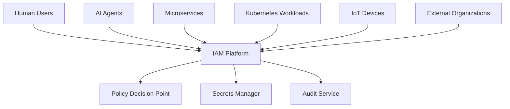
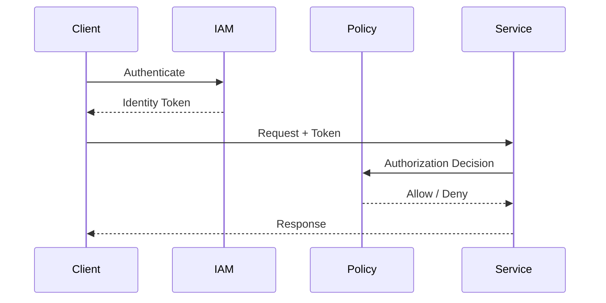
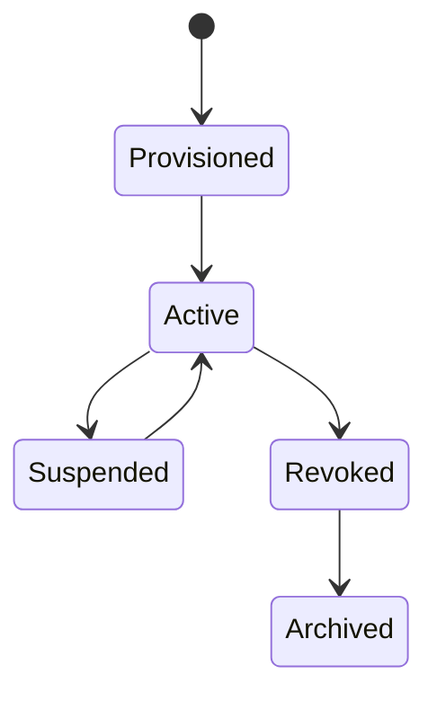

# OM-SOL-126 — Identity and Access Management

---

# Executive Summary

The Identity and Access Management (IAM) Architecture establishes the trust foundation of the OneMind platform by governing authentication, authorization, identity lifecycle, and access control across humans, AI agents, services, workloads, APIs, and external organizations.

Unlike traditional IAM solutions focused solely on human users, OneMind adopts an **Enterprise Identity Fabric** that unifies Human Identity, Agent Identity, Service Identity, Workload Identity, and External Federated Identity under a Zero Trust security model.

This architecture enables secure collaboration between people, AI, applications, and infrastructure while enforcing policy-driven access decisions and maintaining full auditability.

---

# Objectives

The IAM Architecture shall:

- Establish a unified enterprise identity model
- Enforce Zero Trust access
- Support federated identities
- Secure machine-to-machine communication
- Protect AI agents and runtime identities
- Enable fine-grained authorization
- Provide complete auditability
- Support multi-tenant deployments

---

# Scope

## Included

- Human Identity
- Agent Identity
- Service Identity
- Workload Identity
- Federated Identity
- Authentication
- Authorization
- Policy enforcement
- Secret management
- Identity lifecycle

## Excluded

- Physical identity management
- HR onboarding processes
- PKI implementation details

---

# Architecture Principles

- Identity is the new perimeter
- Zero Trust by default
- Least privilege access
- Continuous verification
- Policy-driven authorization
- Strong authentication
- Auditable identity lifecycle

---

# Identity Domains

| Identity Type | Description |
|---------------|-------------|
| Human Identity | Employees, administrators, end users |
| Agent Identity | AI agents and autonomous workers |
| Service Identity | Internal microservices |
| Workload Identity | Kubernetes workloads and containers |
| Device Identity | Edge devices and IoT |
| External Identity | Partners and customers |

---

# IAM Architecture



---

# Authentication Flow



---

# Identity Lifecycle



---

# Authentication Methods

Supported authentication includes:

- Multi-Factor Authentication (MFA)
- Single Sign-On (SSO)
- OAuth 2.1
- OpenID Connect (OIDC)
- SAML 2.0
- Mutual TLS
- Passkeys / WebAuthn
- API Keys (limited legacy use)

---

# Authorization Models

The platform supports:

| Model | Purpose |
|--------|---------|
| RBAC | Role-based access |
| ABAC | Attribute-based access |
| PBAC | Policy-based access |
| ReBAC | Relationship-based access |
| Context-aware Access | Risk-adaptive decisions |

---

# AI Agent Identity

Every AI agent shall possess:

- Unique identity
- Cryptographic credentials
- Assigned permissions
- Tool access policies
- Memory access policies
- Knowledge access policies
- Audit trail

No anonymous AI agent execution is permitted.

---

# Workload Identity

Platform workloads shall authenticate using workload identities instead of static credentials.

Supported mechanisms include:

- Kubernetes Service Accounts
- SPIFFE/SPIRE
- Short-lived certificates
- Token federation

---

# Secret Management

Sensitive credentials shall be managed through centralized secret services.

Supported assets include:

- API keys
- OAuth client secrets
- Database credentials
- LLM provider keys
- Certificates
- Encryption keys

---

# Public Interfaces

| Interface | Purpose |
|------------|---------|
| Authenticate | Identity verification |
| Authorize | Policy decision |
| IssueToken | Access token generation |
| RevokeIdentity | Identity revocation |
| RotateCredentials | Credential rotation |

---

# Published Events

- IdentityCreated
- IdentityUpdated
- IdentityRevoked
- AuthenticationSucceeded
- AuthenticationFailed
- AuthorizationDenied
- CredentialRotated

---

# Consumed Events

- HRUserProvisioned
- AgentRegistered
- ServiceDeployed
- WorkloadCreated
- PolicyUpdated

---

# Security Considerations

The IAM architecture shall enforce:

- MFA for privileged access
- Just-In-Time (JIT) access
- Just-Enough Administration (JEA)
- Continuous session validation
- Credential rotation
- Session timeout
- Device trust verification

---

# Non-Functional Requirements

| Requirement | Target |
|-------------|--------|
| MFA Coverage | 100% privileged accounts |
| Authentication Latency | <200 ms |
| Token Availability | 99.99% |
| Credential Rotation | Automated |
| Audit Coverage | 100% identity events |

---

# Standards Alignment

| Standard | Coverage |
|-----------|----------|
| ISO/IEC 27001 | Access Control |
| ISO/IEC 42001 | AI Identity Governance |
| NIST SP 800-63 | Digital Identity |
| NIST Zero Trust (SP 800-207) | Zero Trust Architecture |
| OAuth 2.1 | Authorization |
| OpenID Connect | Authentication |
| SAML 2.0 | Federation |

---

# ADR Mapping

| ADR | Description |
|------|-------------|
| ADR-009 *(future)* | Identity Provider Selection |
| ADR-010 *(future)* | Policy Engine Selection |

---

# Traceability

| Source | Target |
|---------|--------|
| OM-SOL-105 | AI Runtime |
| OM-SOL-109 | Tool Execution & MCP Runtime |
| OM-SOL-117 | Workflow Runtime |
| OM-SOL-125 | Enterprise Security Architecture |
| OM-ARCH-084 | Architecture Compliance Framework |

---

# Draw.io Reference

```text
assets/diagrams/solution/
26-identity-and-access-management.drawio
```

---

# Future Evolution

Future capabilities include:

- Decentralized Identity (DID)
- Verifiable Credentials (VC)
- Passwordless enterprise
- AI identity attestation
- Cross-organization trust federation
- Adaptive risk-based authentication
- Autonomous credential lifecycle management

---

# Summary

The Identity and Access Management Architecture establishes a unified Enterprise Identity Fabric for OneMind. By governing human, AI, service, workload, and external identities under a Zero Trust model, it provides secure, policy-driven, and auditable access across the entire Enterprise AI Operating Platform.