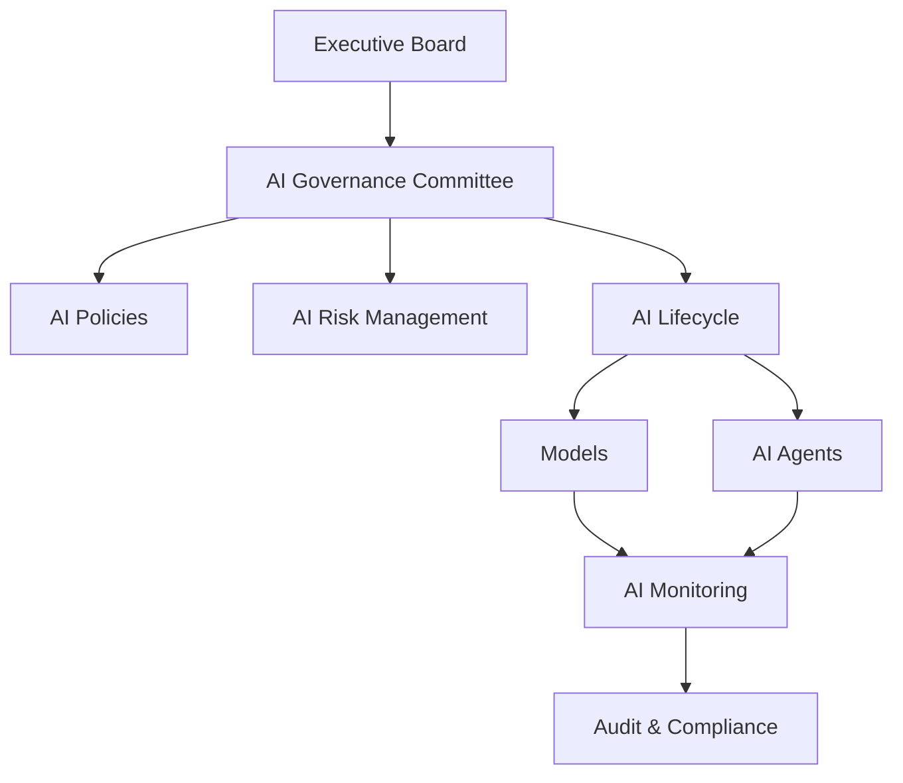
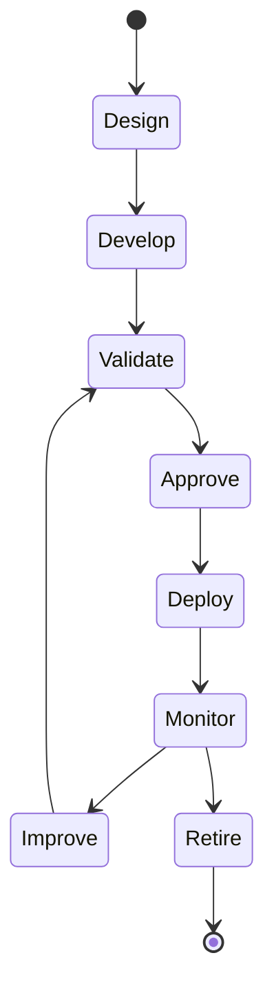
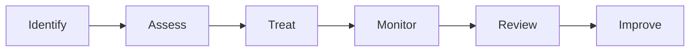

# OM-SOL-127 — AI Governance and Responsible AI

---

# Executive Summary

The AI Governance and Responsible AI Architecture establishes the governance framework for designing, deploying, operating, monitoring, and continuously improving Artificial Intelligence capabilities across the OneMind platform.

AI is treated as an enterprise capability that must be governed with the same rigor as financial systems, cybersecurity, and corporate governance. This architecture defines policies, controls, accountability, and operational practices that ensure AI systems remain trustworthy, transparent, secure, explainable, ethical, and compliant throughout their lifecycle.

The architecture aligns with internationally recognized standards including ISO/IEC 42001, NIST AI Risk Management Framework (AI RMF), OECD AI Principles, UNESCO Recommendation on the Ethics of AI, and the EU AI Act.

---

# Objectives

The AI Governance Architecture shall:

- Establish enterprise AI governance
- Promote responsible AI
- Manage AI risks throughout the lifecycle
- Ensure transparency and explainability
- Protect individuals and organizations
- Support regulatory compliance
- Enable continuous AI monitoring
- Govern autonomous AI agents

---

# Scope

## Included

- AI governance
- AI lifecycle governance
- Model governance
- Prompt governance
- Agent governance
- Human oversight
- AI risk management
- AI transparency
- AI monitoring
- AI compliance

## Excluded

- Business strategy
- Software development lifecycle
- Enterprise risk outside AI

---

# Architecture Principles

- Human accountability
- Responsible autonomy
- Transparency by default
- Explainability where required
- Fairness and non-discrimination
- Privacy by design
- Security by design
- Continuous monitoring
- Human override capability

---

# AI Governance Domains

| Domain | Responsibility |
|---------|----------------|
| AI Strategy | Enterprise direction |
| AI Risk | Risk identification and treatment |
| AI Lifecycle | Model lifecycle governance |
| Model Governance | Versioning and approvals |
| Prompt Governance | Prompt management |
| Agent Governance | Multi-agent oversight |
| AI Operations | Runtime monitoring |
| AI Compliance | Regulatory compliance |

---

# AI Governance Architecture



---

# AI Lifecycle



---

# AI Risk Categories

| Risk | Examples |
|------|----------|
| Safety | Unsafe recommendations |
| Security | Prompt injection |
| Privacy | Personal data leakage |
| Bias | Unfair outcomes |
| Explainability | Opaque reasoning |
| Reliability | Hallucinations |
| Operational | Runtime failures |
| Regulatory | Non-compliance |

---

# Model Governance

Every AI model shall have:

- Model owner
- Version identifier
- Approval status
- Validation report
- Intended use
- Known limitations
- Risk classification
- Retirement plan

---

# Prompt Governance

Prompt assets shall be managed as governed artifacts.

Requirements include:

- Version control
- Change approval
- Security review
- Prompt testing
- Prompt evaluation
- Prompt rollback
- Prompt ownership

---

# Agent Governance

Each AI agent shall have:

- Registered identity
- Defined purpose
- Assigned owner
- Tool permissions
- Knowledge boundaries
- Memory policies
- Escalation rules
- Human override

---

# Human Oversight

Human oversight shall support:

- Approval workflows
- Manual intervention
- Emergency stop
- Decision review
- Escalation paths
- Exception handling

No high-risk autonomous decision shall execute without defined oversight policies.

---

# Explainability

The platform shall support:

- Decision traceability
- Model provenance
- Prompt provenance
- Source attribution
- Confidence indicators
- Reasoning summaries (where technically feasible)

---

# AI Monitoring

Continuous monitoring shall include:

- Model performance
- Prompt effectiveness
- Hallucination indicators
- Drift detection
- Agent behavior
- Safety violations
- Policy violations
- User feedback

---

# AI Risk Management



---

# AI Risk Controls

| Control | Purpose |
|----------|---------|
| Human Approval | High-risk decisions |
| Output Validation | Unsafe response detection |
| Prompt Filtering | Prompt injection defense |
| Tool Restrictions | Least privilege |
| Policy Enforcement | Runtime governance |
| Audit Logging | Accountability |

---

# Public Interfaces

| Interface | Purpose |
|------------|---------|
| RegisterModel | Model registration |
| RegisterAgent | Agent onboarding |
| SubmitRiskAssessment | AI risk review |
| GetGovernanceStatus | Governance reporting |
| SuspendModel | Emergency suspension |

---

# Published Events

- ModelApproved
- ModelRetired
- AgentRegistered
- AgentSuspended
- RiskDetected
- GovernancePolicyUpdated
- HumanOverrideActivated

---

# Consumed Events

- ModelDeployed
- PromptUpdated
- PolicyViolationDetected
- SecurityIncidentRaised
- ComplianceAuditRequested

---

# Non-Functional Requirements

| Requirement | Target |
|-------------|--------|
| Governance coverage | 100% AI assets |
| Model traceability | Mandatory |
| Human oversight | Required for high-risk AI |
| Audit retention | Per regulatory requirements |
| Policy enforcement | Real time |

---

# Standards Alignment

| Standard | Coverage |
|-----------|----------|
| ISO/IEC 42001 | AI Management System |
| NIST AI RMF 1.0 | AI Risk Management |
| OECD AI Principles | Trustworthy AI |
| UNESCO AI Ethics | Ethical AI |
| EU AI Act | Risk-based AI governance |
| ISO/IEC 23894 | AI Risk Management |
| PDPA | Privacy |
| GDPR | Privacy |

---

# ADR Mapping

| ADR | Description |
|------|-------------|
| ADR-003 | LiteLLM |
| ADR-011 *(future)* | AI Governance Framework |
| ADR-012 *(future)* | Model Registry Platform |

---

# Traceability

| Source | Target |
|---------|--------|
| OM-SOL-105 | AI Runtime |
| OM-SOL-106 | Agent Runtime |
| OM-SOL-110 | Knowledge Runtime |
| OM-SOL-125 | Enterprise Security Architecture |
| OM-SOL-126 | Identity and Access Management |
| OM-ARCH-097 | Architecture Governance Operating Model |

---

# Draw.io Reference

```text
assets/diagrams/solution/
27-ai-governance-and-responsible-ai.drawio
```

---

# Future Evolution

Future capabilities include:

- AI governance scorecards
- Automated AI policy enforcement
- Continuous model certification
- AI Bill of Materials (AI-BOM)
- Federated AI governance
- Autonomous AI risk assessment
- AI ethics review workflows
- Regulatory reporting automation

---

# Summary

The AI Governance and Responsible AI Architecture establishes a comprehensive governance framework for the OneMind platform. By integrating enterprise governance, lifecycle management, risk controls, human oversight, transparency, and international best practices, it ensures that AI systems remain trustworthy, secure, explainable, and compliant while enabling responsible innovation at enterprise scale.