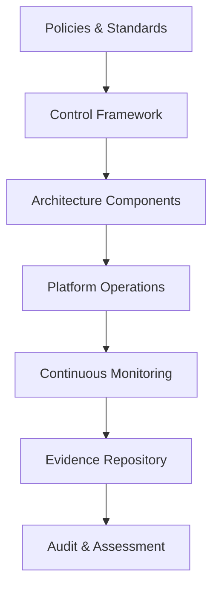
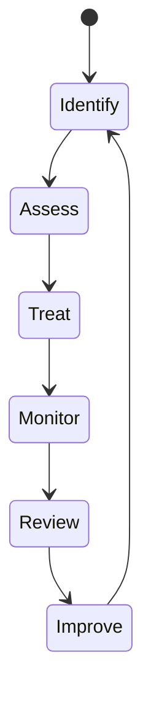

# OM-SOL-128 — Compliance and Risk Architecture

---

# Executive Summary

The Compliance and Risk Architecture establishes the governance framework that enables OneMind to meet legal, regulatory, contractual, and organizational obligations while managing enterprise and AI-related risks.

Compliance is treated as a continuous architectural capability rather than a periodic audit activity. Risk management is embedded throughout the platform lifecycle to ensure that technology, AI, data, and operations remain aligned with business objectives and regulatory expectations.

---

# Objectives

The architecture shall:

- Establish enterprise GRC capabilities
- Embed compliance into architecture
- Integrate AI risk management
- Enable continuous compliance monitoring
- Support internal and external audits
- Provide enterprise-wide control traceability
- Reduce operational and regulatory risks

---

# Scope

## Included

- Governance, Risk & Compliance (GRC)
- Regulatory compliance
- AI compliance
- Risk management
- Control framework
- Audit readiness
- Evidence management
- Continuous compliance monitoring

## Excluded

- Legal interpretation
- Corporate legal affairs
- Financial auditing

---

# Architecture Principles

- Compliance by Design
- Risk-Based Decision Making
- Continuous Assurance
- Evidence-Driven Governance
- Privacy by Design
- Security by Design
- Traceability by Default

---

# Compliance Architecture



---

# Risk Management Lifecycle



---

# Risk Domains

| Domain | Examples |
|---------|----------|
| Strategic | Misaligned AI strategy |
| Operational | Platform outage |
| Cybersecurity | Unauthorized access |
| Privacy | Personal data leakage |
| AI | Hallucination, bias, unsafe outputs |
| Regulatory | PDPA / GDPR violations |
| Third Party | Vendor dependency |
| Business Continuity | Disaster recovery failure |

---

# Compliance Domains

| Domain | Coverage |
|---------|----------|
| Information Security | ISO/IEC 27001 |
| AI Management | ISO/IEC 42001 |
| AI Risk | ISO/IEC 23894 |
| Cybersecurity | NIST CSF 2.0 |
| AI Risk Framework | NIST AI RMF |
| Privacy | PDPA, GDPR |
| Software Security | OWASP ASVS |

---

# Continuous Compliance

Continuous compliance shall include:

- Automated policy validation
- Configuration compliance
- Security posture assessment
- AI governance monitoring
- Infrastructure compliance
- Audit evidence collection
- Exception tracking

---

# Control Mapping Matrix

| Architecture Area | ISO 27001 | ISO 42001 | NIST CSF | NIST AI RMF | PDPA |
|-------------------|-----------|-----------|-----------|-------------|-------|
| Identity & Access | ✔ | ✔ | Protect | Govern | ✔ |
| AI Runtime | ✔ | ✔ | Detect | Measure | |
| Agent Runtime | | ✔ | Govern | Govern | |
| Knowledge | ✔ | ✔ | Protect | Manage | ✔ |
| Memory | ✔ | ✔ | Protect | Manage | ✔ |
| Observability | ✔ | | Detect | Measure | |
| Platform Operations | ✔ | | Respond | Manage | |
| Deployment | ✔ | | Protect | | |
| Data Platform | ✔ | ✔ | Protect | Measure | ✔ |

---

# Risk Treatment Options

- Accept
- Mitigate
- Transfer
- Avoid

Every identified risk shall have:

- Owner
- Classification
- Likelihood
- Impact
- Treatment plan
- Review schedule

---

# Audit Readiness

The platform shall maintain evidence for:

- Architecture decisions (ADR)
- Security controls
- AI governance
- Deployment history
- Change management
- Incident response
- Policy compliance
- Operational metrics

---

# Public Interfaces

| Interface | Purpose |
|------------|---------|
| RegisterRisk | Create risk record |
| UpdateRisk | Modify risk |
| GetComplianceStatus | Compliance dashboard |
| ExportEvidence | Audit evidence |
| SubmitAssessment | Assessment workflow |

---

# Published Events

- RiskRegistered
- RiskAccepted
- RiskMitigated
- ComplianceViolationDetected
- AuditStarted
- AuditCompleted

---

# Consumed Events

- SecurityAlertRaised
- PolicyUpdated
- AIModelApproved
- DeploymentCompleted
- IncidentResolved

---

# Non-Functional Requirements

| Requirement | Target |
|-------------|--------|
| Compliance monitoring | Continuous |
| Evidence availability | 100% |
| Audit traceability | Complete |
| Risk review cycle | Quarterly minimum |
| Control automation | Preferred |

---

# Standards Alignment

| Standard | Purpose |
|-----------|---------|
| ISO/IEC 27001 | Information Security |
| ISO/IEC 42001 | AI Management |
| ISO/IEC 23894 | AI Risk |
| NIST CSF 2.0 | Cybersecurity |
| NIST AI RMF | AI Governance |
| OWASP ASVS | Secure Software |
| PDPA | Privacy |
| GDPR | Privacy |

---

# ADR Mapping

| ADR | Description |
|------|-------------|
| ADR-001 | PostgreSQL |
| ADR-002 | Qdrant |
| ADR-003 | LiteLLM |
| ADR-011 *(future)* | AI Governance Framework |

---

# Traceability

| Source | Target |
|---------|--------|
| OM-SOL-123 | Observability Architecture |
| OM-SOL-124 | Platform Operations |
| OM-SOL-125 | Enterprise Security Architecture |
| OM-SOL-126 | Identity and Access Management |
| OM-SOL-127 | AI Governance and Responsible AI |
| OM-ARCH-084 | Architecture Compliance Framework |

---

# Draw.io Reference

```text
assets/diagrams/solution/
28-compliance-and-risk-architecture.drawio
```

---

# Future Evolution

Future enhancements include:

- Continuous Control Monitoring (CCM)
- Automated compliance reporting
- AI-assisted risk assessment
- Regulatory change impact analysis
- Cross-framework control harmonization
- Integrated GRC platform

---

# Summary

The Compliance and Risk Architecture embeds governance, risk management, and regulatory compliance into the OneMind platform. Through continuous monitoring, evidence-based controls, and integrated risk management, it enables OneMind to operate as a trusted, auditable, and compliant Enterprise AI Operating Platform.