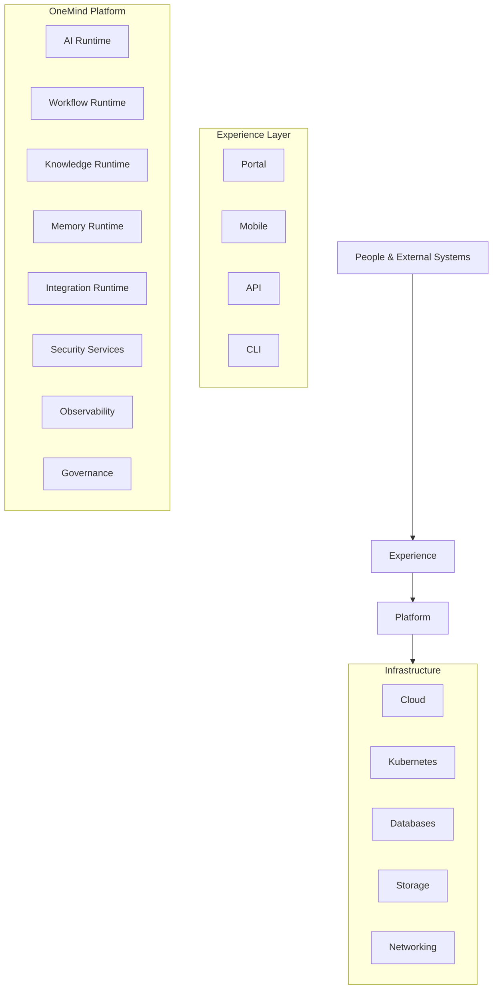
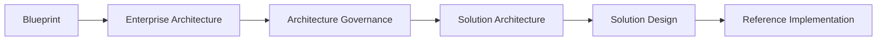

# OM-SOL-129 — Solution Architecture Summary

---

# Executive Summary

This document serves as the master navigation guide and executive summary for the OneMind Solution Architecture.

Milestone M4 defines the complete solution architecture of the OneMind Enterprise AI Operating Platform, covering platform foundation, AI runtime, knowledge management, integration, deployment, operations, security, governance, and compliance.

Rather than introducing new architecture, this document consolidates and connects the complete architecture landscape into a single reference for executives, architects, developers, security teams, and platform engineers.

---

# Architecture Vision

OneMind is an Enterprise AI Operating Platform that unifies:

- People
- AI Agents
- Knowledge
- Memory
- Business Processes
- Enterprise Systems
- AI Models
- Data
- Infrastructure

into a single intelligent operating platform.

---

# Solution Architecture Overview



---

# Architecture Layers

| Layer | Description |
|--------|-------------|
| Experience | User interaction channels |
| Application | Business capabilities |
| AI Runtime | Models and agents |
| Knowledge | Knowledge & RAG |
| Integration | APIs and events |
| Data | Databases, vectors, memory |
| Platform | Shared platform capabilities |
| Infrastructure | Compute, storage, networking |

---

# M4 Document Map

## Phase 1 — Platform Foundation

| ID | Document |
|----|----------|
| OM-SOL-100 | Solution Architecture Overview |
| OM-SOL-101 | Platform Architecture |
| OM-SOL-102 | Application Architecture |
| OM-SOL-103 | Domain Architecture |
| OM-SOL-104 | Service Architecture |

---

## Phase 2 — AI Runtime

| ID | Document |
|----|----------|
| OM-SOL-105 | AI Runtime Architecture |
| OM-SOL-106 | Agent Runtime Architecture |
| OM-SOL-107 | Model Management Architecture |
| OM-SOL-108 | Prompt Management Architecture |
| OM-SOL-109 | Tool Execution & MCP Runtime |

---

## Phase 3 — Data & Intelligence

| ID | Document |
|----|----------|
| OM-SOL-110 | Knowledge Runtime |
| OM-SOL-111 | Memory Architecture |
| OM-SOL-112 | Vector Database Architecture |
| OM-SOL-113 | RAG Architecture |
| OM-SOL-114 | Embedding Pipeline |

---

## Phase 4 — Integration Layer

| ID | Document |
|----|----------|
| OM-SOL-115 | API Gateway Architecture |
| OM-SOL-116 | Event-Driven Integration |
| OM-SOL-117 | Workflow Runtime |
| OM-SOL-118 | External Integration |
| OM-SOL-119 | Data Exchange Architecture |

---

## Phase 5 — Deployment & Operations

| ID | Document |
|----|----------|
| OM-SOL-120 | Deployment Topology |
| OM-SOL-121 | High Availability Architecture |
| OM-SOL-122 | Scalability Architecture |
| OM-SOL-123 | Observability Architecture |
| OM-SOL-124 | Platform Operations |

---

## Phase 6 — Security & Governance

| ID | Document |
|----|----------|
| OM-SOL-125 | Enterprise Security Architecture |
| OM-SOL-126 | Identity & Access Management |
| OM-SOL-127 | AI Governance & Responsible AI |
| OM-SOL-128 | Compliance & Risk Architecture |
| OM-SOL-129 | Solution Architecture Summary |

---

# Cross-Architecture Mapping

| Architecture Domain | Primary Documents |
|---------------------|-------------------|
| Business | OM-BIZ Series |
| Enterprise | OM-ARCH Series |
| Solution | OM-SOL Series |
| Deployment | OM-SOL-120 – 124 |
| Security | OM-SOL-125 – 128 |
| Governance | OM-ARCH-080 – 099 |

---

# Key Architectural Capabilities

- Multi-Agent Collaboration
- Retrieval-Augmented Generation (RAG)
- Enterprise Memory
- Model Routing
- Prompt Management
- Event-Driven Architecture
- API-First Integration
- Zero Trust Security
- Responsible AI Governance
- Platform Observability
- DevSecOps
- SRE & AIOps
- Multi-Tenant Architecture
- High Availability
- Horizontal Scalability

---

# Architecture Principles Traceability

| Principle | Supporting Documents |
|-----------|----------------------|
| API First | OM-SOL-115 |
| Event Driven | OM-SOL-116 |
| AI Native | OM-SOL-105 – 114 |
| Zero Trust | OM-SOL-125 – 126 |
| Responsible AI | OM-SOL-127 |
| Compliance by Design | OM-SOL-128 |
| Observability | OM-SOL-123 |
| Platform Engineering | OM-SOL-124 |

---

# Standards Alignment

| Standard | Coverage |
|-----------|----------|
| ISO/IEC 27001 | Security Architecture |
| ISO/IEC 42001 | AI Management |
| ISO/IEC 23894 | AI Risk |
| NIST CSF 2.0 | Cybersecurity |
| NIST AI RMF | AI Governance |
| TOGAF | Enterprise Architecture |
| C4 Model | Architecture Visualization |
| BPMN 2.0 | Process Modeling |
| ArchiMate | Enterprise Modeling |

---

# Repository Structure

```text
docs/
├── foundation/
├── standards/
├── architecture/
│   ├── vision/
│   ├── business/
│   ├── system/
│   ├── data/
│   ├── ai/
│   ├── integration/
│   ├── deployment/
│   ├── technology/
│   ├── governance/
│   ├── reference/
│   └── solution/
├── presentation/
└── handoff/
```

---

# Architecture Roadmap

| Milestone | Status |
|-----------|--------|
| M1 – Blueprint | Completed |
| M2 – Enterprise Architecture | Completed |
| M3 – Architecture Governance | Completed |
| M4 – Solution Architecture | **Completed** |
| M5 – Solution Design | Planned |
| M6 – Reference Implementation | Planned |

---

# Architecture Dependency



---

# Success Metrics

The Solution Architecture is considered complete when:

- All 30 Solution Architecture documents are approved
- Cross-document traceability is established
- Mermaid diagrams are included where applicable
- Standards alignment is documented
- ADR mappings are complete
- Repository navigation is fully defined

---

# Draw.io Reference

```text
assets/diagrams/solution/
29-solution-architecture-summary.drawio
```

---

# Next Milestone

Milestone M5 — Solution Design

Focus areas include:

- Solution blueprints
- Domain solution design
- Agent specifications
- API specifications
- Database schemas
- Event contracts
- UI architecture
- Infrastructure implementation
- Reference deployments

---

# Summary

Milestone M4 defines the complete Solution Architecture of the OneMind Enterprise AI Operating Platform.

Together with the Enterprise Architecture (M2) and Architecture Governance (M3), this milestone establishes the architectural foundation required to design, implement, deploy, operate, and govern OneMind as an enterprise-grade AI platform.

This document serves as the primary navigation entry point and executive reference for the entire Solution Architecture repository.